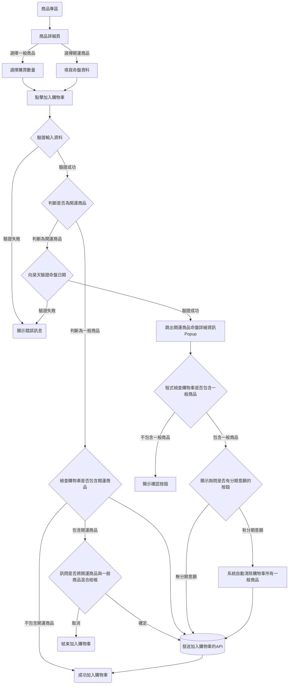
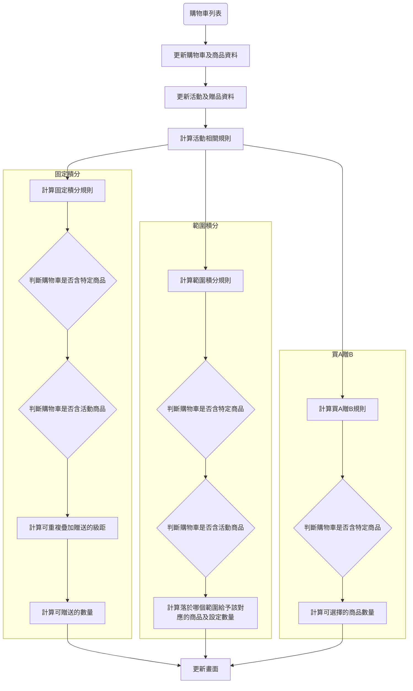

本事溝通共筆
===

加入購物車
--

```mermaid
graph TD;
    A(商品專區)-->B[商品詳細頁];
    B-->|選擇一般商品| D[選擇購買數量];
    B-->|選擇開運商品| E[填寫命盤資料];
    D--> F;
    E--> F;
    F[點擊加入購物車]--> G{驗證輸入資料};
    G-->|驗證失敗| I(顯示錯誤訊息);
    G-->|驗證成功| J{判斷是否為開運商品};
    J-->|判斷為開運商品| K{向昊天驗證命盤日期};
    J-->|判斷為一般商品| S{檢查購物車是否包含開運商品};
    S-->|包含開運商品| T{訊問是否將開運商品與一般商品混合結帳}
    T-->|確定| Q
    T-->|取消| U(結束加入購物車)
    S-->|不包含開運商品| R
    S--> Q
    K-->|驗證失敗| I;
    K-->|驗證成功| L[跳出開運商品命盤詳細資訊Popup];
    L-->M{程式檢查購物車是否包含一般商品};
    M-->|不包含一般商品| N[顯示確認按鈕];
    M-->|包含一般商品| O{顯示詢問是否有分期意願的按鈕};
    O-->|有分期意願| P[系統自動清除購物車所有一般商品];
    O-->|無分期意願| Q;
    P--> Q
    Q[(發送加入購物車的API)]-->R;
    R(成功加入購物車)
```

購物車活動規則判斷運作方式
--

```mermaid
graph TD;
    A(購物車列表)-->B[更新購物車及商品資料];
    B-->C[更新活動及贈品資料]
    C-->D[計算活動相關規則];
    D-->E[計算固定積分規則];
    D-->F[計算範圍積分規則];
    D-->G[計算買A贈B規則];
    subgraph 固定積分;
        E-->HA{判斷購物車是否含特定商品};
        HA-->IA{判斷購物車是否含活動商品};
        IA-->JA[計算可重複疊加贈送的級距];
        JA-->KA[計算可贈送的數量];
    end;
    subgraph 範圍積分;
        F-->HB{判斷購物車是否含特定商品};
        HB-->IB{判斷購物車是否含活動商品};
        IB-->JB[計算落於哪個範圍給予該對應的商品及設定數量];
    end;
    subgraph 買A贈B;
        G-->HC{判斷購物車是否含特定商品};
        HC-->IC[計算可選擇的商品數量];
    end;
    L[更新畫面]
    KA-->L
    JB-->L
    IC-->L
```