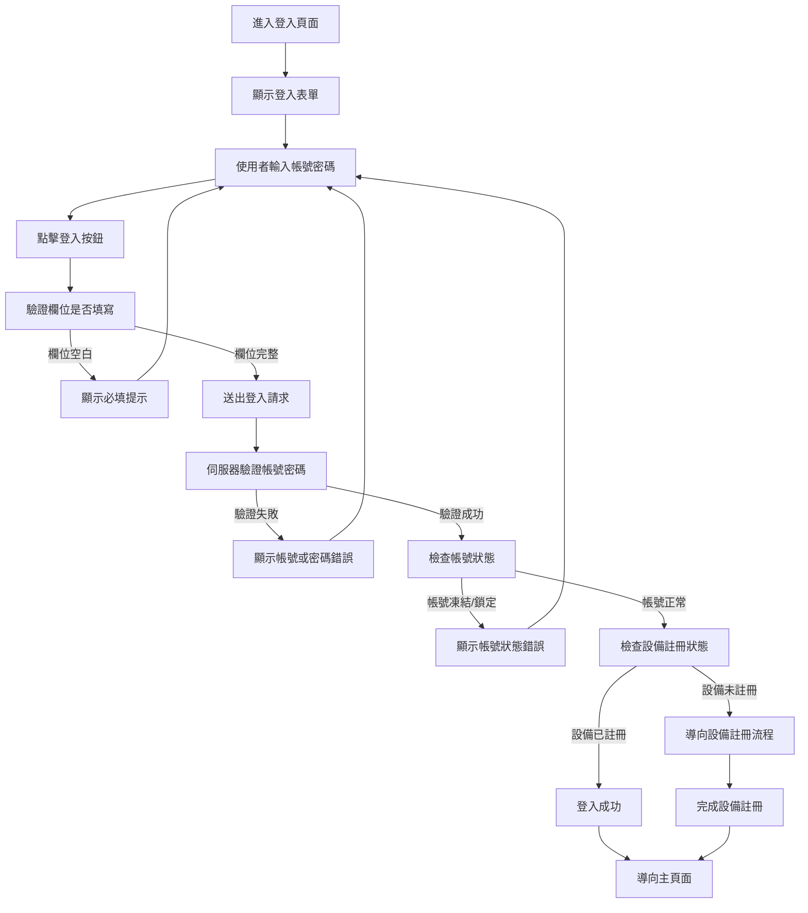
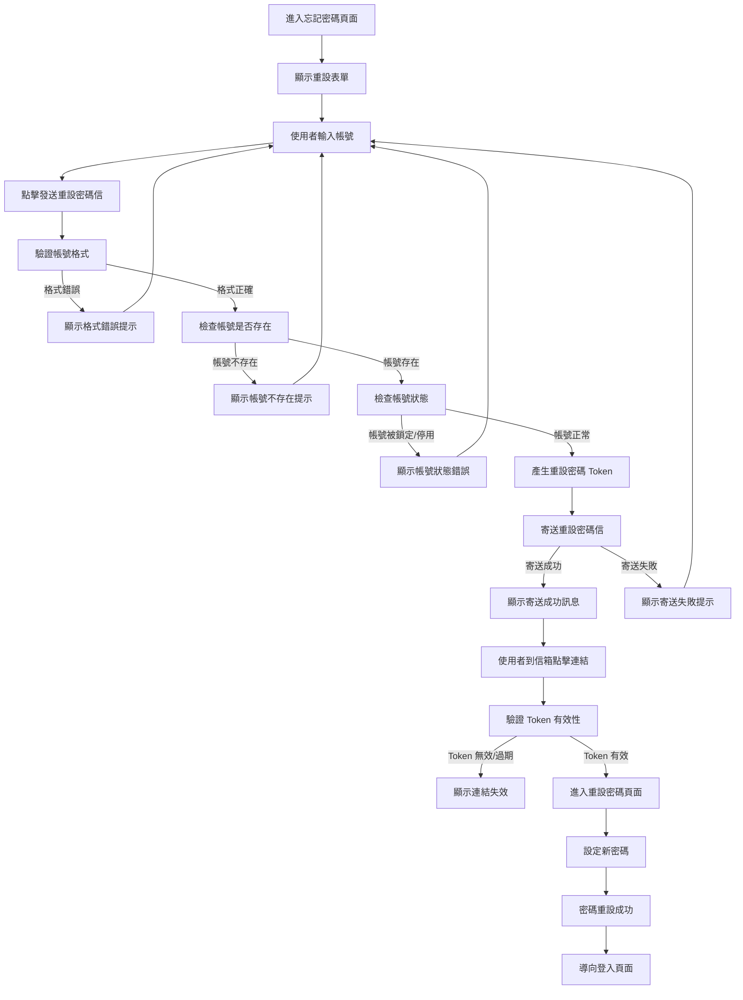
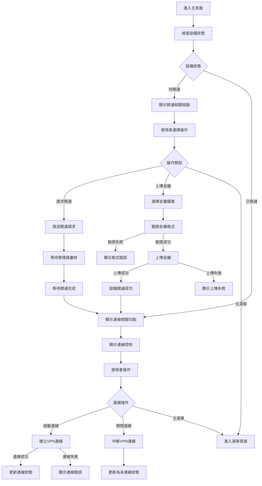
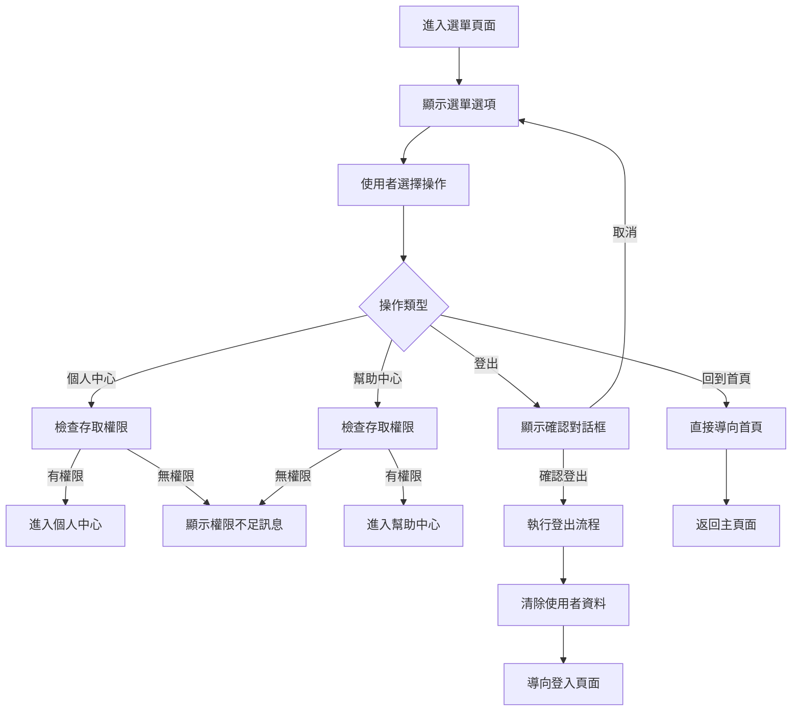
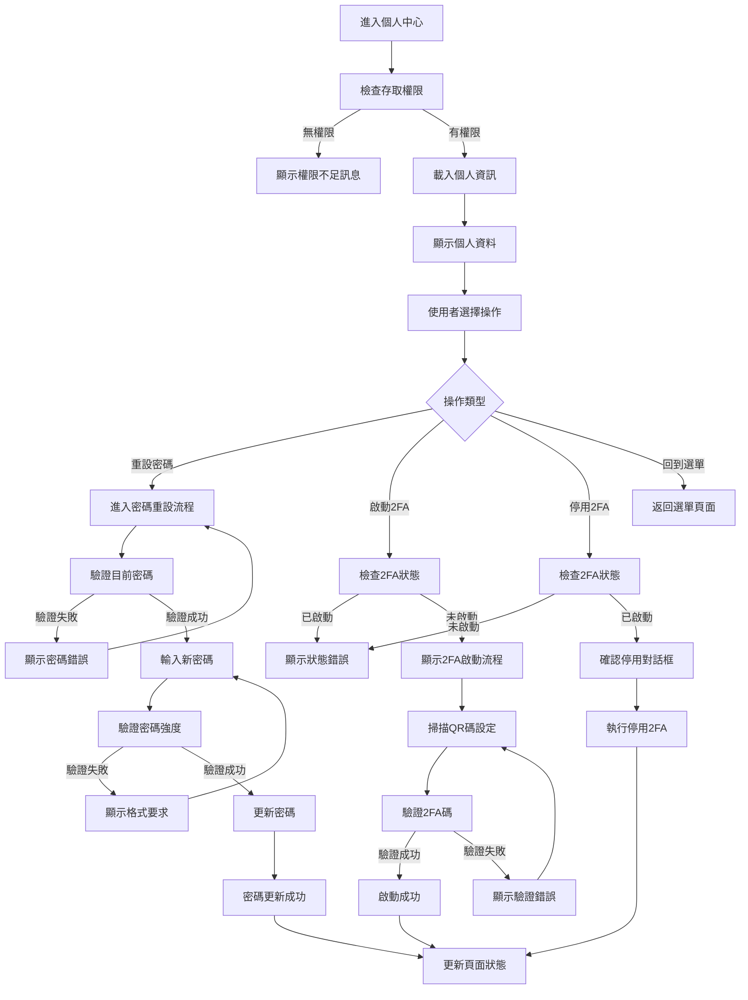
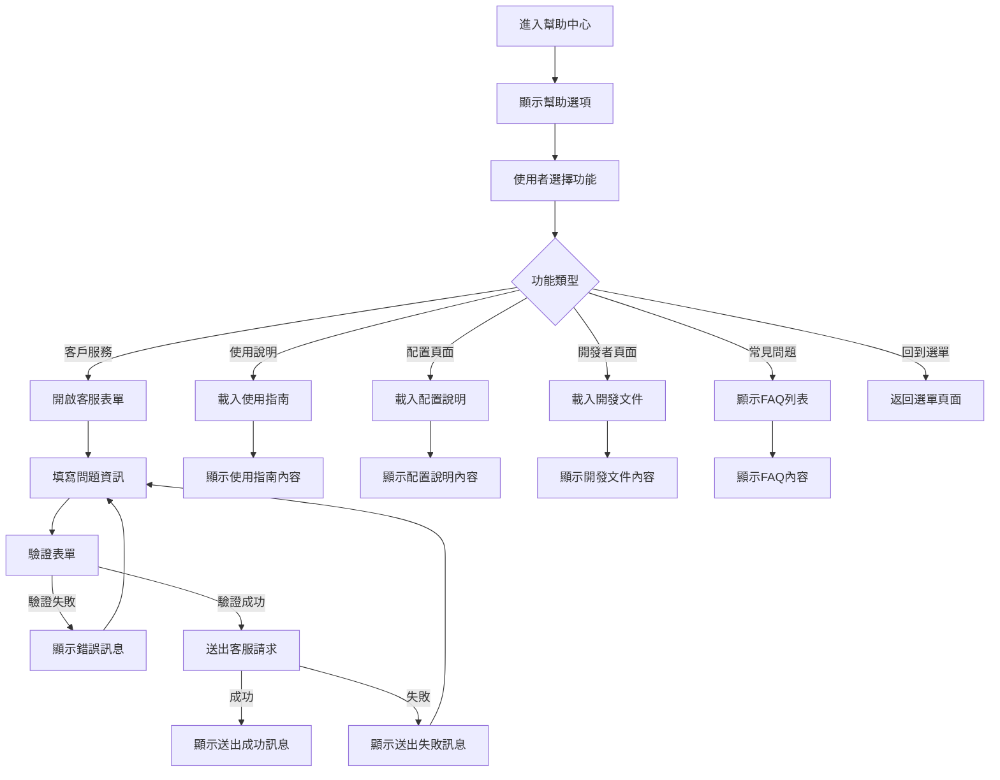

# Agent Platform - 產品規格書

## 一、User Stories

---

## 二、功能需求

### 2.1 登入頁面 (Login)

#### 2.1.1 顯示欄位

**頁面元素**

- 「登入」標題
- 登入表單送出按鈕
- 忘記密碼連結按鈕

#### 2.1.2 表單填寫欄位及驗證規則

**資料驗證**

| Column   | Type | Required | Description |
| -------- | ---- | -------- | ----------- |
| Account  | Text | true     |             |
| Password | Text | true     |             |

#### 2.1.3 Action Flow

#### 2.1.4 商業邏輯

1. **表單驗證**

   - 帳號和密碼為必填欄位
   - 不進行任何格式驗證，由後端驗證
   - 如果帳號凍結、上鎖均無法登入

2. **登入邏輯**

   - 支援帳號密碼登入
   - 登入成功後檢查設備註冊狀態
   - 新設備需要完成註冊流程
   - 登入失敗會記錄嘗試次數，多次失敗會暫時鎖定

#### 2.1.5 權限設計

| Operator | Permission | Description                        |
| -------- | ---------- | ---------------------------------- |
| 登入系統 | -          | 無權限限制，所有使用者都可嘗試登入 |

### 2.2 忘記密碼頁面 (Forget Password)

#### 2.2.1 顯示欄位

**頁面元素**

- 頁面標題 "忘記密碼"
- 帳號輸入欄位
- 發送重設密碼信按鈕
- 返回登入按鈕

**說明文字**

- 請輸入您的帳號，我們將寄送重設密碼信到您的信箱
- 重設密碼信有效期限為 1 小時

#### 2.2.2 表單填寫欄位及驗證規則

**重設密碼表單**

| Column  | Type | Required | Rule       | Description |
| ------- | ---- | -------- | ---------- | ----------- |
| Account | Text | true     | Email 格式 | 系統帳號    |

**驗證規則**

- 帳號必填且需為有效的 Email 格式
- 系統會驗證帳號是否存在於資料庫中

#### 2.2.3 Action Flow

#### 2.2.4 商業邏輯

1. **重設流程**

   - 使用者輸入帳號後，系統產生唯一的重設 Token
   - 重設密碼信有效期限為 1 小時
   - Token 只能使用一次，使用後自動失效

2. **安全機制**

   - 同一帳號 10 分鐘內只能申請一次重設
   - 重設密碼信包含安全連結，不可轉發
   - 新密碼設定後會強制登出所有設備

3. **信件邏輯**

   - 重設密碼信寄送到帳號對應的 Email
   - 信件內容包含重設連結和有效時限說明
   - 每次申請重設會註銷前一個未使用的 Token

4. **密碼設定**

   - 新密碼需符合強度要求
   - 設定完成後需要重新登入驗證

---

### 2.3 主頁面 (Home)

#### 2.3.1 顯示欄位

**頁面元素**

- 頁面標題 "主頁面"
- 使用者名稱顯示
- 請求開通按鈕
- 上傳開通金鑰按鈕
- 主選單按鈕
- 啟動/關閉連線按鈕
- 連線狀態文字
- 最後登入時間文字
- 裝置名稱文字

**狀態資訊**

| Column             | Description    | Display Condition |
| ------------------ | -------------- | ----------------- |
| Username           | 登入使用者名稱 | 所有狀態          |
| Connection Status  | 連線狀態       | 已開通設備        |
| Last Login Time    | 最後登入時間   | 已開通設備        |
| Device Name        | 目前裝置名稱   | 已開通設備        |
| Connection Control | 連線控制按鈕   | 已開通設備        |

#### 2.3.2 表單填寫欄位及驗證規則

**上傳金鑰表單**

| Column   | Type | Required | Rule                 | Description  |
| -------- | ---- | -------- | -------------------- | ------------ |
| Key File | File | true     | 支援格式：.key, .pem | 開通金鑰檔案 |

**驗證規則**

- 金鑰檔案必填且格式正確
- 檔案大小限制 1MB 以內
- 系統會驗證金鑰有效性

#### 2.3.3 Action Flow

#### 2.3.4 商業邏輯

1. **頁面狀態管理**

   - **待開通狀態**

     - 未被開通的設備顯示開通相關功能
     - 隱藏連線狀態文字、啟動/關閉連線按鈕、最後登入時間文字、裝置名稱文字
     - 顯示請求開通按鈕和上傳開通金鑰按鈕

   - **已開通狀態**
     - 已開通設備顯示連線相關功能
     - 隱藏請求開通按鈕、上傳開通金鑰按鈕
     - 顯示連線狀態、控制按鈕和設備資訊

2. **連線狀態管理**

   - **未連線**：可以點擊啟動連線
   - **連線中**：顯示連線進度，無法操作
   - **已連線**：可以點擊關閉連線，顯示連線時間

3. **開通邏輯**

   - 請求開通：發送申請給管理員，等待審核
   - 上傳金鑰：直接上傳有效金鑰完成開通
   - 開通成功後立即切換到已開通狀態

4. **安全機制**

   - 連線時建立加密隧道
   - 定期檢查連線健康狀態
   - 異常斷線時自動嘗試重連

### 2.4 選單 (Menu)

#### 2.4.1 顯示欄位

**頁面元素**

- 頁面標題 "選單"
- 連結個人中心按鈕
- 連結幫助中心按鈕
- 登出按鈕
- 回到首頁按鈕

**功能選項**

| Option   | Description        | Action           |
| -------- | ------------------ | ---------------- |
| 個人中心 | 檢視和管理個人資訊 | 導向個人中心頁面 |
| 幫助中心 | 獲取使用說明和支援 | 導向幫助中心頁面 |
| 登出     | 登出目前帳號       | 執行登出流程     |
| 回到首頁 | 返回主頁面         | 導向首頁         |

#### 2.4.2 表單填寫欄位及驗證規則

**操作驗證**

- 所有操作均無需表單填寫
- 登出操作需確認對話框

#### 2.4.3 Action Flow

#### 2.4.4 商業邏輯

1. **選單邏輯**

   - 所有操作均為導覽性質，不涉及資料修改

2. **登出邏輯**

   - 登出前顯示確認對話框
   - 清除本機儲存的使用者資料
   - 撤銷目前的認證 Token
   - 中斷所有進行中的連線

---

### 2.5 個人中心 (Profile)

#### 2.5.1 顯示欄位

**頁面元素**

- 頁面標題 "個人中心"
- 連結重設密碼按鈕
- 啟動 2FA 按鈕
- 停用 2FA 按鈕
- 允許服務列表
- 回到選單按鈕

**個人資訊**

| Column      | Description        |
| ----------- | ------------------ |
| Account     | 系統帳號名稱       |
| Nickname    | 顯示名稱           |
| 2FA Status  | 雙因素認證狀態     |
| Last Login  | 最後登入時間       |
| Device Name | 目前設備名稱       |
| Services    | 允許存取的服務列表 |

**操作選項**

| Operator | Allow Condition | Description    |
| -------- | --------------- | -------------- |
| 重設密碼 | 任何時候        | 修改登入密碼   |
| 啟動 2FA | 2FA 未啟動      | 啟動雙因素認證 |
| 停用 2FA | 2FA 已啟動      | 停用雙因素認證 |

#### 2.5.2 Action Flow

#### 2.5.3 商業邏輯

1. **個人資訊顯示**

   - 顯示使用者基本資訊（唯讀）
   - 顯示目前 2FA 啟動狀態
   - 顯示允許存取的應用程式列表
     - 顯示 Application Name, Application Host + Port

2. **密碼重設邏輯**

   - 必須去信箱收重置密碼信
   - 密碼更新後強制重新登入所有設備

3. **2FA 管理邏輯**

   - 啟動 2FA：產生 QR 碼，使用者掃描後驗證
   - 停用 2FA：需要確認對話框
   - 2FA 狀態變更後立即生效

4. **服務列表邏輯**

   - 顯示使用者有權限存取的所有服務
   - 服務狀態為唯讀，由系統管理員設定

---

### 2.6 幫助中心 (Help Center)

#### 2.6.1 顯示欄位

**頁面元素**

- 頁面標題 "幫助中心"
- 客戶服務按鈕
- 連結配置頁面按鈕
- 連結開發者頁面按鈕
- 回到選單按鈕

**幫助選項**

| Option     | Description        | Action             |
| ---------- | ------------------ | ------------------ |
| 客戶服務   | 聯絡客服團隊       | 開啟客服聊天或郵件 |
| 使用說明   | 檢視產品使用指南   | 導向使用說明頁面   |
| 配置頁面   | 系統配置說明       | 導向配置說明頁面   |
| 開發者頁面 | API 文件和開發資源 | 導向開發者文件     |
| 常見問題   | FAQ 列表           | 顯示常見問題解答   |
| 回到選單   | 返回主選單         | 導向選單頁面       |

#### 2.6.2 表單填寫欄位及驗證規則

**客戶服務表單**

| Column        | Type     | Required | Rule             | Description |
| ------------- | -------- | -------- | ---------------- | ----------- |
| Subject       | Text     | true     | 最大長度 100 字  | 問題主旨    |
| Category      | Select   | true     | 選擇問題類型     | 問題分類    |
| Description   | Textarea | true     | 最大長度 1000 字 | 詳細描述    |
| Contact Email | Email    | true     | Email 格式       | 聯絡信箱    |

**問題分類**

- 技術問題
- 帳號問題
- 連線問題
- 功能建議
- 其他

#### 2.6.3 Action Flow

#### 2.6.4 商業邏輯

1. **幫助內容邏輯**

   - 根據使用者類型顯示相關幫助內容
   - 開發者頁面需要開發者權限才能存取
   - 配置頁面需要管理員權限才能存取

2. **客戶服務邏輯**

   - 客服表單提交後自動產生工單編號
   - 系統會自動記錄使用者資訊
   - 客服回覆會寄送到聯絡信箱

