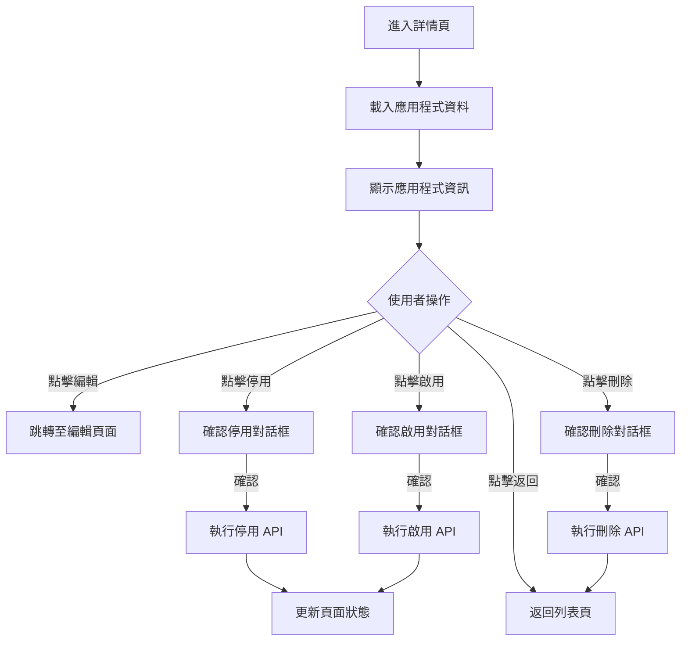
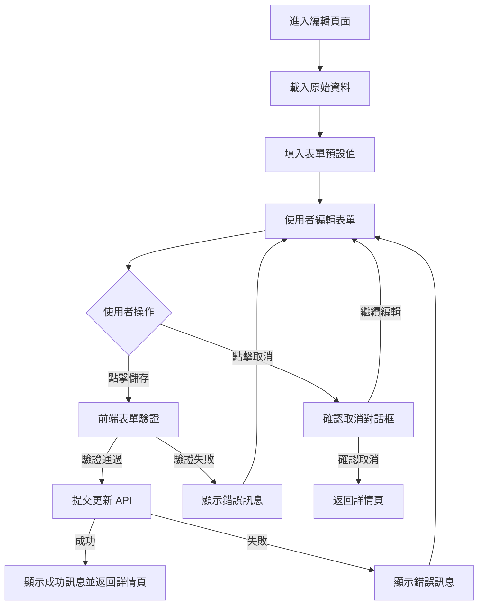

# Console Platform - Application 產品規格書

## 一、User Stories

### 應用程式管理

**作為系統管理員，我希望能夠檢視所有應用程式列表，以便管理組織內的應用服務。**

- **Given** 我有應用程式檢視權限
- **When** 我進入應用程式管理頁面
- **Then** 我可以看到所有應用程式的基本資訊（名稱、描述、服務主機、虛擬網域主機、組織、狀態、建立時間、更新時間）
- **And** 我可以使用搜尋功能找到特定應用程式
- **And** 我可以使用篩選器依照狀態和組織篩選應用程式

**作為系統管理員，我希望能夠對應用程式執行各種操作，以便管理應用程式狀態。**

- **Given** 我有相應的操作權限
- **When** 我選擇特定應用程式
- **Then** 我可以根據應用程式當前狀態執行對應操作（編輯、停用、刪除）
- **And** 系統會根據應用程式狀態顯示或隱藏相關操作按鈕

### 新增應用程式

**作為系統管理員，我希望能夠新增新的應用程式，以便為組織新增可存取的服務。**

- **Given** 我有新增應用程式權限
- **When** 我點擊「新增應用程式」按鈕
- **Then** 我可以分步驟填寫應用程式基本資訊（名稱、描述）和服務設定（服務 IP/Port、虛擬網域 Host/Port）
- **And** 系統會驗證虛擬網域 Host 和 Port 組合的唯一性
- **And** 系統會驗證服務位址和虛擬網域位址的格式正確性

### 檢視應用程式詳情

**作為系統管理員，我希望能夠檢視應用程式的詳細資訊，以便了解應用程式設定和狀態。**

- **Given** 我有檢視應用程式權限
- **When** 我點擊特定應用程式
- **Then** 我可以看到應用程式的完整資訊（基本資料、服務設定、組織、狀態等）
- **And** 我可以看到該應用程式的相關操作歷史

### 編輯應用程式

**作為系統管理員，我希望能夠編輯應用程式的基本資訊，以便更新應用程式設定。**

- **Given** 我有編輯應用程式權限
- **When** 我在應用程式詳情頁面點擊編輯
- **Then** 我可以修改應用程式的名稱、描述、服務設定
- **And** 系統會驗證修改後的資料符合格式要求
- **And** 虛擬網域設定修改時會檢查不與其他應用程式重複

### 權限控制

**作為系統，我希望能夠根據使用者權限控制功能存取，以確保系統安全。**

- **Given** 使用者登入系統
- **When** 使用者嘗試存取應用程式管理功能
- **Then** 系統會檢查使用者是否有對應權限（applications.read, applications.create, applications.update, applications.deactivate, applications.delete）
- **And** 沒有權限的功能按鈕會被隱藏
- **And** 嘗試無權限操作時會顯示權限不足訊息

### 錯誤處理

**作為使用者，我希望遇到錯誤時能獲得清楚的提示，以便知道如何解決問題。**

- **Given** 我在使用應用程式管理功能
- **When** 發生各種錯誤情況（權限不足、資料不存在、操作過於頻繁、系統異常等）
- **Then** 系統會顯示對應的錯誤訊息
- **And** 提供相應的處理建議（重新整理、修改條件、稍後再試等）
- **And** 對於欄位驗證錯誤會明確指出問題所在

---

## 二、功能需求

### 2.1 應用程式列表 (Application)

#### 2.1.1 顯示欄位

**頁面元素**

- 頁面標題 "應用程式管理"
- "新增應用程式" 按鈕
- 搜尋框
- 進階篩選器

**基本資訊**

| Column              | Description                 |
| ------------------- | --------------------------- |
| Name                | 支援多語系                  |
| Description         | 支援多語系                  |
| Service Host        | 包含 Service IP 和 Port     |
| Virtual Domain Host | 包含 virtual Domain 和 Port |
| Organization        | 所屬組織                    |
| Status              | 當前成員狀態                |
| Created At          | 帳號建立時間                |
| Updated At          | 資料最後被修改的時間        |
| Action              |                             |

**狀態指示**

- Active: 應用程式正常使用中
- Inactive: 已停用，該狀態無法登入，只有停用狀態才可刪除

**篩選器選項**

- 關鍵字搜尋
- 狀態篩選 (多選)
- 組織篩選 (多選)

**分頁資訊**

- 顯示總筆數
- 顯示總頁數
- 每頁顯示數量選擇 (10/25/50/100)
- 分頁導覽 (首頁/上頁/下頁/末頁)

#### 2.1.2 表單填寫欄位及驗證規則

**搜尋與篩選**

| Column       | Type         | Required | Rule                           | Description        |
| ------------ | ------------ | -------- | ------------------------------ | ------------------ |
| Keyword      | Text         |          | length: 1-50 char              | 搜尋名稱、服務 DNS |
| Status       | Multi-Select |          | Active/Inactive/Pending/Locked | 應用程式狀態篩選   |
| Organization | Multi-Select |          | 組織清單                       | 組織歸屬篩選       |

**指定操作**

| Operator   | Allow Status            | Description      |
| ---------- | ----------------------- | ---------------- |
| Edit       | Active/Inactive/Pending | 編輯應用程式資訊 |
| Deactivate | Active                  | 停用應用程式     |
| Delete     | Inactive/Pending        | 刪除應用程式     |

**批次操作**

<!-- 暫時不規劃 -->

#### 2.1.3 Action Flow

#### 2.1.4 商業邏輯

**搜尋與篩選邏輯**

1. **搜尋邏輯**

   - 關鍵字搜尋: 支援模糊搜尋名稱和 DNS

2. **篩選邏輯**

   - 多個條件採用聯集篩選
   - 組織篩選採用多選交集篩選，無條件代表全部
   - 狀態篩選採用多選交集篩選，無條件代表全部

3. **排序邏輯**

   - 基礎排序: 預設使用更新時間之倒序
   - 手動排序: 支援建立時間、更新時間
   - 可對手動排序條件設定正序、倒序、不排序

4. **快取策略**

   - 成功發出搜尋，條件會快取於 URL
   - 針對搜尋請求採用 1000ms 防抖
   - 列表資料記憶體快取 5 min

#### 2.1.5 權限設計

| Operator         | Permission              | Description      |
| ---------------- | ----------------------- | ---------------- |
| 檢視應用程式列表 | applications.read       | 基本檢視權限     |
| 新增應用程式     | applications.create     | 建立新應用程式   |
| 編輯應用程式     | applications.update     | 修改應用程式資訊 |
| 停用應用程式     | applications.deactivate | 停用應用程式     |
| 刪除應用程式     | applications.delete     | 刪除應用程式     |

---

---

### 2.2 新增應用程式 (Application)

#### 2.2.1 顯示欄位

**頁面元素**

- 頁面標題 "新增應用程式"
- "下一步" 按鈕驗證當前表單後往下一步前進
- "新增" 按鈕代表送出
- "取消" 按鈕代表退回

#### 2.2.2 表單填寫欄位及驗證規則

**新增資料**

| Column              | Type   | Required | Default | Description |
| ------------------- | ------ | -------- | ------- | ----------- |
| Name                | Text   | true     |         |             |
| Description         | Text   |          |         |             |
| Service IP          | String | true     |         |             |
| Service Port        | Number | true     | 443     |             |
| Virtual Domain Host | String | true     |         |             |
| Virtual Domain Port | Number | true     | 443     |             |

**指定操作**

| Operator | Description      |
| -------- | ---------------- |
| Next/Add | 觸發驗證並提交   |
| Cancel   | 取消並退回列表頁 |

#### 2.2.3 Action Flow

#### 2.2.4 商業邏輯

1. **表單邏輯**

   - 拆分欄位為不同步驟
     - Step1: Name, Description
     - Step2: Service IP, Service Port, Virtual Domain Host, Virtual Domain Port

2. **驗證邏輯**

   - 名稱:
     - 必填
     - 最大長度 50 字
   - 描述:
     - 非必填
     - 最大長度 1000 字
   - 服務 IP & 服務 Port
     - 必填
     - 需要是符合網址格式
     - 如果是 IPv4 允許 `[0-9a-zA-Z_-~.%]`
     - 如果是 IPv6 允許 `[0-9a-zA-Z_-~.%:\[\]]`
   - 虛擬網址 Host & 虛擬網址 Port
     - 必填
     - 虛擬網址的 Host 和 Port 組合後不可重複
     - 需要是符合網址格式
     - 只允許 `[0-9a-zA-Z_-~.%]`

#### 2.2.5 權限設計

| Operator     | Permission          | Description    |
| ------------ | ------------------- | -------------- |
| 新增應用程式 | applications.create | 建立新應用程式 |

---

### 2.3 應用程式詳情頁 (Application)

#### 2.3.1 顯示欄位

**頁面元素**

- 頁面標題 "應用程式詳情"
- "返回列表" 按鈕
- "編輯" 按鈕
- "停用/啟用" 按鈕 (依據目前狀態)
- "刪除" 按鈕

**基本資訊**

| Section  | Field        | Description                |
| -------- | ------------ | -------------------------- |
| 基本資訊 | 名稱         | 應用程式名稱 (支援多語系)  |
|          | 描述         | 應用程式描述 (支援多語系)  |
|          | 狀態         | 當前狀態 (Active/Inactive) |
|          | 所屬組織     | 歸屬組織名稱               |
| 服務設定 | 服務主機     | 服務 IP 和 Port            |
|          | 虛擬網域主機 | 虛擬網域 Host 和 Port      |
| 時間資訊 | 建立時間     | 應用程式建立時間           |
|          | 最後更新時間 | 資料最後被修改的時間       |

**狀態顯示規則**

- Active: 顯示為綠色標籤 "使用中"
- Inactive: 顯示為灰色標籤 "已停用"

#### 2.3.2 表單填寫欄位及驗證規則

不適用 - 此頁面為唯讀顯示頁面

#### 2.3.3 Action Flow

#### 2.3.4 商業邏輯

1. **載入邏輯**

   - 根據 URL 參數中的應用程式 ID 載入詳細資料
   - 如果應用程式不存在，顯示 404 錯誤頁面

2. **操作權限控制**

   - 編輯按鈕：需要 `applications.update` 權限
   - 停用按鈕：需要 `applications.deactivate` 權限，且僅在狀態為 Active 時顯示
   - 啟用按鈕：需要 `applications.update` 權限，且僅在狀態為 Inactive 時顯示
   - 刪除按鈕：需要 `applications.delete` 權限，且僅在狀態為 Inactive 時顯示

3. **狀態變更邏輯**

   - 停用操作：將狀態從 Active 改為 Inactive
   - 啟用操作：將狀態從 Inactive 改為 Active
   - 刪除操作：永久移除應用程式記錄

4. **確認對話框**
   - 停用：顯示「確定要停用此應用程式嗎？停用後該應用程式將無法被存取。」
   - 啟用：顯示「確定要啟用此應用程式嗎？」
   - 刪除：顯示「確定要刪除此應用程式嗎？此操作無法復原。」

#### 2.3.5 權限設計

| Operator         | Permission              | Description      |
| ---------------- | ----------------------- | ---------------- |
| 檢視應用程式詳情 | applications.read       | 基本檢視權限     |
| 編輯應用程式     | applications.update     | 修改應用程式資訊 |
| 停用應用程式     | applications.deactivate | 停用應用程式     |
| 啟用應用程式     | applications.update     | 啟用應用程式     |
| 刪除應用程式     | applications.delete     | 刪除應用程式     |

---

### 2.4 編輯應用程式 (Application)

#### 2.4.1 顯示欄位

**頁面元素**

- 頁面標題 "編輯應用程式"
- "儲存" 按鈕
- "取消" 按鈕

**表單區塊**

- 基本資訊區塊
- 服務設定區塊

#### 2.4.2 表單填寫欄位及驗證規則

**編輯資料**

| Column              | Type   | Required | Default     | Rule                                         | Description  |
| ------------------- | ------ | -------- | ----------- | -------------------------------------------- | ------------ | ------------ |
| Name                | Text   | true     | 目前的名稱  | length: 1-50 char                            | 應用程式名稱 |
| Description         | Text   |          | 目前的描述  | length: 0-1000 char                          | 應用程式描述 |
| Service IP          | String | true     | 目前的 IP   | IPv4/IPv6 格式，允許 `[0-9a-zA-Z_-~.%:\[\]]` | 服務 IP 位址 |
| Service Port        | Number | true     | 目前的 Port | 數字，範圍 1-65535                           | 服務埠號     |
| Virtual Domain Host | String | true     | 目前的 Host | 網域格式，允許 `[0-9a-zA-Z]                  | [_-~.%]`     | 虛擬網域主機 |
| Virtual Domain Port | Number | true     | 目前的 Port | 數字，範圍 1-65535                           | 虛擬網域埠號 |

**指定操作**

| Operator | Description        |
| -------- | ------------------ |
| Save     | 觸發驗證並儲存變更 |
| Cancel   | 取消並返回詳情頁   |

#### 2.4.3 Action Flow

#### 2.4.4 商業邏輯

1. **表單預填邏輯**

   - 載入頁面時，將應用程式現有資料填入對應欄位
   - 如果載入失敗，顯示錯誤訊息並提供返回按鈕

2. **驗證邏輯**

   - 名稱：
     - 必填
     - 最大長度 50 字
   - 描述：
     - 非必填
     - 最大長度 1000 字
   - 服務 IP：
     - 必填
     - 需符合 IPv4 或 IPv6 格式
     - IPv4 允許 `[0-9a-zA-Z_-~.%]`
     - IPv6 允許 `[0-9a-zA-Z_-~.%:\[\]]`
   - 服務 Port：
     - 必填
     - 必須為數字
     - 範圍 1-65535
   - 虛擬網域 Host：
     - 必填
     - 需符合網域格式
     - 只允許 `[0-9a-zA-Z_-~.%]`
   - 虛擬網域 Port：
     - 必填
     - 必須為數字
     - 範圍 1-65535
     - 與 Host 組合後不可與其他應用程式重複 (排除自己)

3. **更新邏輯**

   - 只有變更的欄位才會被更新
   - 更新成功後跳轉回應用程式詳情頁
   - 更新失敗時保持在編輯頁面並顯示錯誤訊息

4. **取消確認邏輯**
   - 如果有未儲存的變更，顯示確認對話框：「您有未儲存的變更，確定要離開嗎？」
   - 如果沒有變更，直接返回詳情頁

#### 2.4.5 權限設計

| Operator     | Permission          | Description      |
| ------------ | ------------------- | ---------------- |
| 編輯應用程式 | applications.update | 修改應用程式資訊 |

