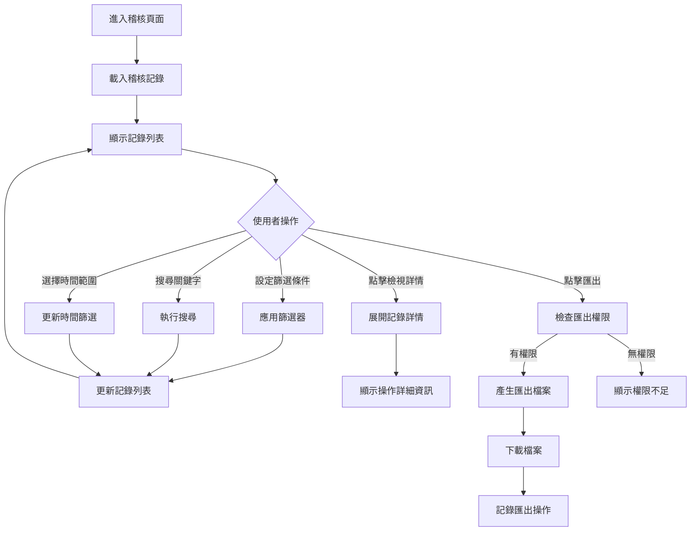
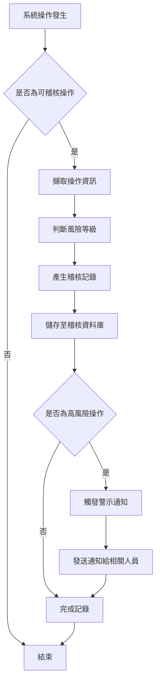

# Console Platform - Audit 產品規格書

## 一、User Stories

### 稽核記錄檢視

**作為資安人員，我希望能夠檢視所有系統操作的稽核記錄，以便監控系統安全和合規性。**

- **Given** 我有稽核檢視權限
- **When** 我進入稽核管理頁面
- **Then** 我可以看到所有系統操作記錄（使用者、操作類型、操作對象、IP 位址、時間等）
- **And** 我可以使用搜尋和篩選功能找到特定記錄
- **And** 記錄按時間倒序排列，最新的在最上方

**作為系統管理員，我希望能夠檢視使用者行為軌跡，以便了解系統使用情況和問題排查。**

- **Given** 我有稽核檢視權限
- **When** 我搜尋特定使用者的操作記錄
- **Then** 我可以看到該使用者的所有操作歷史
- **And** 我可以按時間範圍和操作類型篩選記錄
- **And** 我可以檢視操作的詳細資訊和結果

### 稽核行為審核

**作為稽核人員，我希望能夠對需要審核的行為進行核准或駁回。**

- **Given** 我有行為稽核權限
- **When** 系統中有待審核的行為記錄
- **Then** 我可以檢視行為詳情並進行稽核決定
- **And** 稽核結果會被記錄並通知相關人員

---

## 二、功能需求

### 2.1 稽核列表 (Audit)

#### 2.1.1 顯示欄位

**頁面元素**

- 頁面標題 "稽核記錄"
- 搜尋框
- 進階篩選器

**基本資訊**

| Column       | Description                              |
| ------------ | ---------------------------------------- |
| User/Member  | 操作使用者（帳號/暱稱）                  |
| Action       | 操作類型（登入、新增、編輯、刪除等）     |
| Resource     | 操作對象類型（使用者、角色、應用程式等） |
| Status       | 被稽核狀態                               |
| Trigger Time | 操作時間                                 |
| Details      | 詳細資訊                                 |
| Action       |                                          |

**篩選器選項**

- 關鍵字搜尋（使用者、操作對象）
- 操作類型篩選（多選）
- 資源類型篩選（多選）
- 使用者篩選（多選）
- 時間範圍選擇

**分頁資訊**

- 顯示總筆數
- 顯示總頁數
- 每頁顯示數量選擇（10/25/50/100）
- 分頁導覽（首頁/上頁/下頁/末頁）

#### 2.1.2 表單填寫欄位及驗證規則

**搜尋與篩選**

| Column   | Type         | Required | Rule               | Description    |
| -------- | ------------ | -------- | ------------------ | -------------- |
| Keyword  | Text         |          | length: 1-100 char | 搜尋使用者名稱 |
| Action   | Multi-Select |          | 預定義操作類型清單 | 操作類型篩選   |
| Resource | Multi-Select |          | 預定義資源類型清單 | 資源類型篩選   |

**指定操作**

| Operator | Allow Condition | Description    |
| -------- | --------------- | -------------- |
| Audit    |                 | 通過稽核該行為 |

#### 2.1.3 Action Flow

**稽核記錄檢視流程**

**稽核記錄產生流程**

#### 2.1.4 商業邏輯

1. **稽核記錄產生邏輯**
   - 記錄操作者資訊：使用者 ID、帳號、暱稱
   - 記錄操作資訊：操作類型、操作對象、操作描述
   - 記錄環境資訊：IP 位址、時間戳記、操作結果

2. **搜尋與篩選邏輯**
   - 關鍵字搜尋：支援模糊搜尋使用者名稱、操作對象名稱
   - 多個條件採用交集篩選
   - 操作類型、資源類型、狀態篩選採用多選

3. **排序邏輯**
   - 預設按時間倒序排列（最新的在前）
   - 支援按時間、使用者、操作類型排序

#### 2.1.5 權限設計

| Operator     | Permission     | Description        |
| ------------ | -------------- | ------------------ |
| 檢視稽核記錄 | audits.read    | 檢視和搜尋稽核記錄 |
| 行為稽核     | audits.approve | 審核行為           |

---
