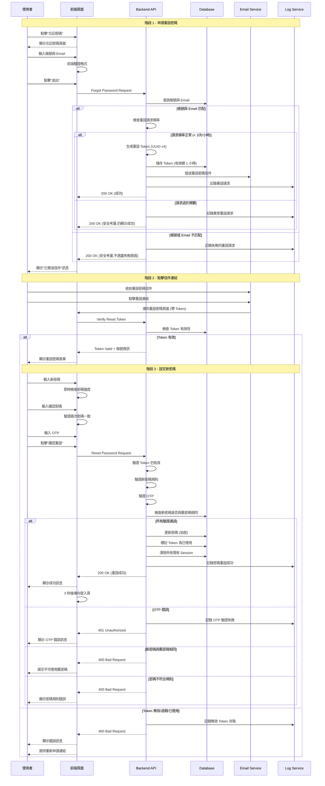

# Console Platform - 忘記密碼 產品規格書

## 一、User Stories

### 1.1 身份與需求

#### 行政人員

**As a** 行政人員  
**I want to** 快速且安全地重設忘記的密碼  
**So that** 我可以重新登入系統繼續完成工作

**Acceptance Criteria:**

- 重設流程簡單直觀
- 可透過自助流程重設密碼
- 支援 Email 驗證與 2FA 雙重安全機制

#### IT 人員

**As a** IT 人員  
**I want to** 安全地重設密碼  
**So that** 我可以重新取得系統存取權限並確保帳號安全性

**Acceptance Criteria:**

- 必須通過 2FA 驗證
- 重設過程有完整的安全記錄
- 可檢視重設歷史

### 1.2 使用場景

#### 場景：忘記密碼

使用者忘記密碼時:

1. 點擊"忘記密碼"連結
2. 輸入帳號與註冊信箱
3. 收到重設密碼信件
4. 點擊信件連結並輸入新密碼與 OTP
5. 完成重設後重新登入

---

## 二、功能需求

### 2.1 忘記密碼 (Forgot Password)

#### 2.1.1 顯示欄位

**忘記密碼頁面**

- 頁面標題 "重設密碼"
- 說明文字: "請輸入您的帳號與註冊信箱,我們將寄送重設密碼連結給您"
- 帳號輸入框
- Email 輸入框
- "送出" 按鈕
- "返回登入" 連結
- 安全提示: "重設連結將於 1 小時內有效"

**信件寄送成功頁面**

- 成功圖示
- 提示訊息: "重設密碼信件已寄出,請檢查您的信箱"
- 注意事項:
  - 請檢查垃圾郵件匣
  - 連結將於 1 小時內有效
  - 若未收到信件,可於 5 分鐘後重新寄送
- "重新寄送" 按鈕 (倒數計時)
- "返回登入" 連結

**重設密碼頁面**

- 頁面標題 "設定新密碼"
- 帳號顯示 (唯讀)
- 新密碼輸入框
- 確認密碼輸入框
- 密碼強度指示器
- OTP 驗證碼輸入框
- "確認重設" 按鈕
- 密碼規則說明

**重設成功頁面**

- 成功圖示
- 提示訊息: "密碼已成功重設"
- "3 秒後自動導向登入頁面" (倒數計時)
- "立即前往登入" 連結

#### 2.1.2 表單填寫欄位及驗證規則

| 欄位名稱 | 欄位類型        | 必填 | 驗證規則                                                                                   | 錯誤訊息                  |
| -------- | --------------- | ---- | ------------------------------------------------------------------------------------------ | ------------------------- |
| 帳號     | Text            | 是   | - 長度: 4-32 字元 - 格式: 英數字、底線、連字號                                          | "請輸入有效的帳號"        |
| Email    | Email           | 是   | - 標準 Email 格式驗證 - 長度: 最多 255 字元                                             | "請輸入有效的 Email 地址" |
| 新密碼   | Password        | 是   | - 長度: 8-128 字元 - 必須包含大寫、小寫、數字 - 不可與舊密碼相同 - 不可與帳號相同 | "密碼不符合安全要求"      |
| 確認密碼 | Password        | 是   | - 必須與新密碼一致                                                                         | "兩次輸入的密碼不一致"    |
| OTP      | Number (6 位數) | 是   | - 6 位數字 - 必須與 Authenticator 顯示一致                                              | "驗證碼錯誤,請重新輸入"   |

#### 2.1.3 Action Flow

#### 2.1.4 商業邏輯

**重設 Token 管理**

1. **Token 生成規則**

   - Token 格式: UUID v4
   - 有效期: 1 小時
   - 一次性使用 (使用後立即失效)
   - 每個帳號同時只能有一個有效 Token
   - 新 Token 生成時,舊 Token 自動失效

2. **重設請求限制**

   - 同一帳號: 1 小時內最多 3 次請求
   - 同一 IP: 1 小時內最多 10 次請求
   - 超過限制後暫時封鎖 (不影響正常登入)
   - 限制期間仍顯示成功訊息 (安全考量)

3. **新密碼驗證規則**

   - 長度: 8-128 字元
   - 必須包含:
     - 至少 1 個大寫字母
     - 至少 1 個小寫字母
     - 至少 1 個數字
   - 限制規則:
     - 不可與舊密碼相同
     - 不可與最近 3 次使用過的密碼相同
     - 不可與帳號相同
     - 不可為常見弱密碼

4. **OTP 驗證要求**

   - 重設密碼必須通過 2FA 驗證
   - OTP 允許 ±1 時間窗口容錯
   - OTP 錯誤 5 次後 Token 失效
   - 需重新申請重設密碼

5. **安全機制**

   - 不透露帳號是否存在 (防止帳號探測)
   - 不透露 Email 是否匹配
   - 即使請求失敗也顯示"已寄送信件"
   - 記錄所有重設請求 (包含失敗嘗試)
   - 異常頻繁的請求觸發警報

6. **密碼重設後的處理**
   - 清除所有現有 Session (強制重新登入)
   - 清除所有信任裝置 (需重新驗證 2FA)
   - 發送"密碼已變更"通知信件
   - 若使用者未申請,信件提示聯繫管理員
   - 記錄密碼變更事件

**Email 內容規範**

1. **重設密碼信件**

   - 主旨: "[Merak] 密碼重設請求"
   - 內容包含:
     - 帳號 (部分隱藏,如: user\*\*\*@example.com)
     - 請求時間
     - 請求來源 IP (部分隱藏)
     - 重設連結 (按鈕形式)
     - 有效期限 (1 小時)
     - 若非本人操作的處理建議
   - 安全提示:
     - 請勿將此信件轉寄他人
     - 連結僅可使用一次
     - 若未申請請忽略此信件

2. **密碼已變更通知信**
   - 主旨: "[Merak] 您的密碼已成功變更"
   - 內容包含:
     - 變更時間
     - 變更來源 IP
     - 若非本人操作請立即聯繫管理員
     - 管理員聯絡方式

#### 2.1.5 權限設計

| 操作               | 所需權限             | 說明                    |
| ------------------ | -------------------- | ----------------------- |
| 申請重設密碼       | 無                   | 所有使用者              |
| 重設密碼           | 無                   | 持有有效 Token 的使用者 |
| 檢視重設請求記錄   | auth.read_logs       | 資安人員                |
| 管理員強制重設密碼 | users.reset_password | 系統管理員 (緊急情況)   |

