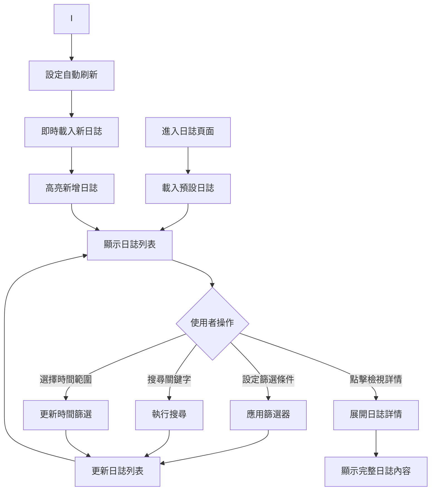
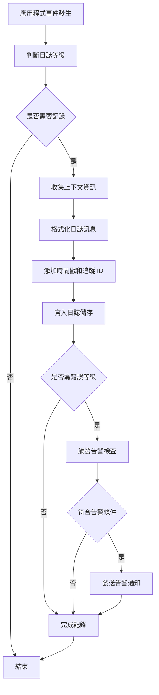

# Console Platform - Log 產品規格書

## 一、User Stories

### 系統日誌檢視

**作為系統管理員，我希望能夠檢視系統運行日誌，以便監控系統狀態和診斷問題。**

- **Given** 我有日誌檢視權限
- **When** 我進入日誌管理頁面
- **Then** 我可以看到所有系統運行記錄（應用程式、服務、錯誤、警告等）
- **And** 我可以使用搜尋和篩選功能找到特定日誌
- **And** 日誌按時間倒序排列，最新的在最上方

**作為開發人員，我希望能夠檢視應用程式錯誤日誌，以便快速定位和修復問題。**

- **Given** 我有日誌檢視權限
- **When** 我需要調查系統錯誤
- **Then** 我可以按錯誤等級篩選日誌
- **And** 我可以檢視詳細的錯誤訊息和堆疊追蹤
- **And** 我可以按應用程式和時間範圍搜尋錯誤日誌

### 日誌搜尋與分析

**作為技術支援人員，我希望能夠深度搜尋日誌內容，以便分析問題模式和趨勢。**

- **Given** 我有日誌檢視權限
- **When** 我需要分析特定問題
- **Then** 我可以使用關鍵字搜尋日誌內容
- **And** 我可以使用多種條件組合篩選（時間、等級、來源、使用者等

### 日誌清理與維護

**作為系統管理員，我希望能夠管理日誌存儲，以便控制系統資源使用。**

- **Given** 我有日誌管理權限
- **When** 我需要管理存儲空間
- **Then** 我可以檢視日誌存儲使用情況
- **And** 系統會自動清理過期日誌

### 日誌告警設定

**作為維運人員，我希望能夠設定日誌告警規則，以便自動通知重要事件。**

- **Given** 我有告警設定權限
- **When** 我需要監控特定類型的錯誤
- **Then** 我可以設定基於日誌內容的告警規則
- **And** 當匹配條件時系統會自動發送通知
- **And** 我可以設定不同等級的通知方式

### 權限控制

**作為系統，我希望能夠根據使用者權限控制日誌存取，以確保敏感資訊安全。**

- **Given** 使用者登入系統
- **When** 使用者嘗試存取日誌功能
- **Then** 系統會檢查使用者是否有對應權限（logs.read, logs.export, logs.admin）
- **And** 沒有權限的功能會被隱藏
- **And** 敏感日誌資訊會根據權限進行遮罩

---

## 二、功能需求

### 2.1 紀錄列表 (Log)

#### 2.1.1 顯示欄位

**頁面元素**

- 頁面標題 "系統日誌"
- 搜尋框
- 進階篩選器
- 時間範圍選擇器
- 自動刷新控制

**基本資訊**

| Column       | Description                             |
| ------------ | --------------------------------------- |
| Created At   | 日誌產生時間                            |
| Level        | 日誌等級（DEBUG/INFO/WARN/ERROR/FATAL） |
| Resource     | 日誌來源（應用程式/服務/模組）          |
| Category     | 日誌分類（系統/業務/安全/效能）         |
| Message      | 日誌訊息                                |
| Context Data | 上下文資料（JSON 格式，可展開檢視）     |

**等級指示**

- DEBUG：灰色標籤
- INFO：藍色標籤
- WARN：橙色標籤
- ERROR：紅色標籤

**來源指示**

- 應用程式
- 系統服務
- 內部模組
- 外部 API

**篩選器選項**

- 關鍵字搜尋（訊息內容、例外資訊）
- 日誌等級篩選（多選）
- 來源應用程式篩選（多選）
- 日誌分類篩選（多選）
- 時間範圍選擇

**分頁資訊**

- 顯示總筆數
- 顯示總頁數
- 每頁顯示數量選擇（50/100/200/500）
- 分頁導覽（首頁/上頁/下頁/末頁）
- 跳轉到指定頁面

#### 2.1.2 表單填寫欄位及驗證規則

**搜尋與篩選**

| Column     | Type         | Required | Rule               | Description      |
| ---------- | ------------ | -------- | ------------------ | ---------------- |
| Keyword    | Text         |          | length: 1-500 char | 搜尋日誌訊息內容 |
| Level      | Multi-Select |          | 預定義等級清單     | 日誌等級篩選     |
| Source     | Multi-Select |          | 預定義來源清單     | 日誌來源篩選     |
| Category   | Multi-Select |          | 預定義分類清單     | 日誌分類篩選     |
| User ID    | Multi-Select |          | 使用者 ID 清單     | 使用者篩選       |
| IP Address | Text         |          | IPv4/IPv6 格式     | IP 位址搜尋      |
| Request ID | Text         |          | UUID/字串格式      | 請求追蹤 ID 搜尋 |
| Start Time | DateTime     |          | ISO 8601 格式      | 開始時間         |
| End Time   | DateTime     |          | ISO 8601 格式      | 結束時間         |
| Exception  | Text         |          | 例外類別名稱       | 例外類型篩選     |

**指定操作**

| Operator  | Allow Condition | Description      |
| --------- | --------------- | ---------------- |
| View      | All             | 檢視日誌詳情     |
| Search    | All             | 搜尋和篩選日誌   |
| Configure | logs.admin      | 設定日誌保留政策 |

#### 2.1.3 Action Flow

**日誌檢視流程**

**日誌產生流程**

#### 2.1.4 商業邏輯

1. **日誌收集與分類邏輯**

   **日誌等級定義**

   - DEBUG：開發調試資訊，僅開發環境記錄
   - INFO：一般資訊記錄，正常操作流程
   - WARN：警告訊息，潛在問題但不影響系統運行
   - ERROR：錯誤訊息，功能異常但系統可繼續運行
   - FATAL：致命錯誤，系統無法繼續運行

   **日誌來源分類**

   - 應用程式：業務邏輯、使用者操作、API 請求
   - 系統服務：作業系統、服務程序、中介軟體
   - 資料庫：SQL 查詢、連接、效能、錯誤
   - 外部 API：第三方服務呼叫、回應、錯誤

   **日誌分類**

   - 系統：系統啟動、關閉、設定變更、資源使用
   - 業務：使用者操作、交易、流程執行
   - 安全：登入、權限、存取控制、異常行為
   - 效能：回應時間、資源使用、瓶頸分析

2. **搜尋與篩選邏輯**

   **搜尋邏輯**

   - 關鍵字搜尋：支援全文搜尋日誌訊息和例外資訊
   - 精確搜尋：使用引號進行精確匹配搜尋
   - 規則運算式：支援進階模式匹配
   - 排除搜尋：使用 NOT 運算子排除特定內容

   **篩選邏輯**

   - 多個條件採用交集篩選
   - 等級篩選：可選擇多個等級進行 OR 運算
   - 來源篩選：可選擇多個來源進行 OR 運算
   - 時間範圍：支援絕對時間和相對時間（最近 1 小時/1 天/1 週）

3. **排序與分頁邏輯**

   **預設排序**

   - 按時間戳倒序排列（最新的在前）
   - 相同時間戳按日誌等級排序（FATAL > ERROR > WARN > INFO > DEBUG）

   **手動排序**

   - 支援按時間、等級、來源、使用者排序
   - 可設定正序、倒序

   **分頁處理**

   - 伺服器端分頁，減少資料傳輸量
   - 支援虛擬捲動以處理大量日誌
   - 智慧預載入下一頁資料

4. **告警與通知邏輯**

   **告警規則**

   - ERROR 等級日誌每分鐘超過 10 筆觸發告警
   - FATAL 等級日誌立即觸發告警
   - 特定關鍵字出現觸發告警
   - 自訂規則支援複雜條件組合

5. **資料保留與清理邏輯**

   **保留期限**

   - 超過 7 日均冷資料管理
   - DEBUG/INFO：保留 30 天
   - WARN：保留 90 天
   - ERROR/FATAL：保留 180 天
   - 重要業務日誌：保留 365 年

   **自動清理**

   - 每日凌晨執行清理任務
   - 分批刪除避免影響系統效能
   - 清理前自動備份重要日誌

   **存儲優化**

   - 舊日誌壓縮存儲
   - 索引優化提升查詢效能
   - 分表存儲處理大量日誌

#### 2.1.5 權限設計

| Operator     | Permission | Description        | Scope        |
| ------------ | ---------- | ------------------ | ------------ |
| 檢視日誌記錄 | logs.read  | 檢視和搜尋日誌記錄 | 所有日誌記錄 |

**權限層級說明**

1. **基礎檢視權限 (logs.read)**

   - 可檢視日誌記錄列表
   - 可使用搜尋和篩選功能
   - 可檢視日誌詳細資訊
   - 無法存取敏感系統日誌（如密碼相關）

2. **管理權限 (logs.admin)**
   - 繼承所有檢視、監控和告警權限
   - 可設定日誌保留政策
   - 可管理日誌存儲設定
   - 可檢視系統效能指標

**資料存取限制**

1. **應用程式範圍限制**

   - 開發人員只能檢視所負責應用程式的日誌
   - 系統管理員可檢視所有應用程式日誌
   - 跨應用程式日誌對相關團隊成員可見

2. **日誌等級限制**

   - 基礎使用者：可檢視 INFO/WARN/ERROR 等級
   - 開發人員：可檢視 DEBUG/INFO/WARN/ERROR 等級
   - 系統管理員：可檢視所有等級日誌

3. **敏感資料遮罩**
   - 個人資料：自動遮罩敏感欄位
   - 密碼相關：完全隱藏密碼內容
   - API 金鑰：部分遮罩顯示

---
