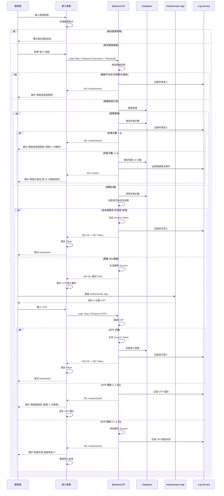
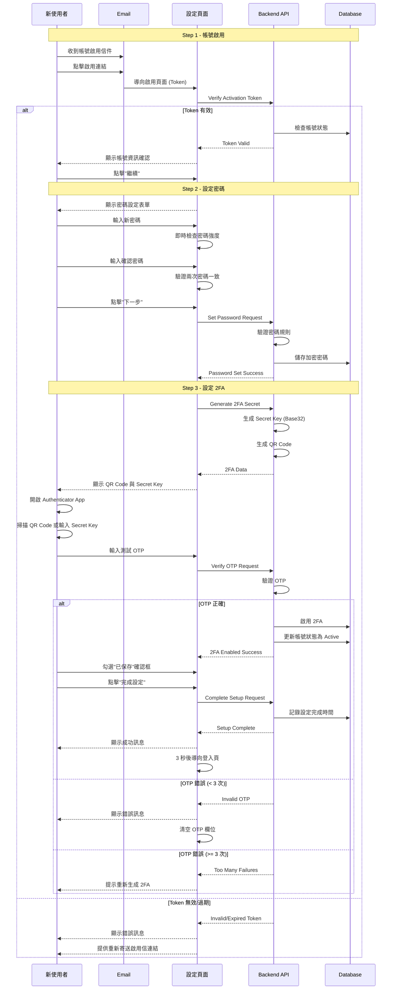
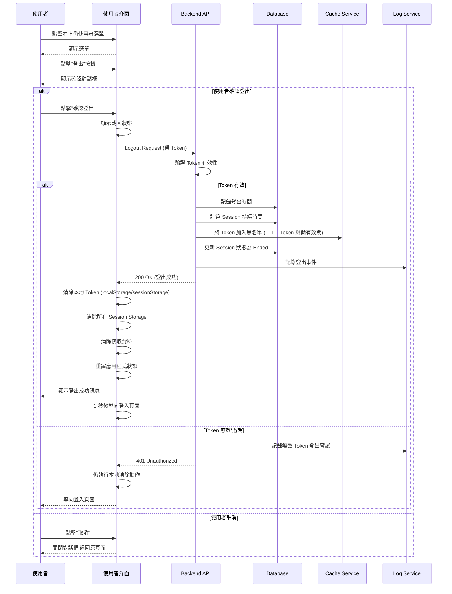
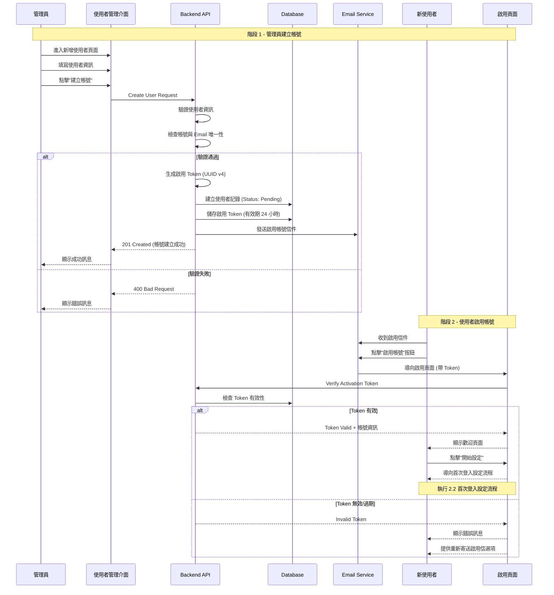

# Console Platform - Login System 產品規格書

## 一、User Stories

### 1.1 身份與需求

#### 系統管理者

**As a** 系統管理者  
**I want to** 安全地登入 Console 平台  
**So that** 我可以管理企業網路權限並確保系統安全性

**Acceptance Criteria:**

- 必須通過帳號密碼與 2FA 雙重驗證
- 登入後可存取所有管理功能
- 所有登入行為皆有完整記錄

#### 行政人員

**As a** 行政人員  
**I want to** 快速且安全地登入系統  
**So that** 我可以申請和查看權限狀態,完成日常工作

**Acceptance Criteria:**

- 登入流程簡單直觀
- 支援"記住我"功能減少重複登入
- 可透過自助流程重設密碼

#### IT 人員

**As a** IT 人員  
**I want to** 快速且安全地登入系統  
**So that** 我可以管理網路資源並確保系統符合企業資安政策

**Acceptance Criteria:**

- 支援 2FA 強化安全性
- 可查看自己的登入歷史
- 異常登入時收到通知

#### 資安人員

**As a** 資安人員  
**I want to** 查看所有登入記錄與異常行為

**Acceptance Criteria:**

- 可檢視所有使用者登入記錄
- 可偵測異常登入模式

### 1.2 使用場景

#### 場景一: 首次登入

使用者收到帳號啟用信件後,首次登入系統需要:

1. 點擊信件中的啟用連結
2. 設定個人密碼
3. 設定 2FA (綁定 Authenticator App)
4. 保存備用代碼
5. 完成後進入系統

#### 場景二: 日常登入

使用者每日登入時:

1. 輸入帳號密碼
2. 輸入 Authenticator App 提供的 6 位數 OTP
3. 選擇是否記住此裝置 (7 天內免 2FA)
4. 成功登入後進入 Dashboard

#### 場景四: 安全登出

使用者完成工作後:

1. 點擊右上角使用者選單
2. 選擇"登出"
3. 確認登出操作
4. 系統清除 Session 並導向登入頁

---

## 二、功能需求

### 2.1 登入頁面 (Login Page)

#### 2.1.1 顯示欄位

**頁面元素**

- 系統 Logo (Merak)
- 系統名稱 "Merak Console - 天璇企業網路權限管理系統"
- 登入表單區塊
- "忘記密碼?" 連結 (連結至忘記密碼功能,參考 forgot-password.md)
- 安全提示文字: "請妥善保管您的帳號密碼,切勿與他人分享"
- 版本資訊 (頁面底部)
- 系統狀態指示燈 (正常/維護)

**登入表單**

- 帳號輸入框
- 密碼輸入框
- OTP 輸入框 (第二階段顯示)
- "記住我" 核取方塊
- "登入" 按鈕
- 登入狀態載入動畫

#### 2.1.2 表單填寫欄位及驗證規則

| 欄位名稱        | 欄位類型        | 必填 | 驗證規則                                                            | 錯誤訊息                                              |
| --------------- | --------------- | ---- | ------------------------------------------------------------------- | ----------------------------------------------------- |
| 帳號 (Username) | Text            | 是   | - 長度: 4-32 字元 - 格式: 英數字、底線、連字號 - 不區分大小寫 | "帳號格式錯誤,請使用 4-32 字元的英數字、底線或連字號" |
| 密碼 (Password) | Password        | 是   | - 長度: 8-128 字元 - 不可為純空白                                | "請輸入密碼"                                          |
| OTP 驗證碼      | Number (6 位數) | 是   | - 必須為 6 位數字 - 不可包含空格或其他字元                       | "請輸入 6 位數驗證碼"                                 |
| 記住我          | Checkbox        | 否   | - 勾選後 7 天內免 2FA - 僅記憶當前瀏覽器與裝置                   | -                                                     |
| CSRF Token      | Hidden          | 是   | - 自動生成 - 每次頁面載入更新                                    | "安全驗證失敗,請重新整理頁面"                         |

#### 2.1.3 Action Flow

#### 2.1.4 商業邏輯

**登入安全機制**

1. **OTP 驗證規則**

   - OTP 有效期: 30 秒
   - 允許 ±1 時間窗口容錯 (共 90 秒有效期)
   - 同一 OTP 不可重複使用
   - OTP 錯誤 3 次後需重新輸入帳號密碼

2. **Session 管理**

   - Access Token 有效期: 8 小時
   - Refresh Token 有效期: 7 天
   - Token 採用 JWT 格式
   - 包含使用者 ID、角色、權限資訊
   - Token 過期前 30 分鐘自動更新

3. **安全記錄**

   - 記錄所有登入嘗試 (成功/失敗)
   - 記錄內容包含:
     - 時間戳記
     - 帳號
     - IP 位址
     - 裝置資訊 (user-agent)
     - 結果 (成功/失敗/鎖定)
   - 記錄保存 90 天

4. **登入嘗試限制**

   - 同一帳號 5 分鐘內允許 5 次登入嘗試
   - 超過限制後帳號自動鎖定 15 分鐘
   - 鎖定期間所有登入嘗試皆失敗
   - 管理員可手動解除鎖定

5. **裝置信任機制**

   - 勾選"記住我"後,當前裝置 7 天內免 2FA
   - 使用瀏覽器指紋識別裝置
   - 每個帳號最多信任 5 台裝置
   - 可在設定中管理信任裝置清單

6. **異常登入偵測**
   - 偵測異常 IP 位址登入
   - 偵測異常時段登入
   - 偵測異常地理位置登入
   - 偵測到異常時:
     - 強制要求 2FA (即使為信任裝置)
     - 發送通知信件給使用者
     - 記錄為高風險事件

#### 2.1.5 權限設計

| 操作         | 所需權限       | 說明                |
| ------------ | -------------- | ------------------- |
| 登入系統     | 無             | 所有使用者皆可登入  |
| 檢視登入記錄 | auth.read_logs | 資安人員、IT 主管   |
| 解除帳號鎖定 | auth.unlock    | IT 主管、系統管理員 |
| 重設 2FA     | auth.reset_2fa | IT 主管、系統管理員 |
| 匯出登入報告 | auth.export    | 資安人員            |

---

### 2.2 首次登入 - 帳號啟用與設定 (First Login Setup)

#### 2.2.1 顯示欄位

**步驟指示器**

- Step 1/3: 啟用帳號
- Step 2/3: 設定密碼
- Step 3/3: 設定 2FA

**Step 1 - 啟用帳號**

- 歡迎訊息
- 帳號資訊確認 (帳號、Email)
- "繼續" 按鈕

**Step 2 - 設定密碼**

- 新密碼輸入框
- 確認密碼輸入框
- 密碼規則說明
- "下一步" 按鈕

**Step 3 - 設定 2FA**

- QR Code (可掃描)
- Secret Key (文字格式,可複製)
- Authenticator App 下載連結:
  - Google Authenticator (iOS/Android)
    - Microsoft Authenticator (iOS/Android)
    - Authy (iOS/Android/Desktop)
- 設定說明文字
- 測試驗證碼輸入欄位
- "完成設定" 按鈕

#### 2.2.2 表單填寫欄位及驗證規則

| 欄位名稱 | 欄位類型        | 必填 | 驗證規則                                                                                               | 錯誤訊息                                |
| -------- | --------------- | ---- | ------------------------------------------------------------------------------------------------------ | --------------------------------------- |
| 新密碼   | Password        | 是   | - 長度: 8-128 字元 - 必須包含大寫字母 - 必須包含小寫字母 - 必須包含數字 - 建議包含特殊符號 | "密碼不符合規範"                        |
| 確認密碼 | Password        | 是   | - 必須與新密碼一致                                                                                     | "兩次輸入的密碼不一致"                  |
| 測試 OTP | Number (6 位數) | 是   | - 6 位數字 - 必須與 Authenticator 顯示一致 - 允許 3 次錯誤                                       | "驗證碼錯誤,請重新輸入 (剩餘 X 次機會)" |

#### 2.2.3 Action Flow

#### 2.2.4 商業邏輯

**帳號啟用流程**

1. **啟用 Token 生成**

   - Token 格式: UUID v4
   - 有效期: 24 小時
   - 一次性使用
   - 每個帳號同時只能有一個有效 Token

2. **密碼設定規則**

   - 長度: 8-128 字元
   - 必須包含:
     - 至少 1 個大寫字母 (A-Z)
     - 至少 1 個小寫字母 (a-z)
     - 至少 1 個數字 (0-9)
   - 建議包含:
     - 至少 1 個特殊符號 (!@#$%^&\*()\_+-=[]{}|;:,.<>?)
   - 限制規則:
     - 不可與帳號相同
     - 不可為常見弱密碼 (如: password123)
     - 不可包含連續 3 個以上相同字元
   - 密碼強度評估:
     - 弱: 僅符合基本要求
     - 中: 長度 >= 12 或包含特殊符號
     - 強: 長度 >= 16 且包含特殊符號

3. **2FA Secret Key 生成**

   - 演算法: TOTP (Time-based OTP)
   - 編碼: Base32
   - 長度: 32 字元
   - 時間步長: 30 秒
   - Hash 演算法: SHA-1
   - OTP 長度: 6 位數

4. **QR Code 生成**

   - 格式: `otpauth://totp/Merak:{username}?secret={secret}&issuer=Merak`
   - 尺寸: 200x200 pixels
   - 容錯級別: M (Medium)

5. **設定完成條件**

   - 必須完成密碼設定
   - 必須完成 2FA 驗證 (測試 OTP 正確)
   - 完成後帳號狀態更新為 Active

6. **設定流程暫存**
   - 允許中斷並稍後繼續
   - 暫存資料保存於 Session (有效期 1 小時)
   - 暫存內容包含:
     - 當前步驟
     - 已設定的密碼 (加密)
     - 已生成的 Secret Key
   - Token 過期後需重新開始

#### 2.2.5 權限設計

| 操作               | 所需權限       | 說明                   |
| ------------------ | -------------- | ---------------------- |
| 啟用帳號           | 無             | 所有新使用者           |
| 重新寄送啟用信     | 無             | Token 過期時可重新寄送 |
| 管理員強制啟用帳號 | users.activate | 系統管理員可手動啟用   |

---

### 2.3 登出 (Logout)

#### 2.3.1 顯示欄位

**登出確認對話框**

- 對話框標題 "確認登出"
- 提示訊息: "您確定要登出系統嗎?"
- 注意事項: "未儲存的變更將會遺失"
- "確認登出" 按鈕
- "取消" 按鈕

**登出處理中**

- 載入動畫
- 提示訊息: "正在登出..."

**登出成功**

- 成功圖示
- 提示訊息: "已成功登出"
- "1 秒後自動導向登入頁面" (倒數計時)

#### 2.3.2 Action Flow

#### 2.3.3 商業邏輯

**登出流程**

1. **Token 處理**

   - 將 Access Token 加入 Redis 黑名單
   - TTL 設為 Token 剩餘有效期
   - 過期後自動從黑名單移除
   - Refresh Token 同步加入黑名單

2. **Session 記錄**

   - 記錄登出時間
   - 計算 Session 持續時間
   - 更新 Session 狀態為 Ended
   - 記錄登出方式 (主動/被動)

3. **本地清除**

   - 清除 localStorage 的所有認證資訊
   - 清除 sessionStorage 的所有資料
   - 清除 IndexedDB 快取 (如有)
   - 重置 Redux/Vuex 等狀態管理
   - 清除所有 Cookies (除必要的設定)

4. **同步登出機制**
   - 若使用者在多個瀏覽器分頁登入
   - 一個分頁登出時,其他分頁偵測到 storage 變化
   - 自動觸發同步登出
   - 使用 BroadcastChannel API 或 storage 事件

**自動登出機制**

1. **Token 過期自動登出**

   - 定期檢查 Token 有效期 (每 5 分鐘)
   - Token 過期前 5 分鐘顯示續期提示
   - 使用者可選擇續期或登出
   - 若無操作,Token 過期後自動登出

2. **閒置超時自動登出**

   - 監控使用者活動 (滑鼠、鍵盤、觸控)
   - 閒置時間超過設定值 (預設 30 分鐘)
   - 顯示倒數計時警告 (60 秒)
   - 使用者可選擇繼續或登出
   - 倒數結束後自動登出

3. **異常情況強制登出**
   - 偵測到異地登入 (不同 IP/地理位置)
   - 偵測到帳號權限變更
   - 偵測到帳號被停用
   - 偵測到密碼被重設
   - 立即清除 Session 並登出

**多裝置登入管理**

1. **登入裝置追蹤**

   - 記錄每個 Session 的裝置資訊
   - 包含: 裝置類型、瀏覽器、作業系統、IP
   - 使用者可在設定中檢視所有登入裝置
   - 可遠端登出特定裝置

2. **並行 Session 限制**

   - 預設允許 5 個並行 Session
   - 超過限制時,登出最舊的 Session
   - 高權限帳號 (管理員) 限制更嚴格 (3 個)
   - 可在系統設定中調整限制

3. **全部登出功能**
   - 使用者可選擇登出所有裝置
   - 除當前裝置外,其他 Session 全部失效
   - 適用於帳號安全疑慮時使用
   - 執行後發送通知信件

**安全記錄**

1. **登出事件記錄**

   - 記錄內容:
     - 使用者 ID
     - 登出時間
     - Session 持續時間
     - 登出方式 (主動/自動/強制)
     - IP 位址
     - 裝置資訊
   - 保存期限: 90 天

2. **異常登出偵測**
   - 短時間內頻繁登入登出
   - 異常時段的登出行為
   - 登出後立即從不同 IP 登入
   - 觸發安全警報並記錄

#### 2.3.4 權限設計

| 操作               | 所需權限           | 說明                   |
| ------------------ | ------------------ | ---------------------- |
| 登出               | 無                 | 所有使用者             |
| 遠端登出特定裝置   | 無                 | 管理自己的登入裝置     |
| 全部裝置登出       | 無                 | 管理自己的所有 Session |
| 強制登出其他使用者 | auth.force_logout  | 系統管理員 (緊急情況)  |
| 檢視使用者 Session | auth.read_sessions | 系統管理員、資安人員   |

---

### 2.4 帳號註冊與啟用 (Account Registration & Activation)

#### 2.4.1 顯示欄位

**管理員建立使用者介面**

- 頁面標題 "新增使用者"
- 使用者資訊表單 (參考 User Management 規格)
- "建立帳號" 按鈕
- "取消" 按鈕

**建立成功提示**

- 成功圖示
- 提示訊息: "使用者帳號已建立,啟用信件已寄出"
- 顯示資訊:
  - 帳號
  - Email
  - 啟用連結有效期限
- "查看使用者列表" 連結
- "繼續新增使用者" 按鈕

**帳號啟用信件內容**

- 主旨: "[Merak] 歡迎加入 Merak Console"
- 內容:
  - 歡迎訊息
  - 帳號資訊 (帳號名稱)
  - 啟用帳號按鈕
  - 啟用連結 (文字格式)
  - 有效期限 (24 小時)
  - 若非本人請忽略此信件
  - 技術支援聯絡方式

**啟用頁面 (On Barding Page)**

- 系統 Logo
- 歡迎訊息: "歡迎使用 Merak Console"
- 帳號資訊顯示
- 引導文字: "請點擊下方按鈕開始設定您的帳號"
- "開始設定" 按鈕

#### 2.4.2 Action Flow

#### 2.4.3 商業邏輯

**帳號建立流程**

1. **建立權限控制**

   - 只有具備 `users.create` 權限的管理員可建立帳號
   - 建立時需指定角色 (Role)
   - 不可指派比自己權限更高的角色
   - Super Admin 只能由現有 Super Admin 建立

2. **帳號初始狀態**

   - Status: Pending (等待啟用)
   - 無法登入系統
   - 啟用前不計入授權數量
   - 24 小時內未啟用自動過期

3. **啟用 Token 規則**

   - Token 格式: UUID v4
   - 有效期: 24 小時
   - 一次性使用
   - 每個帳號只能有一個有效 Token
   - 使用後立即失效

4. **重新寄送啟用信**

   - Token 過期後可重新寄送
   - 同一帳號 1 小時內最多重新寄送 3 次
   - 重新寄送時生成新 Token,舊 Token 失效
   - 重新寄送需要管理員權限或使用原信件的重發連結

**啟用流程**

1. **Token 驗證**

   - 驗證 Token 格式
   - 檢查 Token 是否存在
   - 檢查 Token 是否過期
   - 檢查 Token 是否已使用
   - 檢查對應帳號狀態

2. **啟用成功處理**

   - 導向首次登入設定流程 (參考 2.2)
   - 包含:
     - 設定密碼
     - 設定 2FA (若系統啟用)
   - 完成後帳號狀態更新為 Active
   - 發送"帳號已啟用"通知信給管理員

3. **啟用失敗處理**
   - Token 無效: 顯示錯誤訊息
   - Token 過期: 提供重新寄送選項
   - 帳號已啟用: 導向登入頁面
   - 帳號已停用: 提示聯繫管理員

**系統預設設定**

1. **預設 2FA 設定**

   - 系統可設定是否預設啟用 2FA
   - 若啟用,首次登入必須設定 2FA
   - 若未啟用,使用者可選擇性設定

2. **密碼規則**

   - 遵循 2.2.2 的密碼驗證規則

**通知機制**

1. **建立帳號通知**

   - 發送給新使用者 (啟用信件)
   - 發送給建立者 (確認信件)
   - 副本給相關管理員 (可選)

2. **啟用成功通知**

   - 通知新使用者 (歡迎信件)
   - 通知建立者 (啟用確認)
   - 通知相關管理員

3. **Token 過期**

   - 提供重新寄送連結
   - 通知建立者處理

**安全機制**

1. **防止帳號探測**

   - 不透露帳號或 Email 是否存在
   - Token 無效時顯示一般性錯誤

2. **異常偵測**

   - 短時間內大量建立帳號
   - 多次重新寄送啟用信
   - 異常 IP 存取啟用連結
   - 觸發安全警報

#### 2.4.4 權限設計

| 操作           | 所需權限                | 說明                   |
| -------------- | ----------------------- | ---------------------- |
| 建立使用者帳號 | users.create            | 系統管理員、IT 主管    |
| 重新寄送啟用信 | users.resend_activation | 管理員或使用原信件連結 |
| 手動啟用帳號   | users.activate          | 系統管理員 (特殊情況)  |

---
