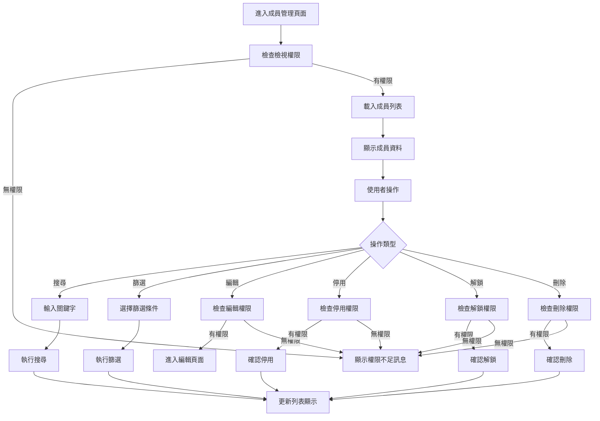
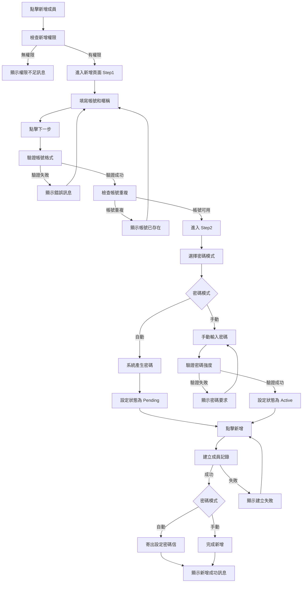
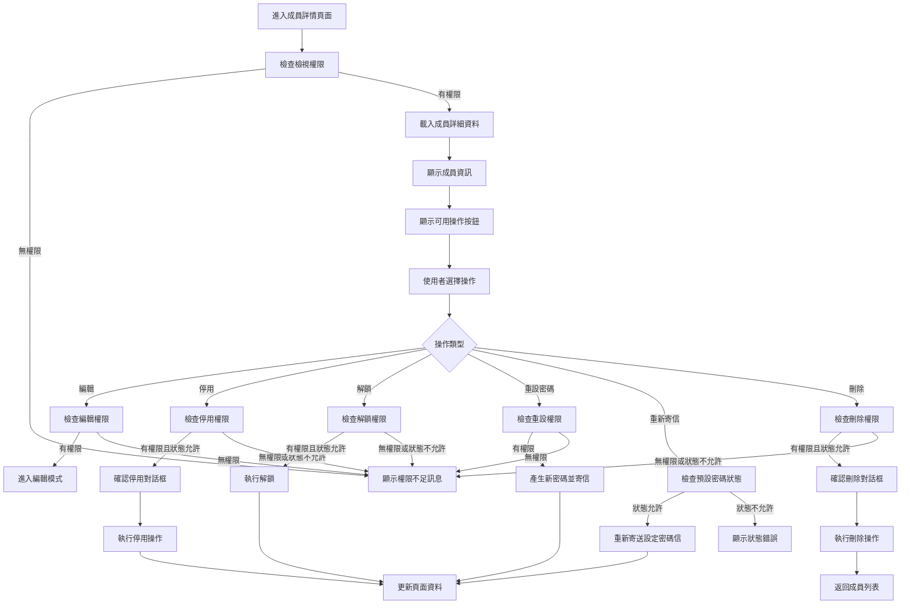
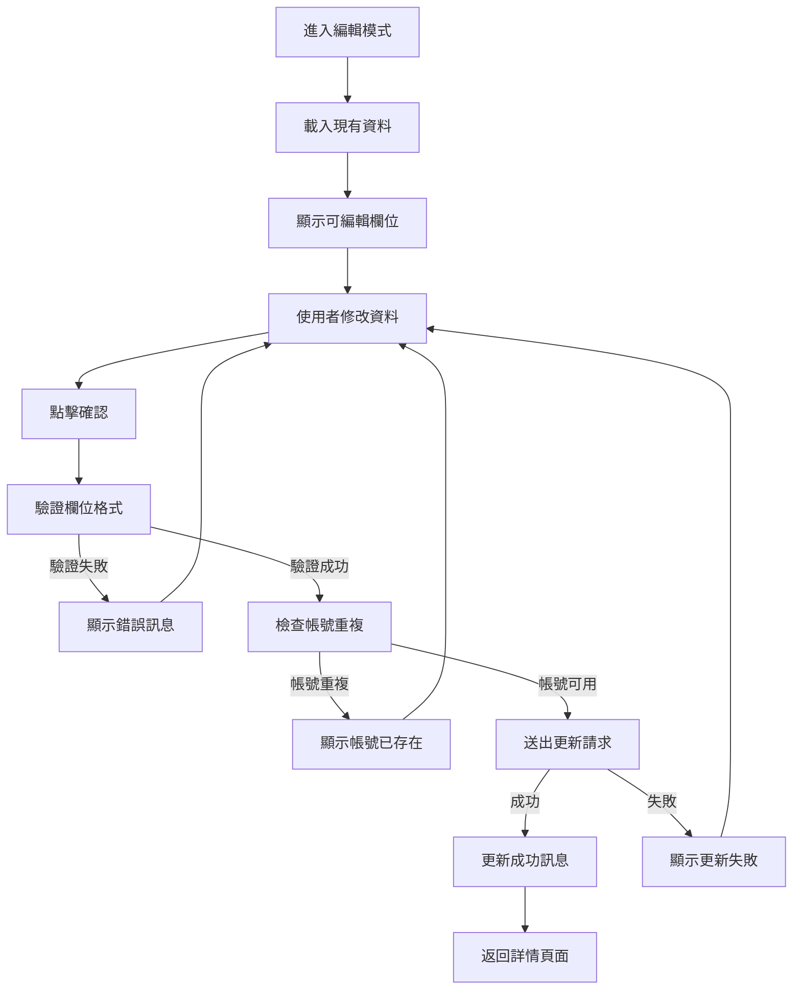
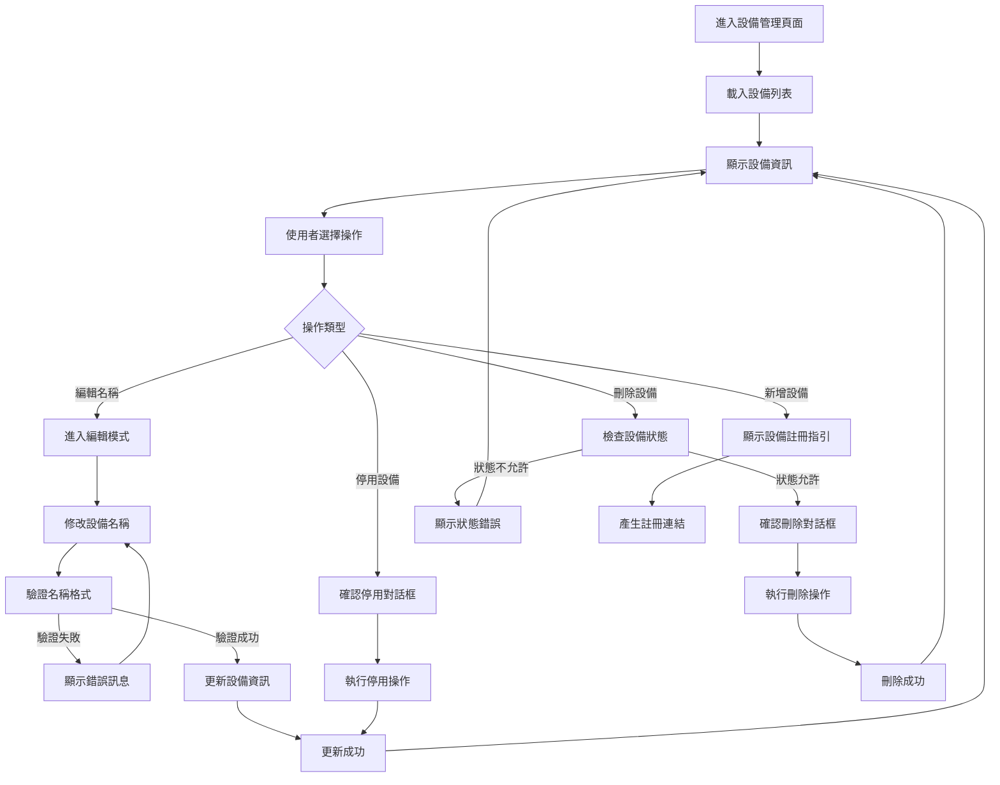

# Console Platform - Member 產品規格書

## 一、User Stories

### 成員列表管理

**作為系統管理員，我希望能夠檢視所有成員列表，以便管理組織內的使用者帳號。**

- **Given** 我有成員檢視權限
- **When** 我進入成員管理頁面
- **Then** 我可以看到所有成員的基本資訊（頭像、帳號、暱稱、組織、狀態、建立時間、更新時間）
- **And** 我可以使用搜尋功能找到特定成員
- **And** 我可以使用篩選器依照狀態和組織篩選成員

**作為系統管理員，我希望能夠對成員執行各種操作，以便管理帳號狀態。**

- **Given** 我有相應的操作權限
- **When** 我選擇特定成員
- **Then** 我可以根據成員當前狀態執行對應操作（編輯、停用、解鎖、刪除）
- **And** 系統會根據成員狀態顯示或隱藏相關操作按鈕

### 新增成員

**作為系統管理員，我希望能夠新增新成員，以便為新使用者建立帳號。**

- **Given** 我有新增成員權限
- **When** 我點擊「新增成員」按鈕
- **Then** 我可以分步驟填寫成員基本資訊（帳號、暱稱）和密碼設定
- **And** 系統會驗證帳號不重複且符合 Email 格式
- **And** 我可以選擇自動產生密碼或手動設定密碼

**作為系統管理員，我希望能夠為新成員設定密碼模式，以便控制帳號啟用方式。**

- **Given** 我正在新增成員
- **When** 我選擇自動密碼模式
- **Then** 系統會產生隨機密碼，成員狀態設為 Pending，並自動寄出設定密碼信
- **When** 我選擇手動密碼模式
- **Then** 我需要手動輸入密碼，成員狀態設為 Active
- **And** 我可以選擇是否強迫成員首次登入時更改密碼

### 檢視成員詳情

**作為系統管理員，我希望能夠檢視成員的詳細資訊，以便了解帳號狀態和相關設定。**

- **Given** 我有檢視成員權限
- **When** 我點擊特定成員
- **Then** 我可以看到成員的完整資訊（基本資料、組織、設備、2FA 狀態、預設密碼狀態等）
- **And** 我可以看到該成員已註冊的所有設備

**作為系統管理員，我希望能夠對成員執行管理操作，以便維護帳號安全。**

- **Given** 我在成員詳情頁面且有相應權限
- **When** 成員狀態允許特定操作
- **Then** 我可以執行停用、解鎖、重設密碼、刪除等操作
- **And** 重設密碼時系統會產生新的隨機密碼並寄出設定密碼信
- **And** 我可以重新寄送設定密碼信給成員

### 編輯成員資訊

**作為系統管理員，我希望能夠編輯成員的基本資訊，以便更新帳號資料。**

- **Given** 我有編輯成員權限
- **When** 我在成員詳情頁面點擊編輯
- **Then** 我可以修改成員的帳號、暱稱、所屬組織和允許存取的應用程式
- **And** 系統會驗證修改後的資料符合格式要求
- **And** 帳號修改時會檢查不與其他成員重複

### 設備管理

**作為系統管理員，我希望能夠管理成員的註冊設備，以便控制存取安全。**

- **Given** 我有設備管理權限
- **When** 我檢視成員的設備列表
- **Then** 我可以看到所有註冊設備的名稱、Token 和狀態
- **And** 我可以編輯設備名稱
- **And** 我可以停用或刪除設備（僅限停用狀態的設備可被刪除）

### 權限控制

**作為系統，我希望能夠根據使用者權限控制功能存取，以確保系統安全。**

- **Given** 使用者登入系統
- **When** 使用者嘗試存取成員管理功能
- **Then** 系統會檢查使用者是否有對應權限（members.read, members.create, members.update, members.deactivate, members.delete）
- **And** 沒有權限的功能按鈕會被隱藏
- **And** 嘗試無權限操作時會顯示權限不足訊息

### 錯誤處理

**作為使用者，我希望遇到錯誤時能獲得清楚的提示，以便知道如何解決問題。**

- **Given** 我在使用成員管理功能
- **When** 發生各種錯誤情況（權限不足、資料不存在、操作過於頻繁、系統異常等）
- **Then** 系統會顯示對應的錯誤訊息
- **And** 提供相應的處理建議（重新整理、修改條件、稍後再試等）
- **And** 對於欄位驗證錯誤會明確指出問題所在

---

## 二、功能需求

### 2.1 成員列表 (Member)

#### 2.1.1 顯示欄位

**頁面元素**

- 頁面標題 "成員管理"
- "新增成員" 按鈕
- 搜尋框
- 進階篩選器

**基本資訊**

| Column       | Description                  |
| ------------ | ---------------------------- |
| Avatar       | 個人頭像或預設圖示           |
| Account      | 系統帳號名稱，同時也是 Email |
| Nickname     | 顯示名稱                     |
| Organization | 所屬組織                     |
| Status       | 當前成員狀態                 |
| Created At   | 帳號建立時間                 |
| Updated At   | 資料最後被修改的時間         |
| Action       |                              |

**狀態指示**

- Active: 帳號正常使用中
- Pending: 等待啟用，該狀態無法登入
- Inactive: 已停用，該狀態無法登入，只有停用狀態才可刪除
- Locked: 已鎖定，該狀態無法登入，通常是錯誤操作造成

**篩選器選項**

- 關鍵字搜尋
- 狀態篩選 (多選)
- 組織篩選 (多選)

**分頁資訊**

- 顯示總筆數
- 顯示總頁數
- 每頁顯示數量選擇 (10/25/50/100)
- 分頁導覽 (首頁/上頁/下頁/末頁)

#### 2.1.2 表單填寫欄位及驗證規則

**搜尋與篩選**

| Column       | Type         | Required | Rule                           | Description    |
| ------------ | ------------ | -------- | ------------------------------ | -------------- |
| Keyword      | Text         |          | length: 1-50 char              | 搜尋帳號或暱稱 |
| Status       | Multi-Select |          | Active/Inactive/Pending/Locked | 成員狀態篩選   |
| Organization | Multi-Select |          | 組織清單                       | 組織歸屬篩選   |

**指定操作**

| Operator   | Allow Status            | Description    |
| ---------- | ----------------------- | -------------- |
| Edit       | Active/Inactive/Pending | 編輯成員資訊   |
| Deactivate | Active                  | 停用成員帳號   |
| Unlock     | Locked                  | 解鎖被鎖定帳號 |
| Delete     | Inactive/Pending        | 刪除成員帳號   |

**批次操作**

<!-- 暫時不規劃 -->

#### 2.1.3 Action Flow

#### 2.1.4 商業邏輯

**搜尋與篩選邏輯**

1. **搜尋邏輯**

   - 關鍵字搜尋: 支援模糊搜尋帳號、暱稱

2. **篩選邏輯**

   - 多個條件採用聯集篩選
   - 組織篩選採用多選交集篩選，無條件代表全部
   - 狀態篩選採用多選交集篩選，無條件代表全部

3. **排序邏輯**

   - 基礎排序: 預設使用更新時間之倒序
   - 手動排序: 支援建立時間、更新時間
   - 可對手動排序條件設定正序、倒序、不排序

4. **快取策略**

   - 成功發出搜尋，條件會快取於 URL
   - 針對搜尋請求採用 1000ms 防抖
   - 列表資料記憶體快取 5 min

#### 2.1.5 權限設計

| Operator       | Permission         | Description    |
| -------------- | ------------------ | -------------- |
| 檢視使用者列表 | members.read       | 基本檢視權限   |
| 新增使用者     | members.create     | 建立新帳號     |
| 編輯使用者     | members.update     | 修改使用者資訊 |
| 停用使用者     | members.deactivate | 停用帳號       |
| 刪除使用者     | members.delete     | 刪除帳號       |

---

### 2.2 新增成員 (Create Member)

#### 2.2.1 顯示欄位

**頁面元素**

- 頁面標題 "新增成員"
- "下一步" 按鈕驗證當前表單後往下一步前進
- "新增" 按鈕代表送出
- "取消" 按鈕代表退回

#### 2.2.2 表單填寫欄位及驗證規則

**新增資料**

| Column              | Type | Required | Default | Description                |
| ------------------- | ---- | -------- | ------- | -------------------------- |
| Account             | Text | true     |         | 系統帳號（Email 格式）     |
| Nickname            | Text | true     |         | 顯示名稱                   |
| Status              | Enum |          | Pending | 帳號狀態（唯讀）           |
| Password Mode       | Enum | true     | Auto    | 密碼模式（自動/手動）      |
| Password            | Text |          |         | 登入密碼（手動模式時必填） |
| Is Default Password | Bool | true     | true    | 是否為預設密碼             |

**指定操作**

| Operator | Description      |
| -------- | ---------------- |
| Next/Add | 觸發驗證並提交   |
| Cancel   | 取消並退回列表頁 |

#### 2.2.3 Action Flow

#### 2.2.4 商業邏輯

1. **表單邏輯**

   - 拆分欄位為不同步驟
     - Step1: Account, Nickname
     - Step2: Status, Password Mode, Password, First Password Change
   - 帳號不可重複，輸入完成時非同步驗證
   - 密碼設計邏輯
     - 如果為自動密碼，預設狀態為「Pending」，當完成時會發出自動寄出「設定密碼信」，點擊後將帳號狀態更改為「Active」，直接導向後完成登入
     - 如果為自動，成功進入後強迫設定密碼
     - 如果為手動，預設狀態為「Active」，需要設定密碼
     - 如果為手動，可設定初次成功進入強迫設定密碼

2. **驗證邏輯**

   - 帳號:
     - 必填
     - Email 格式
   - 暱稱:
     - 必填
     - 最大長度 50 字
   - 密碼:
     - 如果為手動，密碼為必填
     - 最大長度 20 字
     - 需包含一個英文大寫，一個英文小寫，一個數字

3. **信件邏輯**

   - 設定密碼信只有 1 小時時限，超過需要重新寄信
   - 每次重新寄信會註銷前一封信件的 Token

#### 2.2.5 權限設計

| Operator   | Permission     | Description |
| ---------- | -------------- | ----------- |
| 新增使用者 | members.create | 建立新帳號  |

---

### 2.3 檢視成員詳情 (View Member Detail)

#### 2.3.1 顯示欄位

**頁面元素**

- 頁面標題 "成員詳細資訊"
- "凍結成員" 按鈕
- "解鎖成員" 按鈕
- "重設密碼" 按鈕
- "刪除成員" 按鈕

**基本資訊**

| Column            | Description                  |
| ----------------- | ---------------------------- |
| Avatar            | 個人頭像或預設圖示           |
| Account           | 系統帳號名稱，同時也是 Email |
| Nickname          | 顯示名稱                     |
| Organization      | 所屬組織                     |
| Devices           | 已經註冊的設備               |
| Status            | 當前成員狀態                 |
| Created At        | 帳號建立時間                 |
| Updated At        | 資料最後被修改的時間         |
| 2FA               | 是否啟動 2FA                 |
| isDefaultPassword | 是否為預設密碼狀態           |
| Action            |                              |

**指定操作**

| Operator       | Allow Status            | Description                    |
| -------------- | ----------------------- | ------------------------------ |
| Deactivate     | Active                  |                                |
| Unlock         | Locked                  |                                |
| Reset Password | Active/Inactive/Pending |                                |
| Resend Email   |                         | 需要 isDefaultPassword 為 true |
| Delete         | Inactive/Pending        |                                |

#### 2.3.2 表單填寫欄位及驗證規則

#### 2.3.3 Action Flow

#### 2.3.4 商業邏輯

1. **指定操作**

   - 執行凍結，該成員即刻無法登入，Token 失效
   - 執行解鎖，通常上鎖成員是因為不正常操作導致系統執行上鎖
   - 執行重設密碼，系統會產生亂數密碼，isDefaultPassword 更新為 true，並寄出「設定密碼信」
   - 可以重新寄出設定密碼信，會將上一封信件的 Token 失效
   - 重設密碼會強制登出該成員所有設備

#### 2.3.5 權限設計

| Operator     | Permission            | Description        |
| ------------ | --------------------- | ------------------ |
| 檢視成員詳情 | members.read          | 檢視成員基本資訊   |
| 停用成員     | members.deactivate    | 停用成員帳號       |
| 解鎖成員     | members.unlock        | 解鎖被鎖定帳號     |
| 重設密碼     | members.resetpassword | 重設成員密碼       |
| 重新寄信     | members.resendemail   | 重新寄送設定密碼信 |
| 刪除成員     | members.delete        | 刪除成員帳號       |

---

### 2.4 編輯成員 (Edit Member)

#### 2.4.1 顯示欄位

**頁面元素**

- 延伸於詳細頁面
- "確認" 按鈕送出當前資訊
- "取消" 按鈕退出編輯模式

**可編輯資料**

| Column             | Type | Required | Description        |
| ------------------ | ---- | -------- | ------------------ |
| Account            | Text | true     | 系統帳號（Email）  |
| Nickname           | Text | true     | 顯示名稱           |
| Organizations      | List |          | 所屬組織列表       |
| Allow Applications | List |          | 允許存取的應用程式 |

#### 2.4.2 表單填寫欄位及驗證規則

**編輯資料驗證**

| Column             | Type | Required | Description        |
| ------------------ | ---- | -------- | ------------------ |
| Account            | Text | true     | 不可與其他成員重複 |
| Nickname           | Text | true     | 顯示名稱           |
| Organizations      | List |          | 多選組織歸屬       |
| Allow Applications | List |          | 多選應用程式權限   |

**驗證邏輯**

1. **帳號驗證**

   - 必填欄位
   - Email 格式檢查
   - 即時檢查帳號重複性

2. **暱稱驗證**

   - 必填欄位
   - 最大長度 50 字

#### 2.4.3 Action Flow

#### 2.4.4 商業邏輯

#### 2.4.5 權限設計

| Operator | Permission     | Description      |
| -------- | -------------- | ---------------- |
| 編輯成員 | members.update | 修改成員基本資訊 |

---

### 2.5 編輯成員設備 (Edit Member Device)

#### 2.5.1 顯示欄位

**頁面元素**

- 頁面標題 "成員設備管理"
- "新增設備" 按鈕
- "批量操作" 選項
- 設備列表顯示

**設備資訊**

| Column      | Type | Required | Description                     |
| ----------- | ---- | -------- | ------------------------------- |
| Device Name | Text | true     | 設備名稱（支援多語系）          |
| Device Type | Text |          | 設備類型（手機/電腦/平板/未知） |
| Token       | Text |          | 設備識別碼（Readonly）          |
| Status      | Enum |          | Normal/Inactive/Pending         |
| Last Login  | Date |          | 最後登入時間                    |
| Created At  | Date |          | 設備註冊時間                    |
| Action      |      |          | 操作按鈕                        |

**設備狀態說明**

- Normal: 設備正常可用
- Inactive: 設備已停用
- Pending: 等待驗證的設備

#### 2.5.2 表單填寫欄位及驗證規則

**設備管理表單**

| Column      | Type | Required | Rule           | Description      |
| ----------- | ---- | -------- | -------------- | ---------------- |
| Device Name | Text | true     | 最大長度 50 字 | 使用者自定義名稱 |
| Device Type | Enum |          | 手機/電腦/平板 | 設備類型分類     |

**操作驗證**

- 設備名稱:
  - 必填欄位
  - 最大長度 50 字
- 設備類型:
  - 可選欄位
  - 預設由系統自動識別

#### 2.5.3 Action Flow

#### 2.5.4 商業邏輯

1. **設備註冊邏輯**

   - 每個成員最多可註冊 5 個設備
   - 設備註冊需要驗證成員身份
   - 新設備預設狀態為 Pending
   - 驗證通過後狀態變更為 Normal

2. **設備名稱管理**

   - 初次註冊由系統自動產生名稱
   - 根據設備類型和時間產生預設名稱
   - 支援多語系顯示
   - 成員可自定義設備名稱

3. **設備狀態管理**

   - Normal 狀態設備可正常登入
   - Inactive 狀態設備無法登入
   - Pending 狀態設備等待驗證
   - 只有 Inactive 狀態設備可被刪除

4. **安全機制**
   - 停用設備會立即失效所有 Token
   - 刪除設備會移除所有相關登入記錄
   - 長時間未使用設備會自動標記為可疑
   - 異常登入行為會自動鎖定設備

#### 2.5.5 權限設計

| Operator     | Permission              | Description        |
| ------------ | ----------------------- | ------------------ |
| 檢視設備列表 | members.devices.read    | 檢視成員設備資訊   |
| 編輯設備     | members.devices.edit    | 修改設備名稱等資訊 |
| 停用設備     | members.devices.disable | 停用成員設備       |
| 刪除設備     | members.devices.delete  | 刪除成員設備       |

