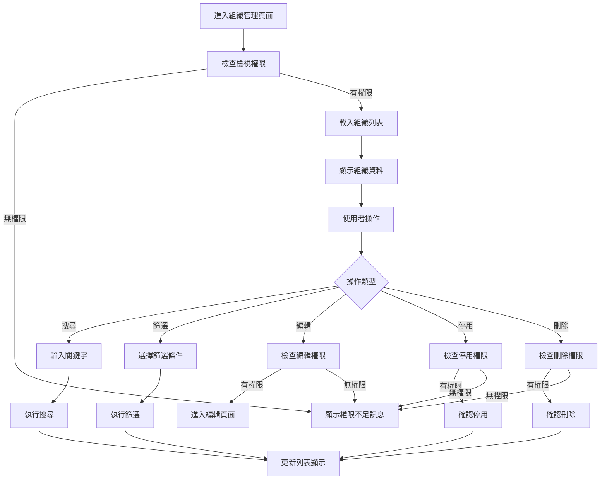
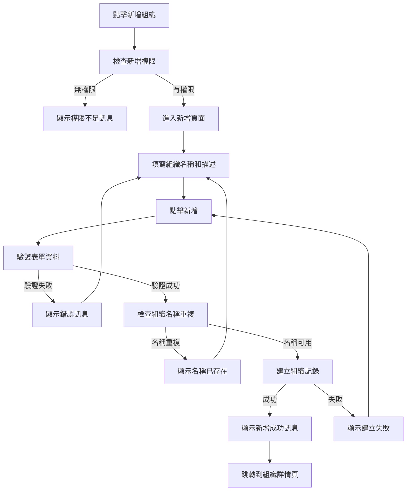
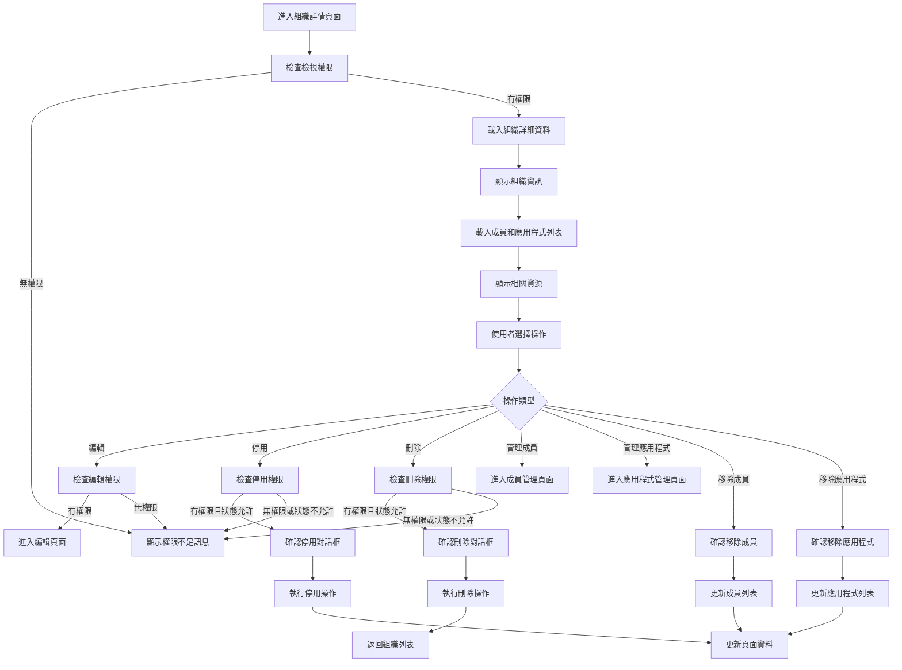
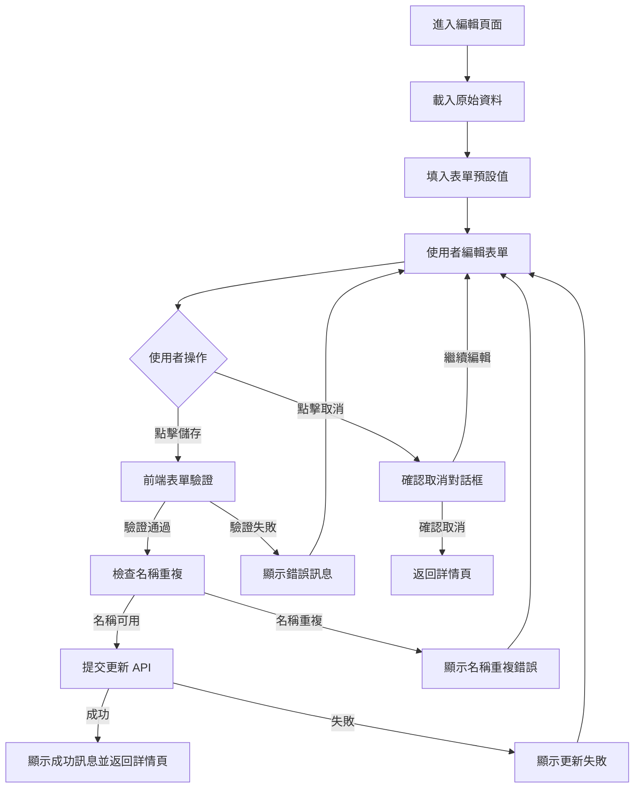
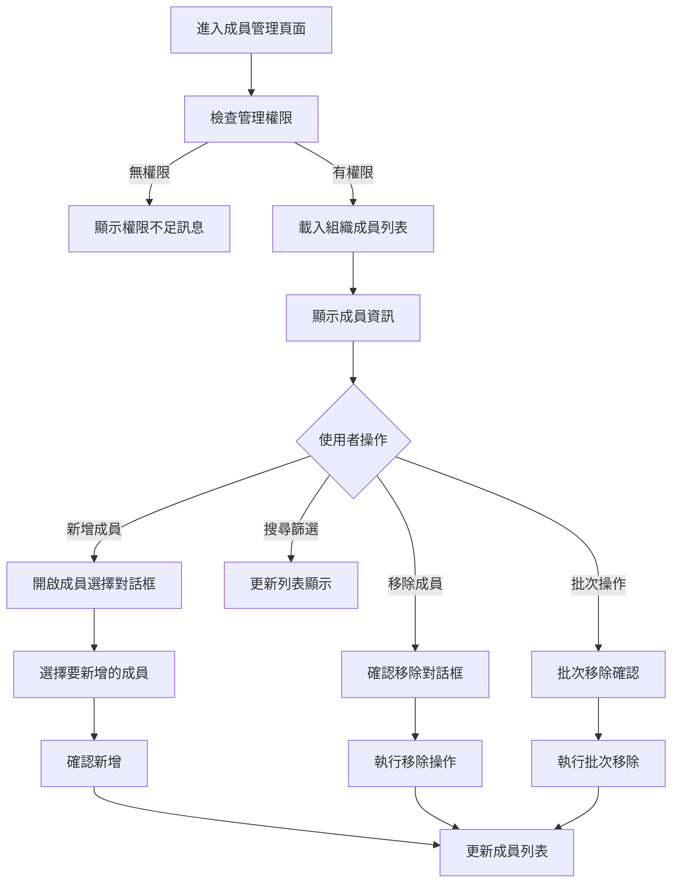
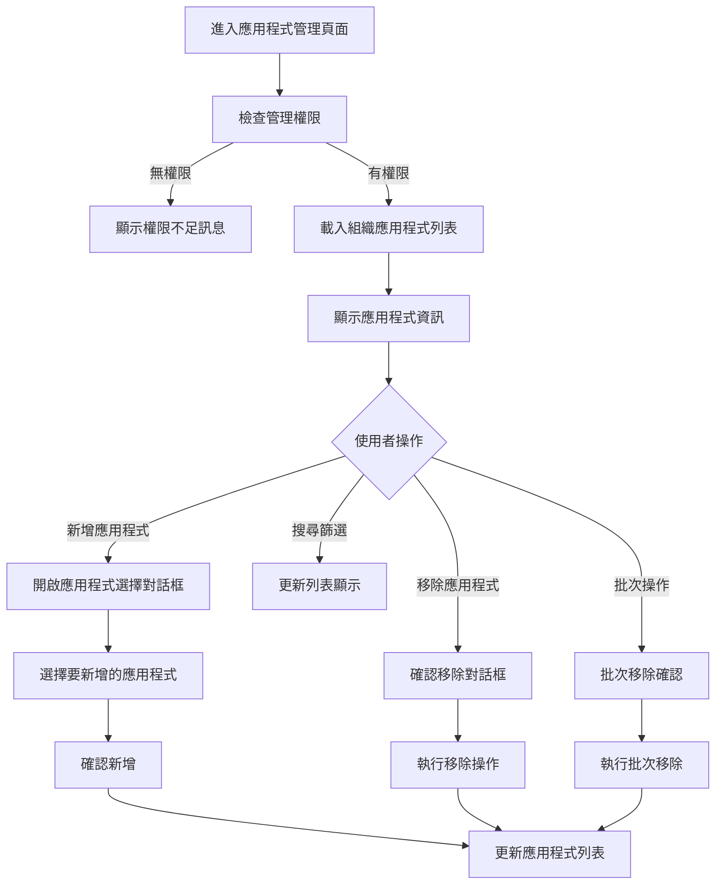

# Console Platform - Organization 產品規格書

## 一、User Stories

### 組織列表管理

**作為系統管理員，我希望能夠檢視所有組織列表，以便管理組織架構。**

- **Given** 我有組織檢視權限
- **When** 我進入組織管理頁面
- **Then** 我可以看到所有組織的基本資訊（名稱、描述、成員數量、應用程式數量、狀態、建立時間、更新時間）
- **And** 我可以使用搜尋功能找到特定組織
- **And** 我可以使用篩選器依照狀態篩選組織

**作為系統管理員，我希望能夠對組織執行各種操作，以便管理組織狀態。**

- **Given** 我有相應的操作權限
- **When** 我選擇特定組織
- **Then** 我可以根據組織當前狀態執行對應操作（編輯、停用、刪除）
- **And** 系統會根據組織狀態顯示或隱藏相關操作按鈕

### 新增組織

**作為系統管理員，我希望能夠新增新組織，以便建立組織架構。**

- **Given** 我有新增組織權限
- **When** 我點擊「新增組織」按鈕
- **Then** 我可以填寫組織基本資訊（名稱、描述）
- **And** 系統會驗證組織名稱不重複
- **And** 新增完成後可以為組織指派成員和應用程式

### 檢視組織詳情

**作為系統管理員，我希望能夠檢視組織的詳細資訊，以便了解組織狀態和相關資源。**

- **Given** 我有檢視組織權限
- **When** 我點擊特定組織
- **Then** 我可以看到組織的完整資訊（基本資料、成員列表、應用程式列表、統計資訊）
- **And** 我可以看到該組織所有成員和他們的狀態
- **And** 我可以看到該組織所有可存取的應用程式

### 編輯組織資訊

**作為系統管理員，我希望能夠編輯組織的基本資訊，以便更新組織設定。**

- **Given** 我有編輯組織權限
- **When** 我在組織詳情頁面點擊編輯
- **Then** 我可以修改組織的名稱、描述
- **And** 系統會驗證修改後的資料符合格式要求
- **And** 組織名稱修改時會檢查不與其他組織重複

### 組織成員管理

**作為系統管理員，我希望能夠管理組織內的成員，以便控制組織人員。**

- **Given** 我有組織成員管理權限
- **When** 我在組織詳情頁面檢視成員
- **Then** 我可以看到所有組織成員的狀態和資訊
- **And** 我可以新增成員到組織
- **And** 我可以移除組織內的成員
- **And** 我可以批次管理組織成員

### 組織應用程式管理

**作為系統管理員，我希望能夠管理組織可存取的應用程式，以便控制組織資源存取權限。**

- **Given** 我有組織應用程式管理權限
- **When** 我在組織詳情頁面檢視應用程式
- **Then** 我可以看到所有組織可存取的應用程式
- **And** 我可以為組織新增應用程式存取權限
- **And** 我可以移除組織的應用程式存取權限
- **And** 我可以設定組織內成員對不同應用程式的存取權限

### 權限控制

**作為系統，我希望能夠根據使用者權限控制功能存取，以確保系統安全。**

- **Given** 使用者登入系統
- **When** 使用者嘗試存取組織管理功能
- **Then** 系統會檢查使用者是否有對應權限（organizations.read, organizations.create, organizations.update, organizations.deactivate, organizations.delete）
- **And** 沒有權限的功能按鈕會被隱藏
- **And** 嘗試無權限操作時會顯示權限不足訊息

### 錯誤處理

**作為使用者，我希望遇到錯誤時能獲得清楚的提示，以便知道如何解決問題。**

- **Given** 我在使用組織管理功能
- **When** 發生各種錯誤情況（權限不足、資料不存在、操作過於頻繁、系統異常等）
- **Then** 系統會顯示對應的錯誤訊息
- **And** 提供相應的處理建議（重新整理、修改條件、稍後再試等）
- **And** 對於欄位驗證錯誤會明確指出問題所在

---

## 二、功能需求

### 2.1 組織列表 (Organization)

#### 2.1.1 顯示欄位

**頁面元素**

- 頁面標題 "組織管理"
- "新增組織" 按鈕
- 搜尋框
- 進階篩選器

**基本資訊**

| Column      | Description            |
| ----------- | ---------------------- |
| Name        | 組織名稱（支援多語系） |
| Description | 組織描述（支援多語系） |
| Created At  | 組織建立時間           |
| Updated At  | 資料最後被修改的時間   |
| Action      |                        |

**篩選器選項**

- 關鍵字搜尋
- 成員篩選 (多選)
- 應用程式篩選 (多選)

**分頁資訊**

- 顯示總筆數
- 顯示總頁數
- 每頁顯示數量選擇 (10/25/50/100)
- 分頁導覽 (首頁/上頁/下頁/末頁)

#### 2.1.2 表單填寫欄位及驗證規則

**搜尋與篩選**

| Column  | Type         | Required | Rule              | Description        |
| ------- | ------------ | -------- | ----------------- | ------------------ |
| Keyword | Text         |          | length: 1-50 char | 搜尋組織名稱或描述 |
| Status  | Multi-Select |          | Active/Inactive   | 組織狀態篩選       |

**指定操作**

| Operator   | Allow Status    | Description  |
| ---------- | --------------- | ------------ |
| Edit       | Active/Inactive | 編輯組織資訊 |
| Deactivate | Active          | 停用組織     |
| Delete     | Inactive        | 刪除組織     |

#### 2.1.3 Action Flow

#### 2.1.4 商業邏輯

**搜尋與篩選邏輯**

1. **搜尋邏輯**

   - 關鍵字搜尋: 支援模糊搜尋組織名稱、描述

2. **篩選邏輯**

   - 成員篩選採用多選交集篩選，無條件代表全部
   - 應用程式篩選採用多選交集篩選，無條件代表全部

3. **排序邏輯**

   - 基礎排序: 預設使用更新時間之倒序
   - 手動排序: 支援建立時間、更新時間、成員數量、應用程式數量
   - 可對手動排序條件設定正序、倒序、不排序

4. **快取策略**

   - 成功發出搜尋，條件會快取於 URL
   - 針對搜尋請求採用 1000ms 防抖
   - 列表資料記憶體快取 5 min

#### 2.1.5 權限設計

| Operator     | Permission           | Description  |
| ------------ | -------------------- | ------------ |
| 檢視組織列表 | organizations.read   | 基本檢視權限 |
| 新增組織     | organizations.create | 建立新組織   |
| 編輯組織     | organizations.update | 修改組織資訊 |
| 刪除組織     | organizations.delete | 刪除組織     |

---

### 2.2 新增組織 (Create Organization)

#### 2.2.1 顯示欄位

**頁面元素**

- 頁面標題 "新增組織"
- "新增" 按鈕代表送出
- "取消" 按鈕代表退回

#### 2.2.2 表單填寫欄位及驗證規則

**新增資料**

| Column      | Type | Required | Default | Description |
| ----------- | ---- | -------- | ------- | ----------- |
| Name        | Text | true     |         | 多語系      |
| Description | Text |          |         | 多語系      |

**指定操作**

| Operator | Description      |
| -------- | ---------------- |
| Add      | 觸發驗證並提交   |
| Cancel   | 取消並退回列表頁 |

#### 2.2.3 Action Flow

#### 2.2.4 商業邏輯

1. **表單邏輯**

   - 組織名稱不可重複，輸入完成時非同步驗證
   - 新組織初始無任何成員和應用程式

2. **驗證邏輯**

   - 組織名稱:
     - 必填
     - 最大長度 50 字
     - 不可與現有組織重複
   - 描述:
     - 非必填
     - 最大長度 500 字

3. **建立後續動作**
   - 成功建立後可立即進入組織詳情頁進行成員和應用程式設定
   - 建立者自動擁有該組織的管理權限

#### 2.2.5 權限設計

| Operator | Permission           | Description |
| -------- | -------------------- | ----------- |
| 新增組織 | organizations.create | 建立新組織  |

---

### 2.3 組織詳情頁 (View Organization Detail)

#### 2.3.1 顯示欄位

**頁面元素**

- 頁面標題 "組織詳細資訊"
- "編輯組織" 按鈕
- "刪除組織" 按鈕
- "管理成員" 按鈕
- "管理應用程式" 按鈕

**基本資訊**

| Section  | Field        | Description                |
| -------- | ------------ | -------------------------- |
| 基本資訊 | 名稱         | 組織名稱（支援多語系）     |
|          | 描述         | 組織描述（支援多語系）     |
|          | 狀態         | 當前狀態 (Active/Inactive) |
| 統計資訊 | 成員數量     | 組織內成員總數             |
|          | 應用程式數量 | 可存取的應用程式總數       |
| 時間資訊 | 建立時間     | 組織建立時間               |
|          | 最後更新時間 | 資料最後被修改的時間       |

**成員列表（精簡顯示）**

| Column   | Description      |
| -------- | ---------------- |
| Avatar   | 成員頭像         |
| Account  | 成員帳號         |
| Nickname | 成員暱稱         |
| Action   | 快速操作（移除） |

**應用程式列表（精簡顯示）**

| Column              | Description      |
| ------------------- | ---------------- |
| Name                | 應用程式名稱     |
| Virtual Domain Host | 存取位址         |
| Action              | 快速操作（移除） |

#### 2.3.2 表單填寫欄位及驗證規則

不適用 - 此頁面主要為顯示頁面，編輯功能在獨立頁面

#### 2.3.3 Action Flow

#### 2.3.4 商業邏輯

1. **資料載入邏輯**

   - 根據 URL 參數中的組織 ID 載入詳細資料
   - 如果組織不存在，顯示 404 錯誤頁面
   - 同時載入組織基本資訊、成員列表、應用程式列表

2. **權限控制邏輯**

   - 編輯按鈕：需要 `organizations.update` 權限
   - 刪除按鈕：需要 `organizations.delete` 權限
   - 管理成員：需要 `organizations.members.update` 權限
   - 管理應用程式：需要 `organizations.apps.update` 權限

3. **狀態變更邏輯**

   - 刪除組織：會將所有關聯的成員和應用程式進行移除
   - 移除成員：解除成員與組織的關聯，但不影響成員本身
   - 移除應用程式：解除應用程式與組織的關聯，但不影響應用程式本身

4. **快速操作**
   - 成員列表顯示最多 5 個成員，超過顯示 "查看全部" 連結
   - 應用程式列表顯示最多 5 個應用程式，超過顯示 "查看全部" 連結
   - 支援快速移除成員和應用程式的關聯

#### 2.3.5 權限設計

| Operator         | Permission                   | Description          |
| ---------------- | ---------------------------- | -------------------- |
| 檢視組織詳情     | organizations.read           | 檢視組織基本資訊     |
| 編輯組織         | organizations.update         | 修改組織資訊         |
| 刪除組織         | organizations.delete         | 刪除組織             |
| 管理組織成員     | organizations.members.update | 管理組織成員關聯     |
| 管理組織應用程式 | organizations.apps.update    | 管理組織應用程式關聯 |
| 移除組織成員     | organizations.members.remove | 移除組織成員關聯     |
| 移除組織應用程式 | organizations.apps.remove    | 移除組織應用程式關聯 |

---

### 2.4 編輯組織 (Edit Organization)

#### 2.4.1 顯示欄位

**頁面元素**

- 頁面標題 "編輯組織"
- "儲存" 按鈕
- "取消" 按鈕

**可編輯資料**

| Column      | Type | Required | Description |
| ----------- | ---- | -------- | ----------- |
| Name        | Text | true     | 組織名稱    |
| Description | Text |          | 組織描述    |

#### 2.4.2 表單填寫欄位及驗證規則

**編輯資料驗證**

| Column      | Type | Required | Rule                        | Description |
| ----------- | ---- | -------- | --------------------------- | ----------- |
| Name        | Text | true     | length: 1-50 char，不可重複 | 組織名稱    |
| Description | Text |          | length: 0-500 char          | 組織描述    |

**驗證邏輯**

1. **組織名稱驗證**

   - 必填欄位
   - 最大長度 50 字
   - 即時檢查名稱重複性（排除自己）

2. **描述驗證**
   - 非必填欄位
   - 最大長度 500 字

#### 2.4.3 Action Flow

#### 2.4.4 商業邏輯

1. **表單預填邏輯**

   - 載入頁面時，將組織現有資料填入對應欄位
   - 如果載入失敗，顯示錯誤訊息並提供返回按鈕

2. **驗證邏輯**

   - 組織名稱重複性檢查會排除當前組織本身
   - 只有實際變更的欄位才會進行更新

3. **更新邏輯**

   - 更新成功後跳轉回組織詳情頁
   - 更新失敗時保持在編輯頁面並顯示錯誤訊息
   - 組織名稱變更會影響相關成員和應用程式的顯示

4. **取消確認邏輯**
   - 如果有未儲存的變更，顯示確認對話框："您有未儲存的變更，確定要離開嗎？"
   - 如果沒有變更，直接返回詳情頁

#### 2.4.5 權限設計

| Operator | Permission           | Description  |
| -------- | -------------------- | ------------ |
| 編輯組織 | organizations.update | 修改組織資訊 |

---

### 2.5 組織成員管理 (Organization Member Management)

#### 2.5.1 顯示欄位

**頁面元素**

- 頁面標題 "組織成員管理 - {組織名稱}"
- "新增成員" 按鈕
- "批次操作" 選項
- 搜尋框
- 篩選器

**成員資訊**

| Column     | Description      |
| ---------- | ---------------- |
| Avatar     | 成員頭像         |
| Account    | 成員帳號         |
| Nickname   | 成員暱稱         |
| Status     | 成員狀態         |
| Join Date  | 加入組織時間     |
| Last Login | 最後登入時間     |
| Action     | 操作按鈕（移除） |

#### 2.5.2 表單填寫欄位及驗證規則

**新增成員表單**

| Column        | Type         | Required | Description      |
| ------------- | ------------ | -------- | ---------------- |
| Member Select | Multi-Select | true     | 從現有成員中選擇 |

**搜尋篩選**

| Column  | Type         | Required | Rule              | Description    |
| ------- | ------------ | -------- | ----------------- | -------------- |
| Keyword | Text         |          | length: 1-50 char | 搜尋帳號或暱稱 |
| Status  | Multi-Select |          | 成員狀態          | 成員狀態篩選   |

#### 2.5.3 Action Flow

#### 2.5.4 商業邏輯

1. **成員新增邏輯**

   - 只能從現有的系統成員中選擇
   - 不能重複新增已在組織內的成員
   - 支援批次新增多個成員
   - 新增成員時記錄加入時間

2. **成員移除邏輯**

   - 移除成員不會刪除成員本身，只是解除組織關聯
   - 移除後該成員無法存取組織內的應用程式

3. **權限繼承**
   - 成員在組織內的應用程式存取權限基於組織設定
   - 個別成員可以有額外的應用程式存取權限

#### 2.5.5 權限設計

| Operator     | Permission                   | Description      |
| ------------ | ---------------------------- | ---------------- |
| 檢視組織成員 | organizations.members.read   | 檢視組織成員列表 |
| 管理組織成員 | organizations.members.update | 管理組織成員關聯 |

---

### 2.6 組織應用程式管理 (Organization Application Management)

#### 2.6.1 顯示欄位

**頁面元素**

- 頁面標題 "組織應用程式管理 - {組織名稱}"
- "新增應用程式" 按鈕
- "批次操作" 選項
- 搜尋框
- 篩選器

**應用程式資訊**

| Column         | Description      |
| -------------- | ---------------- |
| Name           | 應用程式名稱     |
| Description    | 應用程式描述     |
| Virtual Domain | 存取位址         |
| Added Date     | 新增到組織時間   |
| Action         | 操作按鈕（移除） |

#### 2.6.2 表單填寫欄位及驗證規則

**新增應用程式表單**

| Column     | Type         | Required | Description          |
| ---------- | ------------ | -------- | -------------------- |
| App Select | Multi-Select | true     | 從現有應用程式中選擇 |

**搜尋篩選**

| Column  | Type         | Required | Rule              | Description          |
| ------- | ------------ | -------- | ----------------- | -------------------- |
| Keyword | Text         |          | length: 1-50 char | 搜尋應用程式名稱描述 |
| Status  | Multi-Select |          | 應用程式狀態      | 應用程式狀態篩選     |

#### 2.6.3 Action Flow

#### 2.6.4 商業邏輯

1. **應用程式新增邏輯**

   - 只能從現有的系統應用程式中選擇
   - 不能重複新增已在組織內的應用程式
   - 支援批次新增多個應用程式
   - 新增應用程式時記錄新增時間

2. **應用程式移除邏輯**

   - 移除應用程式不會刪除應用程式本身，只是解除組織關聯
   - 移除後組織成員無法存取該應用程式

3. **存取控制**

   - 組織內成員自動獲得組織應用程式的存取權限
   - 個別成員的應用程式存取權限可以被額外限制

#### 2.6.5 權限設計

| Operator         | Permission                | Description          |
| ---------------- | ------------------------- | -------------------- |
| 檢視組織應用程式 | organizations.apps.read   | 檢視組織應用程式列表 |
| 管理組織應用程式 | organizations.apps.update | 管理組織應用程式關聯 |

