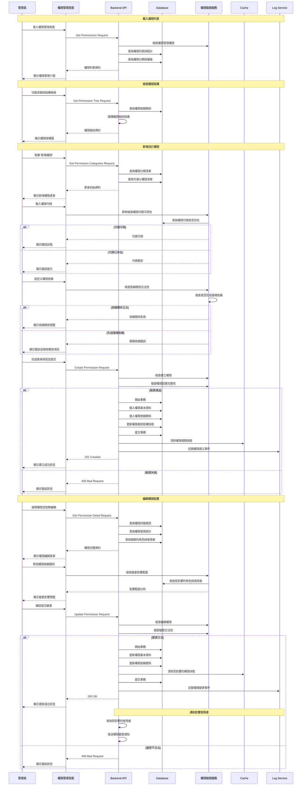

# Console Platform - 權限管理系統 產品規格書

## 一、User Stories

### 1.1 身份與需求

#### 系統管理者 (Super Admin)

**As a** 系統管理者  
**I want to** 管理系統所有權限配置與定義  
**So that** 我可以精細化控制系統功能的存取範圍

**Acceptance Criteria:**

- 可以建立、修改、刪除自訂權限
- 可以檢視所有權限的使用狀況
- 可以設定權限的依賴關係
- 可以匯出權限配置報告
- 所有權限操作皆有完整稽核記錄

#### IT 管理員 (IT Admin)

**As a** IT 管理員  
**I want to** 檢視系統權限架構與分配狀況  
**So that** 我可以協助進行權限相關的問題排查

**Acceptance Criteria:**

- 可以檢視所有權限定義與說明
- 可以檢視權限與角色的對應關係
- 可以查詢特定權限的使用者清單

### 1.2 使用場景

#### 場景一: 新增自訂權限

系統需要為新功能模組建立專屬權限時:

1. 進入權限管理頁面
2. 點擊「新增權限」按鈕
3. 填寫權限基本資訊與命名
4. 設定權限的分類與層級
5. 配置權限依賴關係
6. 測試權限有效性並提交

#### 場景二: 權限架構調整

系統功能重構需要調整權限架構時:

1. 檢視目前權限架構圖
2. 識別需要調整的權限項目
3. 規劃新的權限組織結構
4. 逐步調整權限關係
5. 驗證調整對現有角色的影響
6. 發布權限架構變更通知

---

## 二、功能需求

### 2.1 權限管理 (Permission Management)

#### 2.1.1 顯示欄位

**權限列表頁面**

- 頁面標題 "權限管理"
- 搜尋框 (支援權限名稱、描述搜尋)
- 權限分類篩選器
- "新增權限" 按鈕 (權限: permissions.create)
- 權限樹狀結構切換按鈕

**權限列表表格**

| 欄位     | 顯示內容           | 說明               |
| -------- | ------------------ | ------------------ |
| 權限代碼 | Permission Code    | 系統唯一識別碼     |
| 權限名稱 | Permission Name    | 人類可讀名稱       |
| 權限分類 | Category Badge     | 功能分類標籤       |
| 權限層級 | Level Indicator    | 權限等級顯示       |
| 權限類型 | 系統權限/自訂權限  | 系統權限不可刪除   |
| 依賴關係 | Dependencies Count | 依賴的權限數量     |
| 使用統計 | Usage Count        | 使用此權限的角色數 |
| 狀態     | Active/Inactive    | 權限啟用狀態       |
| 建立時間 | 格式化日期         | 權限建立時間       |
| 操作     | Action Menu        | 編輯/檢視/刪除等   |

**權限詳情區塊**

- 權限代碼與名稱
- 權限描述與用途說明
- 權限分類與層級
- 權限圖示與顏色
- 建立與更新資訊

**權限關係區塊**

- 父權限 (此權限依賴的上級權限)
- 子權限 (依賴此權限的下級權限)
- 互斥權限 (不可同時擁有的權限)
- 權限組合建議

**使用狀況區塊**

- 使用此權限的角色列表
- 擁有此權限的使用者統計
- 權限使用頻率分析
- 權限存取記錄摘要

#### 2.1.2 表單填寫欄位及驗證規則

| 欄位名稱 | 欄位類型 | 必填 | 驗證規則                                                       | 錯誤訊息                 |
| -------- | -------- | ---- | -------------------------------------------------------------- | ------------------------ |
| 權限代碼 | Text     | 是   | 格式: resource.action<br>長度: 5-64 字元<br>不可與現有權限重複 | "權限代碼格式錯誤或重複" |
| 權限名稱 | Text     | 是   | 長度: 1-100 字元<br>不可為純空白                               | "請輸入權限名稱"         |
| 權限描述 | Textarea | 是   | 長度: 1-500 字元<br>清楚說明權限用途                           | "包含多語系"             |

#### 2.1.3 Action Flow



#### 2.1.4 商業邏輯

**權限建立與管理**

1. **權限命名規範**

   - 採用 `{resource}.{action}` 格式
   - resource: 資源類型 (如 users, roles, reports)
   - action: 操作類型 (如 read, create, update, delete)
   - 支援通配符 (\*) 表示所有權限

2. **權限依賴檢查**

   - 防止循環依賴的形成
   - 檢查依賴深度不超過限制
   - 自動計算權限繼承關係

3. **權限分類管理**

   - 依功能模組進行權限分類
   - 支援巢狀分類結構
   - 分類層級不超過 3 層

**權限架構設計**

1. **階層式權限結構**

   - 上級權限自動包含下級權限
   - 支援權限的正向與負向繼承
   - 明確定義權限的作用範圍

2. **權限組合規則**

   - 定義互斥權限組合
   - 設定必要權限依賴
   - 權限組合的業務邏輯驗證

3. **動態權限計算**

   - 即時計算使用者最終權限
   - 快取權限計算結果
   - 權限變更時自動重新計算

**權限使用監控**

1. **使用統計追蹤**

   - 追蹤權限的實際使用情況
   - 識別未使用或過度使用的權限
   - 提供權限優化建議

2. **權限存取記錄**

   - 記錄權限檢查請求
   - 記錄權限拒絕事件
   - 分析權限存取模式

#### 2.1.5 權限設計

| 操作         | 所需權限           | 說明             |
| ------------ | ------------------ | ---------------- |
| 檢視權限列表 | permissions.read   | 基本檢視權限     |
| 建立自訂權限 | permissions.create | 建立新的權限項目 |
| 編輯權限資訊 | permissions.update | 修改權限基本資訊 |
| 刪除權限     | permissions.delete | 刪除自訂權限     |


---

## 三、權限分類架構

### 3.1 權限分類結構

**權限列表**

- `permissions.read` - 檢視權限列表
- `permissions.create` - 建立權限
- `permissions.update` - 修改權限
- `permissions.delete` - 刪除權限

**權限層級**

```
permissions.read              # 檢視權限列表
├── permissions.update        # 修改權限
│   ├── permissions.create    # 建立權限
│   ├── permissions.delete    # 刪除權限
```

### 3.2 權限使用指南

#### 3.2.1 權限命名最佳實務

1. **命名規範**

   - 使用小寫英文字母
   - 資源與動作之間用點(.)分隔
   - 動作使用標準動詞 (read, create, update, delete, manage)
   - 避免使用縮寫或特殊字元

2. **權限粒度控制**
   - 基礎權限: 提供最小必要權限
   - 管理權限: 包含所有相關操作權限
   - 敏感權限: 需要額外安全檢查的權限

#### 3.2.2 權限分配建議

1. **角色權限對應**

   - Super Admin: `*.*` (所有權限)
   - IT Admin: `users.*`, `roles.read`
   - Security Officer: `users.read`

2. **權限繼承原則**
   - 上級權限自動包含下級權限
   - 管理權限包含對應的檢視權限
   - 特殊權限需要明確指派

#### 3.2.3 安全考量

1. **最小權限原則**

   - 僅授予完成工作所需的最小權限
   - 定期檢視並回收不必要的權限
   - 避免過度授權和權限濫用

2. **權限隔離**
   - 敏感操作需要額外權限
   - 不同業務領域的權限分離
   - 避免單一角色擁有過多權限
