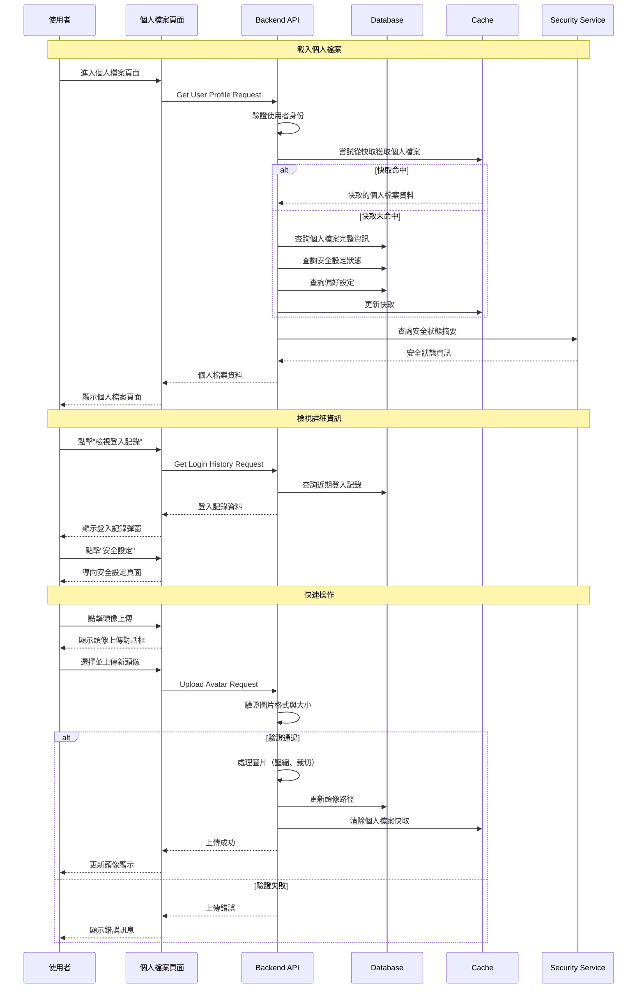
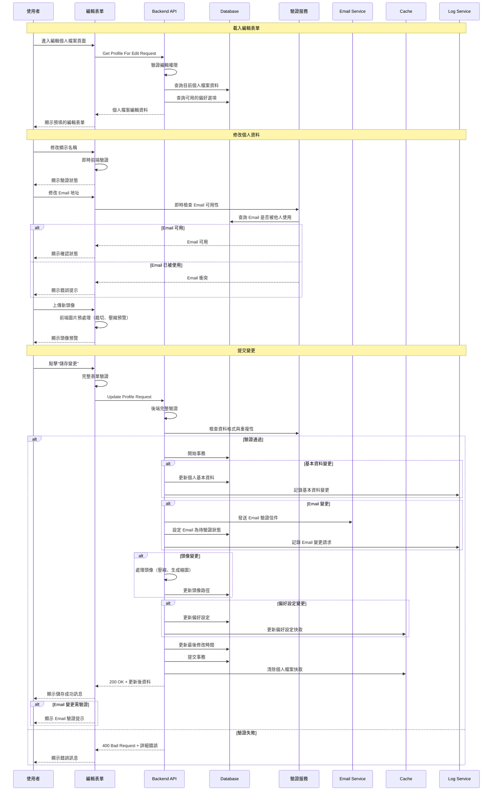

# Console Platform - 個人檔案管理系統 產品規格書

## 一、User Stories

### 1.1 身份與需求

#### 一般使用者 (End User)

**As a** 一般使用者  
**I want to** 檢視和管理我的個人檔案資訊  
**So that** 我可以保持個人資訊的正確性並控制個人隱私設定

**Acceptance Criteria:**

- 可以檢視個人基本資訊與帳號狀態
- 可以修改個人基本資訊（姓名、聯絡資訊等）
- 可以變更帳號密碼
- 可以設定和管理雙因子驗證 (2FA)
- 可以管理個人偏好設定
- 所有變更都有即時回饋與確認

#### IT 管理員 (IT Admin)

**As a** IT 管理員  
**I want to** 協助使用者進行個人檔案相關的問題處理  
**So that** 我可以快速解決使用者的帳號問題並提供技術支援

**Acceptance Criteria:**

- 可以檢視使用者的個人檔案資訊
- 可以協助重設使用者的 2FA 設定
- 可以檢視使用者的安全設定狀態
- 可以提供個人檔案設定的技術指導

### 1.2 使用場景

#### 場景一: 新員工完成個人檔案設定

新員工首次登入系統時:

1. 系統提示完善個人檔案資訊
2. 填寫或確認基本個人資訊
3. 上傳個人頭像（可選）
4. 設定個人偏好（語言、時區等）
5. 完成雙因子驗證設定
6. 確認並儲存所有設定

#### 場景二: 定期安全檢查與更新

使用者進行定期安全維護時:

1. 進入個人檔案頁面
2. 檢查個人資訊是否需要更新
3. 更新密碼（如需要）
4. 檢查雙因子驗證狀態
5. 調整隱私與通知設定

#### 場景三: 個人資訊變更

當個人資訊發生變化時:

1. 進入個人檔案編輯頁面
2. 修改相關個人資訊
3. 如涉及敏感資訊變更需要額外驗證
4. 提交變更申請
5. 系統驗證變更合法性
6. 完成變更並發送確認通知

---

## 二、功能需求

### 2.1 個人檔案檢視 (Profile View)

#### 2.1.1 顯示欄位

**頁面標題與操作**

- 頁面標題 "個人檔案"
- "編輯個人檔案" 按鈕
- "安全設定" 快速連結
- "偏好設定" 快速連結

**基本資訊卡片**

| 欄位  | 顯示內容      | 說明                 |
| ----- | ------------- | -------------------- |
| 頭像  | Avatar        | 個人頭像或預設圖示   |
| 帳號  | Username      | 系統帳號名稱         |
| 姓名  | Display Name  | 顯示名稱             |
| Email | Email Address | 主要聯絡信箱         |
| 手機  | Phone Number  | 聯絡電話（遮罩顯示） |
| 角色  | Current Roles | 目前系統角色         |

**帳號狀態資訊**

- 帳號狀態: Active/Inactive/Pending/Locked
- 上次登入時間與地點
- 密碼最後變更時間
- 密碼有效期剩餘天數
- 2FA 啟用狀態

**安全設定概覽**

- 雙因子驗證狀態
- 隱私設定狀態

#### 2.1.2 Action Flow

#### 2.1.3 商業邏輯

**資料顯示規則**

1. **個人資訊顯示**

   - 所有個人基本資料對本人完全可見
   - 敏感資訊（如完整手機號碼）部分遮罩顯示
   - 空白欄位顯示提示文字引導填寫

**快取策略**

1. **資料快取**

   - 基本個人檔案快取 3 分鐘
   - 安全設定快取 1 分鐘
   - 偏好設定快取 10 分鐘
   - 頭像快取 1 小時

2. **快取更新**
   - 個人資料變更時立即清除快取
   - 安全設定變更時清除相關快取
   - 定期背景更新快取避免過期

---

### 2.2 編輯個人檔案 (Edit Profile)

#### 2.2.1 顯示欄位

**頁面標題與導覽**

- 頁面標題 "編輯個人檔案"
- 麵包屑導覽: 個人檔案 > 編輯
- "儲存變更" 按鈕
- "取消" 按鈕
- "重設" 按鈕

**可編輯欄位區塊**

- 個人頭像上傳/變更
- 顯示名稱 \*必填
- 聯絡信箱 \*必填
- 手機號碼
- 個人簽名

**不可編輯資訊顯示**

- 帳號名稱（唯讀）
- 員工編號（唯讀）
- 角色與權限（唯讀，連結至角色說明）

#### 2.2.2 表單填寫欄位及驗證規則

| 欄位名稱 | 欄位類型 | 必填 | 驗證規則                              | 錯誤訊息                 |
| -------- | -------- | ---- | ------------------------------------- | ------------------------ |
| 顯示名稱 | Text     | 是   | - 長度: 1-50 字元 - 不可為純空白   | "請輸入顯示名稱"         |
| 聯絡信箱 | Email    | 是   | - 標準 Email 格式 - 不可與他人重複 | "Email 格式錯誤或已存在" |
| 手機號碼 | Tel      | 否   | 台灣手機格式: 09xxxxxxxx              | "手機號碼格式錯誤"       |
| 個人簽名 | Textarea | 否   | 最多 200 字元                         | "個人簽名過長"           |
| 頭像上傳 | File     | 否   | - JPG,PNG,WebP - 大小: 最大 2MB    | "頭像格式或大小不符"     |

#### 2.2.3 Action Flow

#### 2.2.4 商業邏輯

**資料變更處理**

1. **即時生效變更**

   - 顯示名稱、手機號碼、個人簽名
   - 偏好設定（語言、時區等）
   - 頭像上傳（處理後即時顯示）

2. **需要驗證的變更**

   - Email 變更需要新 Email 驗證確認
   - 驗證通過前舊 Email 仍然有效
   - 24 小時內未驗證則自動取消變更

3. **圖片處理邏輯**
   - 上傳時自動壓縮至合適大小
   - 生成多種尺寸縮圖（頭像、預覽等）
     - 100x100
     - 250x250
     - 500x500
   - 舊頭像檔案定期清理

**資料驗證機制**

1. **前端即時驗證**

   - 輸入格式即時檢查
   - 字元數量即時計算
   - 檔案格式與大小預檢

2. **後端完整驗證**
   - 重複執行所有前端驗證
   - 資料庫唯一性檢查
   - 安全性掃描（XSS、SQL Injection 防護）

**Email 變更流程**

1. **變更申請**

   - 使用者提交新 Email 地址
   - 系統發送驗證信件至新 Email
   - 舊 Email 收到變更通知

2. **驗證確認**
   - 新 Email 點擊驗證連結
   - 系統確認變更並更新資料
   - 發送變更完成通知

## 三、系統整合

### 3.1 與其他系統整合

#### 3.1.1 使用者管理系統

**資料同步**

- 個人檔案變更時同步更新使用者管理系統
- 角色與權限變更時通知個人檔案系統
- 帳號狀態變更時自動限制個人檔案編輯

**權限整合**

- 使用統一的權限檢查機制
- 繼承使用者管理系統的角色權限
- 個人檔案權限作為基礎權限的延伸

#### 3.1.2 安全系統

**身份驗證**

- 支援多種驗證方式 (密碼、2FA、生物識別)
- Session 管理與安全監控

#### 3.1.3 通知系統

**Email 通知**

- 管理員進行個人資料變更通知

### 3.2 資料安全與隱私

#### 3.2.1 資料加密

- 敏感個人資料加密儲存
- 傳輸過程全程 HTTPS 加密
- 2FA Secret 使用專用加密金鑰

#### 3.2.2 存取控制

- 個人檔案資料僅本人可存取
- 管理員需特定權限才能檢視他人資料
- 所有存取行為完整記錄

#### 3.2.3 資料保護

- 符合個資法規要求（GDPR、個資法等）
