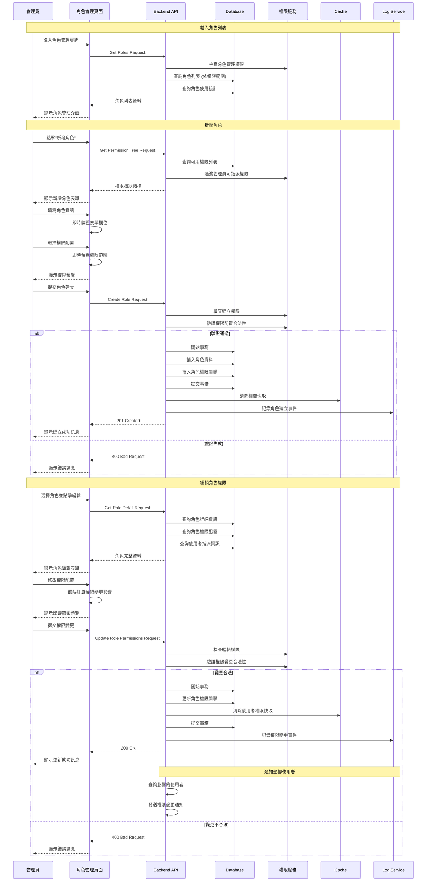
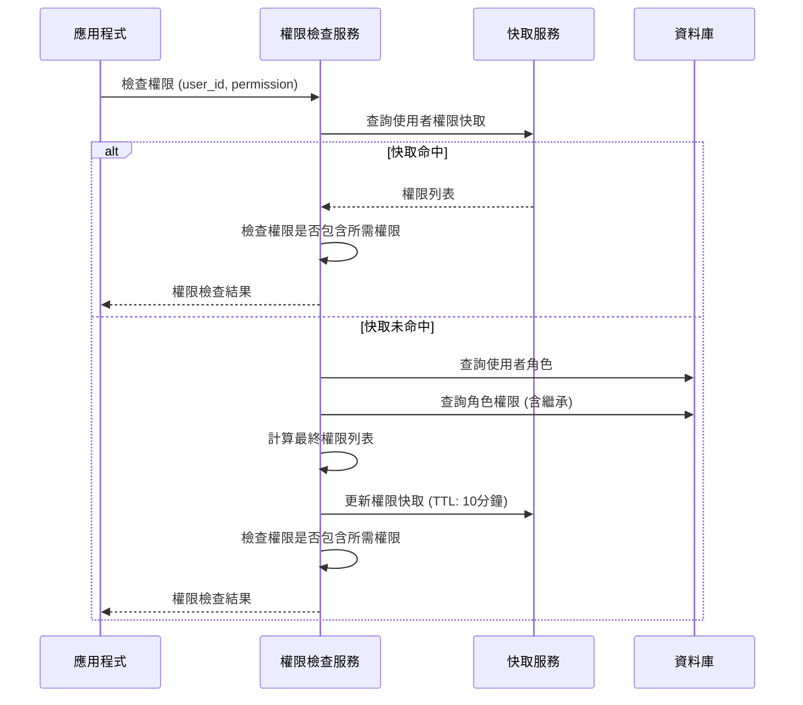

# Console Platform - 角色管理系統 產品規格書

## 一、User Stories

### 1.1 身份與需求

#### 系統管理者 (Super Admin)

**As a** 系統管理者  
**I want to** 管理所有系統角色與權限配置  
**So that** 我可以確保系統安全並控制各角色的存取範圍

**Acceptance Criteria:**

- 可以建立、修改、刪除所有角色
- 可以配置角色的權限組合
- 可以檢視角色使用狀況與權限分配
- 可以設定角色的繼承關係
- 所有操作皆有完整稽核記錄

#### IT 管理員 (IT Admin)

**As a** IT 管理員  
**I want to** 管理一般角色與權限指派  
**So that** 我可以協助組織進行日常的權限管理工作

**Acceptance Criteria:**

- 可以檢視所有角色資訊
- 可以指派角色給使用者
- 無法修改系統預設角色
- 可以檢視角色權限範圍

#### 部門主管 (Department Manager)

**As a** 部門主管  
**I want to** 管理部門內同仁的帳號與基本權限  
**So that** 我可以確保部門運作順暢並控制團隊成員的系統存取

**Acceptance Criteria:**

- 可以檢視部門內所有成員的資訊
- 可以為部門新進人員建立帳號
- 可以調整部門成員的基本權限
- 可以檢視部門相關的業務報表
- 無法存取其他部門的敏感資訊

#### 人資管理員 (HR Manager)

**As a** 人資管理員  
**I want to** 管理員工的完整生命週期與人事相關權限  
**So that** 我可以有效處理員工入職、異動、離職等人事作業

**Acceptance Criteria:**

- 可以管理所有員工的基本資訊
- 可以處理員工入職、異動、離職流程
- 可以指派和調整員工角色
- 可以檢視人事相關報表和稽核記錄
- 可以管理組織架構與部門設定

### 1.2 使用場景

#### 場景一: 新增自訂角色

IT 管理員需要為特定部門建立專用角色時:

1. 進入角色管理頁面
2. 點擊「新增角色」按鈕
3. 填寫角色基本資訊
4. 選擇適當的權限組合
5. 預覽角色權限範圍
6. 提交建立並指派給相關使用者

#### 場景二: 調整角色權限

系統需要調整某個角色的權限範圍時:

1. 搜尋並選擇目標角色
2. 檢視角色當前權限配置
3. 調整權限設定
4. 檢查權限變更影響範圍
5. 確認變更並記錄調整原因
6. 通知相關使用者權限變更

#### 場景三: 部門主管指派角色

部門主管為新進同仁設定系統權限時:

1. 進入部門人員管理頁面
2. 選擇新進同仁帳號
3. 根據職務性質選擇適當的預設角色
4. 檢視角色包含的權限範圍
5. 確認角色指派並提交
6. 系統自動通知 IT 部門完成設定

#### 場景四: 人資管理員處理員工異動

員工部門調動或職位變更時:

1. 進入員工管理系統
2. 查詢目標員工的現有角色
3. 根據新職位調整角色配置
4. 檢查權限變更對既有工作的影響
5. 設定權限生效時間
6. 通知相關部門主管與 IT 管理員

#### 場景五: 專案經理設定專案團隊權限

啟動新專案需要設定團隊成員權限時:

1. 建立專案並定義所需權限
2. 邀請團隊成員加入專案
3. 為成員指派專案相關角色
4. 設定專案資料存取範圍
5. 配置專案報表檢視權限
6. 專案結束時自動回收專案權限

---

## 二、功能需求

### 2.1 RBAC 角色管理 (Role Management)

#### 2.1.1 顯示欄位

**角色列表頁面**

- 頁面標題 "角色管理"
- 搜尋框 (支援角色名稱、描述搜尋)
- "新增角色" 按鈕 (權限: roles.create)

**角色列表表格**

| 欄位     | 顯示內容          | 說明             |
| -------- | ----------------- | ---------------- |
| 角色名稱 | Role Name         | 無               |
| 顯示名稱 | Display Name      | 無               |
| 角色類型 | 系統角色/自訂角色 | 系統角色不可刪除 |
| 建立時間 | 格式化日期        | 建立時間         |
| 建立者   | Create By         | 建立者           |
| 更新時間 | 格式化日期        | 更新時間         |
| 更新者   | Update By         | 更新者資訊       |

**角色詳情區塊**

- 角色名稱與顯示名稱
- 角色描述
- 狀態與建立資訊

**權限配置區塊**

- 權限樹狀結構展示
- 權限說明與範圍
- 權限預覽功能

**使用者指派區塊**

- 已指派使用者列表
- 新增使用者按鈕

#### 2.1.2 表單填寫欄位及驗證規則

| 欄位名稱   | 欄位類型        | 必填 | 驗證規則                                                    | 錯誤訊息                 |
| ---------- | --------------- | ---- | ----------------------------------------------------------- | ------------------------ |
| 角色名稱   | Text            | 是   | 長度: 3-32 字元<br>格式: 英數字、底線<br>不可與現有角色重複 | "角色名稱格式錯誤或重複" |
| 顯示名稱   | Text            | 是   | 長度: 1-50 字元<br>不可為純空白                             | "包含多語系"             |
| 描述       | Textarea        | 否   | 最多 200 字元                                               | "包含多語系"             |
| 權限設定   | Permission Tree | 是   | 至少選擇一個權限<br>不可選擇超越建立者權限的項目            | "請選擇有效的權限"       |
| 角色優先級 | Number          | 否   | 1-100 整數<br>數字越低優先級越高                            | "優先級設定錯誤"         |

#### 2.1.3 Action Flow



#### 2.1.4 商業邏輯

**角色建立與管理**

1. **角色唯一性檢查**

   - 角色名稱全系統唯一
   - 顯示名稱建議唯一 (警告但不強制)
   - 使用樂觀鎖防止並發建立

2. **權限指派邏輯**

   - 建立者只能指派不超過自己權限的角色
   - 權限組合需符合業務邏輯限制
   - 支援權限的依賴關係檢查

3. **系統角色保護**

   - 系統預設角色不可刪除
   - 系統角色權限修改需特殊權限
   - 至少保留一個 Super Admin 角色

**權限繼承機制**

1. **角色權限計算**

   - 基礎權限 = 角色定義的權限集合
   - 最終權限 = 基礎權限 ∪ 額外個人權限
   - 支援權限的正向與負向繼承

2. **權限衝突處理**

   - 明確禁止 > 明確允許 > 預設拒絕
   - 多角色權限取聯集
   - 記錄權限計算過程供稽核

**角色生命週期管理**

1. **角色狀態管理**

   - Active: 正常使用中
   - Inactive: 暫時停用
   - Deprecated: 準備淘汰
   - Archived: 已歸檔

2. **角色變更影響評估**

   - 計算角色變更影響的使用者數量
   - 評估權限變更對系統功能的影響
   - 提供變更回滾機制

#### 2.1.5 權限設計

| 操作         | 所需權限                 | 說明                   |
| ------------ | ------------------------ | ---------------------- |
| 檢視角色列表 | roles.read               | 基本檢視權限           |
| 建立自訂角色 | roles.create             | 不能超越自己的權限範圍 |
| 編輯角色資訊 | roles.update             | 修改角色基本資訊       |
| 編輯角色權限 | roles.update_permissions | 修改角色權限配置       |
| 刪除角色     | roles.delete             | 刪除自訂角色           |


---

## 三、權限系統架構

### 3.1 權限命名規範

**權限命名採用 `{resource}.{action}` 格式:**

- 資源類型.操作類型
- 例如: users.read, users.create, users.update, users.delete

### 3.2 權限分類結構

**權限列表**

- `roles.read` - 檢視角色列表
- `roles.create` - 建立角色
- `roles.update` - 修改角色
- `roles.update_permissions` - 修改角色權限
- `roles.delete` - 刪除角色

**權限層級**

```
roles.read                        # 檢視角色列表
├── roles.update                  # 修改角色
│   ├── roles.create              # 建立角色
│   ├── roles.delete              # 刪除角色
│   ├── roles.update_permissions  # 修改角色權限
│   └── roles.assign              # 指派角色
```

### 3.3 預設角色定義

#### 3.3.1 Super Admin (系統管理者)

```json
{
  "name": "super_admin",
  "display_name": "系統管理者",
  "description": "擁有系統所有權限的最高管理者",
  "permissions": ["*.*"],
  "is_system": true,
  "priority": 100
}
```

#### 3.3.2 IT Admin (IT 管理員)

```json
{
  "name": "it_admin",
  "display_name": "IT 管理員",
  "description": "負責系統維運與使用者管理",
  "permissions": ["users.*", "roles.read", "roles.assign"],
  "is_system": true,
  "priority": 80
}
```

#### 3.3.3 Security Officer (資安人員)

```json
{
  "name": "security_officer",
  "display_name": "資安人員",
  "description": "負責安全稽核與監控",
  "permissions": [
    "users.read",
    "users.read_sensitive",
    "users.deactivate",
    "security.*",
    "audit.*"
  ],
  "is_system": true,
  "priority": 70
}
```

#### 3.3.4 Department Manager (部門主管)

```json
{
  "name": "department_manager",
  "display_name": "部門主管",
  "description": "負責部門內人員管理與業務監督",
  "permissions": [
    "users.read",
    "users.create",
    "users.update",
    "users.read_sensitive",
    "reports.department.*",
    "profile.*",
    "dashboard.read"
  ],
  "is_system": true,
  "priority": 60
}
```

#### 3.3.5 HR Manager (人資管理員)

```json
{
  "name": "hr_manager",
  "display_name": "人資管理員",
  "description": "負責人力資源管理與員工生命週期",
  "permissions": [
    "users.*",
    "roles.read",
    "roles.assign",
    "reports.hr.*",
    "audit.user_activities",
    "profile.*",
    "dashboard.read"
  ],
  "is_system": true,
  "priority": 75
}
```

#### 3.3.6 Project Manager (專案經理)

```json
{
  "name": "project_manager",
  "display_name": "專案經理",
  "description": "負責專案管理與團隊協作",
  "permissions": [
    "projects.*",
    "users.read",
    "reports.project.*",
    "dashboard.project.*",
    "profile.*",
    "dashboard.read"
  ],
  "is_system": true,
  "priority": 50
}
```

#### 3.3.7 Finance Officer (財務人員)

```json
{
  "name": "finance_officer",
  "display_name": "財務人員",
  "description": "負責財務相關業務與報表管理",
  "permissions": [
    "finance.*",
    "reports.finance.*",
    "audit.finance",
    "users.read",
    "profile.*",
    "dashboard.read"
  ],
  "is_system": true,
  "priority": 65
}
```

#### 3.3.8 Customer Service (客服人員)

```json
{
  "name": "customer_service",
  "display_name": "客服人員",
  "description": "負責客戶服務與問題處理",
  "permissions": [
    "customers.read",
    "customers.update",
    "tickets.*",
    "reports.customer.*",
    "profile.*",
    "dashboard.read"
  ],
  "is_system": true,
  "priority": 30
}
```

#### 3.3.9 Sales Representative (業務代表)

```json
{
  "name": "sales_representative",
  "display_name": "業務代表",
  "description": "負責銷售業務與客戶關係維護",
  "permissions": [
    "sales.*",
    "customers.read",
    "customers.create",
    "customers.update",
    "reports.sales.*",
    "profile.*",
    "dashboard.read"
  ],
  "is_system": true,
  "priority": 40
}
```

#### 3.3.10 Marketing Specialist (行銷專員)

```json
{
  "name": "marketing_specialist",
  "display_name": "行銷專員",
  "description": "負責行銷活動規劃與執行",
  "permissions": [
    "marketing.*",
    "campaigns.*",
    "reports.marketing.*",
    "customers.read",
    "profile.*",
    "dashboard.read"
  ],
  "is_system": true,
  "priority": 35
}
```

#### 3.3.11 Data Analyst (資料分析師)

```json
{
  "name": "data_analyst",
  "display_name": "資料分析師",
  "description": "負責數據分析與報表製作",
  "permissions": [
    "analytics.*",
    "reports.*",
    "data.read",
    "data.export",
    "dashboard.*",
    "profile.*"
  ],
  "is_system": true,
  "priority": 55
}
```

#### 3.3.12 Content Manager (內容管理員)

```json
{
  "name": "content_manager",
  "display_name": "內容管理員",
  "description": "負責網站內容與資訊管理",
  "permissions": [
    "content.*",
    "media.*",
    "cms.*",
    "reports.content.*",
    "profile.*",
    "dashboard.read"
  ],
  "is_system": true,
  "priority": 45
}
```

#### 3.3.13 Auditor (稽核人員)

```json
{
  "name": "auditor",
  "display_name": "稽核人員",
  "description": "負責內部稽核與合規檢查",
  "permissions": [
    "audit.*",
    "users.read",
    "users.read_sensitive",
    "reports.audit.*",
    "security.read",
    "profile.read",
    "dashboard.read"
  ],
  "is_system": true,
  "priority": 85
}
```

#### 3.3.14 Guest User (訪客使用者)

```json
{
  "name": "guest_user",
  "display_name": "訪客使用者",
  "description": "臨時或受限存取的訪客帳號",
  "permissions": ["dashboard.read", "profile.read", "public.read"],
  "is_system": true,
  "priority": 5
}
```

#### 3.3.15 End User (一般使用者)

```json
{
  "name": "end_user",
  "display_name": "一般使用者",
  "description": "系統基本使用者",
  "permissions": [
    "profile.read",
    "profile.update",
    "dashboard.read",
    "notifications.read"
  ],
  "is_system": true,
  "priority": 10
}
```

### 3.4 權限檢查機制



### 3.5 安全機制

#### 3.5.1 最高權限管理者保護

1. **Super Admin 保護機制**

   - 系統必須至少保留一個 Active 的 Super Admin
   - Super Admin 不能被其他人停用或刪除
   - Super Admin 的權限不能被降級

2. **危險操作預防**

   - 刪除角色前檢查是否有使用者正在使用
   - 修改系統角色需要多重確認
   - 權限變更會強制登出 Super Admin 之外相關權限管理者
     - 編輯刪除角色權限
     - 編輯刪除管理者角色
