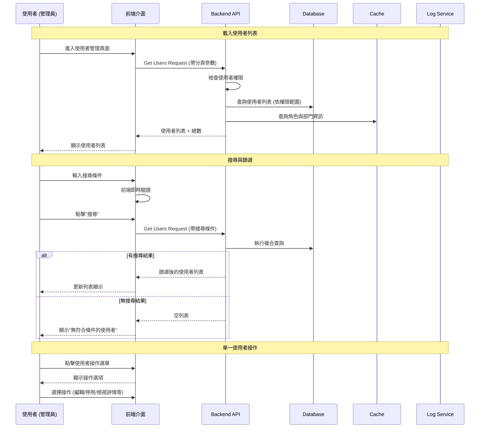
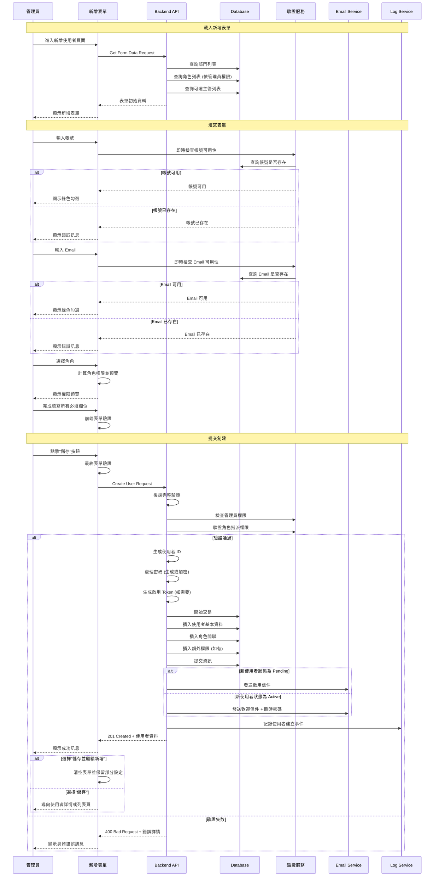
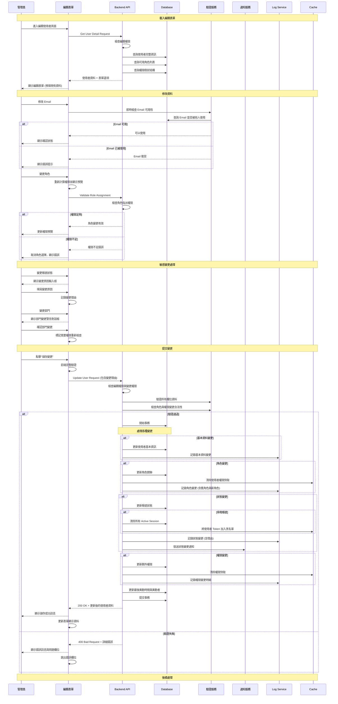
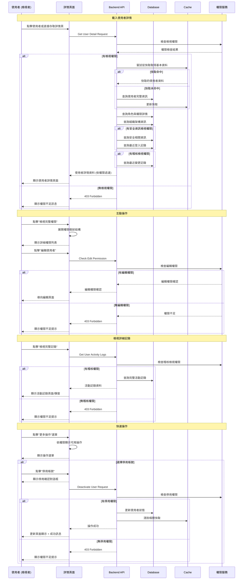

# Console Platform - User Management System 產品規格書

## 一、User Stories

### 1.1 身份與需求

#### 系統管理者 (Super Admin)

**As a** 系統管理者  
**I want to** 管理所有使用者帳號、角色與權限  
**So that** 我可以確保系統安全並控制存取權限

**Acceptance Criteria:**

- 可以建立、修改、刪除所有使用者帳號
- 可以指派和變更使用者角色
- 可以檢視所有使用者的活動記錄
- 可以強制重設任何使用者的密碼和 2FA
- 所有操作皆有完整稽核記錄

#### IT 管理員 (IT Admin)

**As a** IT 管理員  
**I want to** 管理一般使用者帳號與基本權限  
**So that** 我可以協助組織進行日常的帳號管理工作

**Acceptance Criteria:**

- 可以建立和管理一般使用者帳號
- 可以指派預設角色給新使用者
- 無法管理其他管理員帳號
- 可以檢視使用者基本資訊和狀態

#### 資安人員 (Security Officer)

**As a** 資安人員  
**I want to** 監控使用者存取行為與安全狀態  
**So that** 我可以及時發現異常並維護系統安全

**Acceptance Criteria:**

- 可以檢視所有使用者的登入記錄
- 可以檢視權限變更歷史
- 可以匯出稽核報告
- 可以暫時停用可疑帳號
- 收到異常行為通知

### 1.2 使用場景

#### 場景一: 新員工入職

部門主管為新員工申請帳號時:

1. 填寫新員工基本資訊表單
2. 選擇適當的角色模板
3. 提交申請並等待 IT 管理員審核
4. IT 管理員核准後建立帳號
5. 系統自動發送啟用信件給新員工
6. 新員工完成帳號啟用流程

#### 場景二: 角色權限調整

IT 管理員需要調整使用者權限時:

1. 在使用者管理頁面搜尋目標使用者
2. 檢視使用者當前角色與權限
3. 編輯使用者角色或自訂權限
4. 填寫變更原因並提交
5. 系統記錄權限變更並通知相關人員
6. 使用者下次登入時生效新權限

#### 場景三: 員工離職

員工離職時的帳號處理:

1. 部門主管提交離職申請
2. IT 管理員停用使用者帳號
3. 系統自動撤銷所有權限
4. 將帳號資料進行歸檔
5. 通知相關部門確認權限回收完成

---

## 二、功能需求

### 2.1 使用者列表頁面 (User List)

#### 2.1.1 顯示欄位

**頁面標題與操作**

- 頁面標題 "使用者管理"
- "新增使用者" 按鈕 (權限: users.create)
- 搜尋框 (支援帳號、姓名、Email 搜尋)
- 進階篩選器

**資料表格欄位**

| 欄位     | 顯示內容      | 說明                           |
| -------- | ------------- | ------------------------------ |
| 頭像     | Avatar        | 使用者頭像或預設圖示           |
| 帳號     | Username      | 登入用帳號名稱                 |
| 姓名     | Display Name  | 使用者顯示名稱                 |
| Email    | Email Address | 聯絡信箱                       |
| 角色     | Role Badge    | 目前角色 (可多個)              |
| 狀態     | Status Badge  | Active/Inactive/Pending/Locked |
| 最後登入 | Last Login    | 最近一次登入時間               |
| 建立時間 | Created At    | 帳號建立時間                   |
| 操作     | Action Menu   | 編輯/檢視/停用等操作           |

**狀態指示**

- Active: 帳號正常使用中
- Pending: 等待啟用
- Inactive: 已停用
- Locked: 已鎖定

**篩選器選項**

- 角色篩選 (多選下拉)
- 狀態篩選 (多選)
- 建立時間範圍
- 最後登入時間範圍

**分頁資訊**

- 顯示總筆數
- 每頁顯示數量選擇 (10/25/50/100)
- 分頁導覽 (首頁/上頁/下頁/末頁)

#### 2.1.2 表單填寫欄位及驗證規則

**搜尋與篩選**

| 欄位名稱   | 欄位類型     | 必填 | 驗證規則                       | 說明                  |
| ---------- | ------------ | ---- | ------------------------------ | --------------------- |
| 關鍵字搜尋 | Text         | 否   | 長度: 1-50 字元                | 搜尋帳號、姓名、Email |
| 狀態篩選   | Multi-Select | 否   | Active/Inactive/Pending/Locked | 可多選                |
| 建立時間起 | Date         | 否   | 有效日期格式                   | 不可晚於結束時間      |
| 建立時間迄 | Date         | 否   | 有效日期格式                   | 不可早於開始時間      |

**操作**

| 操作類型 | 適用狀態        | 必要欄位 | 驗證規則                   |
| -------- | --------------- | -------- | -------------------------- |
| 變更角色 | Active/Inactive | 目標角色 | 不可指派比自己權限高的角色 |
| 停用帳號 | Active          | 停用原因 | 必填,最多 200 字元         |
| 啟用帳號 | Inactive        | 啟用原因 | 必填,最多 200 字元         |
| 解除鎖定 | Locked          | 解鎖原因 | 必填,最多 200 字元         |
| 重設密碼 | Active/Inactive | 確認操作 | 需二次確認                 |

#### 2.1.3 Action Flow



#### 2.1.4 商業邏輯

**資料權限控制**

1. **角色權限限制**

   - Super Admin: 可檢視所有使用者
   - IT Admin: 可檢視除 Super Admin 外的所有使用者
   - Security Officer: 可檢視所有使用者 (唯讀)

2. **資料欄位權限**

   - 敏感欄位 (如完整 Email) 需特定權限
   - 管理操作按鈕依權限動態顯示

**搜尋與篩選邏輯**

1. **搜尋機制**

   - 關鍵字搜尋: 支援模糊搜尋帳號、姓名、Email
   - 搜尋範圍依使用者權限限制
   - 搜尋結果按相關性排序

2. **篩選邏輯**

   - 多條件組合使用 AND 邏輯
   - 日期範圍包含起迄日期

3. **排序功能**

   - 預設按建立時間降序
   - 支援所有欄位排序

**分頁機制**

1. **效能優化**

   - 使用 Cursor-based Pagination 處理大量資料
   - 前端只載入當前頁面資料
   - 快取常用查詢結果

2. **使用者體驗**

   - 保持篩選條件在換頁時不變
   - 支援 URL 直接跳轉特定頁面
   - 顯示載入狀態防止重複點擊

**快取策略**

1. **資料快取**

   - 角色列表快取 (5 分鐘)
   - 使用者列表快取 (1 分鐘)

2. **快取更新**

   - 資料變更時自動清除相關快取
   - 定期背景更新快取

#### 2.1.5 權限設計

| 操作           | 所需權限             | 說明                                            |
| -------------- | -------------------- | ----------------------------------------------- |
| 檢視使用者列表 | users.read           | 基本檢視權限                                    |
| 檢視敏感資訊   | users.read_sensitive | 如果沒有權限，Email、手機、登入記錄等都會被隱藏 |
| 新增使用者     | users.create         | 建立新帳號                                      |
| 編輯使用者     | users.update         | 修改使用者資訊                                  |
| 停用使用者     | users.deactivate     | 停用帳號                                        |
| 刪除使用者     | users.delete         | 刪除帳號 (少用)                                 |

**角色權限矩陣**

| 角色             | 權限組合                                                 |
| ---------------- | -------------------------------------------------------- |
| Super Admin      | 所有 users.\* 權限                                       |
| IT Admin         | users.read, users.create, users.update, users.deactivate |
| Security Officer | users.read, users.read_sensitive                         |

**注意**: 詳細角色與權限管理請參考 `role.md` 和 `permission.md`


---

### 2.2 新增使用者 (Create User)

#### 2.2.1 顯示欄位

**頁面標題與導覽**

- 頁面標題 "新增使用者"
- 麵包屑導覽: 使用者管理 > 新增使用者
- "儲存並繼續新增" 按鈕
- "儲存" 按鈕
- "取消" 按鈕

**基本資訊區塊**

- 帳號 (Username) \*必填
- 姓名 (Display Name) \*必填
- Email \*必填
- 手機號碼

**角色設定區塊**

- 角色設定 \*必填 (可多選,參考 role.md)

**系統設定區塊**

- 帳號狀態
  - 預設 Inactive
  - 固定選項 Active/Inactive
- 密碼設定方式:
  - 系統產生
  - 手動設定
- 密碼
- 是否首次登入更改密碼

**備註區塊**

- 備註說明 (多行文字)

#### 2.2.2 表單填寫欄位及驗證規則

| 欄位名稱   | 欄位類型     | 必填     | 驗證規則                                                                                    | 錯誤訊息                 |
| ---------- | ------------ | -------- | ------------------------------------------------------------------------------------------- | ------------------------ |
| 帳號       | Text         | 是       | - 長度: 4-32 字元<br>- 格式: 英數字、底線、連字號<br>- 不可與現有帳號重複<br>- 不區分大小寫 | "帳號格式錯誤或已存在"   |
| 姓名       | Text         | 是       | - 長度: 1-50 字元<br>- 不可為純空白                                                         | "請輸入使用者姓名"       |
| Email      | Email        | 是       | - 標準 Email 格式<br>- 長度: 最多 255 字元<br>- 不可與現有 Email 重複                       | "Email 格式錯誤或已存在" |
| 手機號碼   | Tel          | 否       | - 台灣手機格式: 09xxxxxxxx<br>- 國際格式: +886xxxxxxxxx                                     | "手機號碼格式錯誤"       |
| 角色       | Multi-Select | 是       | - 至少選擇一個角色<br>- 不可指派比自己權限高的角色                                          | "請選擇有效的角色"       |
| 手動密碼   | Password     | 條件必填 | - 當選擇手動設定時必填<br>- 遵循密碼強度規則(參考 forgot-password.md)                       | "密碼不符合安全要求"     |
| 權限有效期 | Date         | 否       | - 不可早於當前日期<br>- 最長不超過 1 年                                                     | "權限有效期設定錯誤"     |

#### 2.2.3 Action Flow



#### 2.2.4 商業邏輯

**使用者建立流程**

1. **權限檢查機制**

   - 管理員只能指派等於或低於自己權限的角色
   - Super Admin 可以建立任何角色的使用者
   - IT Admin 不能建立其他 Super Admin 角色

2. **帳號唯一性檢查**

   - 帳號名稱全系統唯一
   - Email 地址全系統唯一
   - 使用樂觀鎖防止並發建立重複帳號

3. **密碼處理策略**

   - 系統生成: 產生 12 位隨機密碼,包含大小寫字母、數字、符號
   - 手動設定: 遵循密碼強度規則
   - 所有密碼使用 bcrypt 加密儲存 (cost=12)

4. **系統設定**

   - 帳號狀態
     - 預設 Pending
     - 只可設定 Active/Inactive/Pending
   - 密碼設定
     - 如果密碼設定方式為系統產生，則不顯示
     - 如果密碼設定方式為手動設定，則必填
   - 是否首次登入更改密碼
     - 系統產生，強制首次登入寄信變更密碼

**角色與權限處理**

1. **角色指派邏輯**

   - 新使用者至少需要一個角色
   - 支援多角色指派 (權限為所有角色的聯集)
   - 角色衝突檢查: 防止互斥角色同時指派

2. **權限計算**

   - 基礎權限 = 所有指派角色的權限聯集
   - 額外權限 = 手動指派的額外權限
   - 最終權限 = 基礎權限 ∪ 額外權限
   - 權限預覽即時更新

**通知機制**

1. **啟用流程通知**

   - 帳號待啟用: 發送啟用連結給使用者
   - 帳號直接啟用: 發送歡迎信件
   - 建立完成: 通知直屬主管與相關管理員

2. **信件內容**
   - 啟用信件: 包含啟用連結 (24 小時有效)
   - 歡迎信件: 包含臨時密碼和首次登入說明
   - 通知信件: 通知相關人員新使用者加入

**資料驗證與清理**

1. **輸入清理**

   - 移除字串前後空白
   - HTML 標籤清理防止 XSS
   - 特殊字元轉義
   - 統一格式 (如電話號碼格式)

#### 2.2.5 權限設計

| 操作           | 所需權限               | 說明                                         |
| -------------- | ---------------------- | -------------------------------------------- |
| 建立一般使用者 | users.create           | 無                                           |
| 查看角色預覽   | users.read_roles       | 與 users.create 綁定                         |
| 查看權限預覽   | users.read_permissions | 與 users.create 綁定，不能指派高於自己的角色 |


---

### 2.3 編輯使用者 (Edit User)

#### 2.3.1 顯示欄位

**編輯方式**

- 在各欄位可以單獨修改
- 因為牽扯引敏感資訊，不採用全表修改的方式

**可修改欄位**

- 使用者頭像 (可上傳更換)
- 姓名 (Display Name)
- Email
- 手機號碼

**系統設定區塊**

- 角色設定 (可多選,參考 role-management.md)
- 帳號狀態 (Active/Inactive/Locked)
- 強制下次登入變更密碼 (開關)
- 2FA 狀態 (已啟用/未啟用) - 可重設

**權限設定區塊**

- 目前角色權限 (唯讀，展開式檢視,參考 role-management.md)
- 額外權限 (權限樹狀結構,參考 permission-management.md)
- 權限有效期設定
- 權限變更歷史 (摺疊式檢視)

**密碼管理區塊**

- 重設密碼按鈕
- 密碼最後變更時間 (唯讀)
- 密碼過期日期 (唯讀)
- 登入失敗次數 (唯讀)

**活動記錄區塊**

- 最後登入時間與 IP
- 最後活動時間
- Session 狀態 (活躍 Session 數量)
- "檢視完整記錄" 連結

**備註區塊**

- 備註說明 (多行文字)
- 變更記錄 (顯示最近 5 次變更)

#### 2.3.2 表單填寫欄位及驗證規則

| 欄位名稱   | 欄位類型     | 必填 | 驗證規則                                   | 特殊處理                   |
| ---------- | ------------ | ---- | ------------------------------------------ | -------------------------- |
| 使用者頭像 | Blob         | 否   | - 限制大小 2MB<br/>- 限制類型 jpg,png,webp | 無                         |
| 名字       | Text         | 是   | 長度: 1-50 字元                            | 包含多語系填寫             |
| Email      | Email        | 是   | 標準格式，不可與他人重複                   | 無                         |
| 角色       | Multi-Select | 是   | 至少一個，不可超越編輯者權限               | 角色變更會強制登出相關人員 |
| 帳號狀態   | Select       | 是   | Active/Inactive/Locked/Pending             | 無                         |
| 手機號碼   | Tel          | 否   | 台灣手機格式                               | 無                         |

**特殊欄位處理**

| 欄位            | 編輯限制     | 特殊邏輯       |
| --------------- | ------------ | -------------- |
| 帳號 (Username) | 不可編輯     | 系統唯一識別碼 |
| 使用者 ID       | 不可編輯     | 系統內部 ID    |
| 建立時間        | 不可編輯     | 歷史記錄       |
| 最後登入        | 不可編輯     | 系統自動更新   |
| 2FA Secret      | 不可直接編輯 | 透過重設功能   |

#### 2.3.3 Action Flow



#### 2.3.4 商業邏輯

**編輯權限控制**

1. **分級編輯權限**

   - Super Admin: 可編輯所有使用者的所有欄位
   - IT Admin: 可編輯除 Super Admin 外的使用者
   - Security Officer: 可編輯帳號狀態與安全相關設定

2. **欄位級別權限**

   - 基本欄位 (姓名): 一般編輯權限即可
   - 敏感欄位 (手機、信箱): 需要相應權限
   - 控制欄位 (角色權限、狀態、2FA): 需要相應權限

**資料變更處理**

- 帳號
  - 不可變更
- 姓名
  - 即時生效的變更
- 角色權限
  - 需要重新登入生效的變更
- 帳號狀態
  - 需要重新登入生效的變更
  - 對應狀態需要對應權限才可以改
- 信箱
  - 需要新 Email 驗證
- 密碼
  - 管理員不可變更
  - 變更需要發 Email 驗證

**安全機制**

1. **防止權限提升攻擊**

   - 除了 Super Admin ，編輯者不能調整自己的權限
   - 角色變更需要觸發 2FA

2. **並發編輯處理**

   - 使用樂觀鎖防止同時編輯衝突
   - 衝突時提示重新請求

**快取與效能**

1. **快取策略**

   - 使用者基本資料快取 (5 分鐘)
   - 權限資料快取 (10 分鐘)
   - 組織架構快取 (30 分鐘)
   - 變更後立即清除相關快取

2. **效能最佳化**

   - 只查詢編輯者有權限看到的欄位
   - 使用索引優化查詢效能

#### 2.3.5 權限設計

| 操作         | 所需權限               | 說明 |
| ------------ | ---------------------- | ---- |
| 檢視編輯表單 | users.read             | 無   |
| 編輯基本資訊 | users.update           | 無   |
| 重設 2FA     | users.reset_2fa        | 無   |
| 編輯敏感資訊 | users.update_sensitive | 無   |
| 角色權限     | users.update_role      | 無   |


---

### 2.4 檢視使用者詳情 (View User Detail)

#### 2.4.1 顯示欄位

**頁面標題與導覽**

- 頁面標題 "使用者詳情 - {使用者姓名}"
- 麵包屑導覽: 使用者管理 > 使用者詳情
- "編輯使用者" 按鈕 (權限: users.update)
- "更多操作" 下拉選單
- "返回列表" 按鈕

**使用者概覽區塊**

- 使用者頭像
- 姓名與帳號
- 目前狀態
- 角色
- 快速操作按鈕組
  - 重設密碼(寄信給該使用者)
  - 編輯
  - 刪除
- 狀態
  - 正常(停用)
  - 停用(啟用)
  - 未啟用(啟用)
  - 上鎖(解鎖)
- 2FA
  - 啟用(停用)
  - 停用(啟用)

**基本資訊卡片**

| 欄位     | 顯示內容       | 說明 |
| -------- | -------------- | ---- |
| 帳號     | Username       |      |
| 姓名     | Display Name   |      |
| Email    | 完整 Email     |      |
| 手機     | 格式化手機號碼 |      |
| 角色     | 被賦予的角色   |      |
| 建立時間 | 格式化日期     |      |
| 建立者   | Create By      |      |
| 更新時間 | 格式化日期     |      |
| 更新者   | Update By      |      |

**角色與權限卡片**

- 目前角色列表 (參考 role-management.md)
- 角色說明與權限範圍
- 額外權限樹狀檢視 (參考 permission-management.md)
- 權限有效期資訊
- "檢視完整權限" 展開按鈕

**安全資訊卡片**

| 欄位     | 顯示內容                       |
| -------- | ------------------------------ |
| 帳號狀態 | Active/Inactive/Locked/Pending |
| 2FA 狀態 | 已啟用/未啟用 + 設定時間       |
| 密碼狀態 | 最後變更時間 + 到期資訊        |
| 登入失敗 | 失敗次數 + 鎖定狀態            |

**活動記錄區塊**

- 記錄項目
  - 登入
  - 變更
  - 鎖定
  - 停用
  - 啟用
  - 忘記密碼
  - 變更密碼
  - 重設密碼
  - 使用者完成密碼重設
  - 登出
  - 關閉 2FA
  - 重設 2FA
  - 使用者完成 2FA 設定
- 目前活躍 Session 數量
- 最近登入記錄 (最多 10 筆)

#### 2.4.2 Action Flow



#### 2.4.3 商業邏輯

**檢視權限控制**

1. **分級檢視權限**

   - Super Admin: 可檢視所有使用者的完整資訊
   - IT Admin: 可檢視除 Super Admin 外所有使用者
   - Security Officer: 可檢視所有使用者
   - End User: 只能檢視自己的基本資訊

2. **動態權限檢查**

   - 頁面載入時檢查基本檢視權限
   - 每個區塊依權限動態顯示/隱藏
   - 操作按鈕依權限即時更新
   - 敏感資訊需額外權限檢查

**資料聚合與呈現**

1. **即時資訊計算**

   - 在職天數自動計算
   - 權限有效期狀態判斷
   - 活躍 Session 即時統計
   - 最後活動時間格式化

2. **關聯資料載入**

   - 角色資訊 (名稱、描述、權限)

**快取策略**

1. **多層快取機制**

   - 瀏覽器快取: 靜態資源 (頭像、圖標)
   - 應用快取: 基本使用者資料 (5 分鐘)
   - 分散式快取: 權限資料 (10 分鐘)
   - 資料庫快取: 關聯查詢結果

2. **快取更新策略**

   - 使用者資料變更時清除相關快取
   - 權限變更時清除權限快取
   - 設定 TTL 避免快取過期

**使用者體驗最佳化**

1. **漸進式載入**

   - 基本資訊優先載入
   - 詳細資訊延遲載入
   - 大型資料集分頁載入
   - 載入狀態即時回饋

2. **互動設計**

   - 重要資訊突出顯示
   - 關聯資料可點擊跳轉
   - 狀態變化動畫效果
   - 錯誤狀態友善提示

3. **響應式設計**
   - 行動裝置適配
   - 卡片式佈局
   - 摺疊式詳細資訊
   - 觸控友善操作

**安全考量**

1. **資訊洩漏防護**

   - 敏感資訊依權限遮罩
   - 防止透過 URL 推測其他使用者
   - 檢視記錄稽核追蹤
   - 異常存取行為監控

2. **操作權限驗證**

   - 每個操作都重新驗證權限
   - 防止客戶端權限繞過
   - Session 狀態即時檢查
   - CSRF 防護機制

#### 2.4.4 權限設計

| 資訊類別     | 所需權限                                      | 說明 |
| ------------ | --------------------------------------------- | ---- |
| 基本資訊     | users.read                                    | 無   |
| 閱讀敏感資料 | users.read_sensitive                          | 無   |
| 角色權限     | users.read_role                               | 無   |
| 編輯人員     | users.update                                  | 無   |
| 狀態操作     | users.deactivate                              | 無   |
| 編輯敏感資訊 | users.read_sensitive + users.update_sensitive | 無   |
| 刪除人員     | users.delete                                  | 無   |
| 密碼重設     | users.reset_password                          | 無   |
| 重設 2FA     | users.reset_2fa                               | 無   |


---

### 3.2 權限分類結構

**權限列表**

- `users.read` - 檢視使用者列表
- `users.create` - 建立使用者
- `users.update` - 修改使用者資訊
- `users.delete` - 刪除使用者
- `users.read_sensitive` - 檢視敏感資訊
- `users.update_sensitive` - 修改敏感資訊
- `users.update_role` - 修改使用者角色
- `users.deactivate` - 修改使用者狀態
- `users.reset_password` - 重設密碼
- `users.reset_2fa` - 重設 2FA

**權限層級**

```
users.read                            # 檢視使用者列表
├── users.read_sensitive              # 檢視敏感資訊
├── users.update                      # 修改使用者
│   ├── users.create                  # 建立使用者
│   │   ├── users.read_roles          # 查看角色預覽
│   │   ├── users.read_permissions    # 查看權限預覽
│   ├── users.delete                  # 刪除使用者
│   ├── users.update_role             # 修改角色
│   ├── users.deactivate              # 修改狀態(停用)
│   ├── users.update_sensitive        # 修改敏感資訊
│   ├── users.reset_password          # 重設密碼
│   └── users.reset_2fa               # 重設2FA
```
