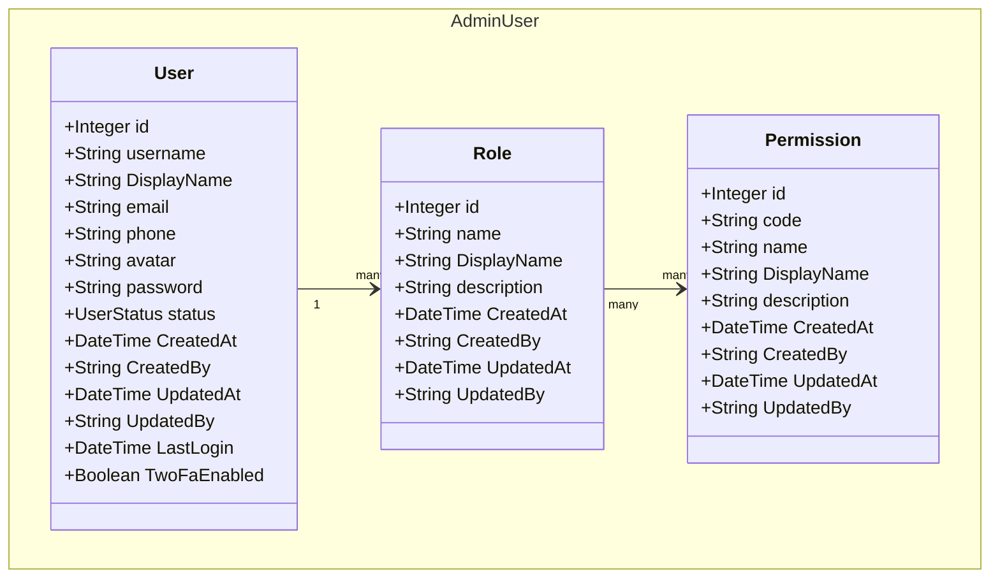
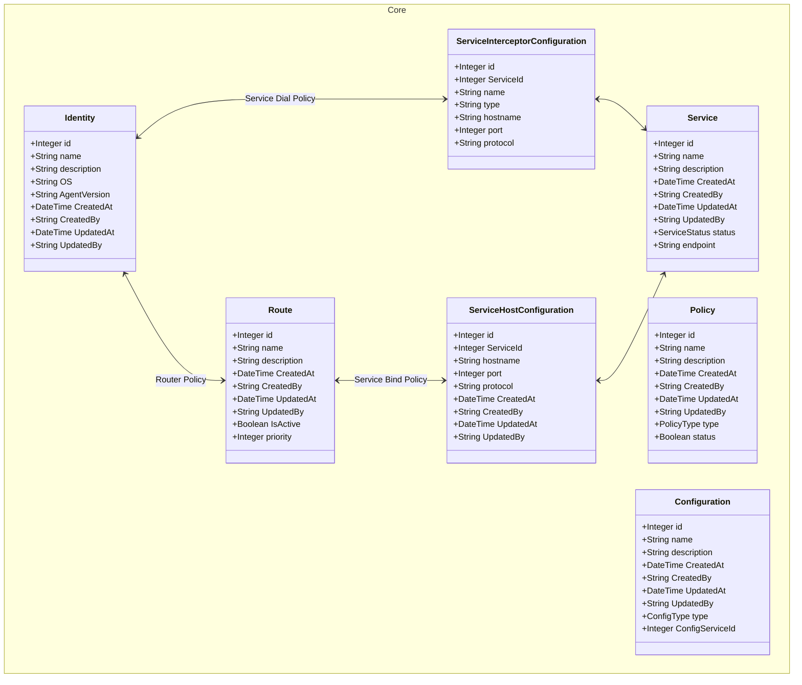
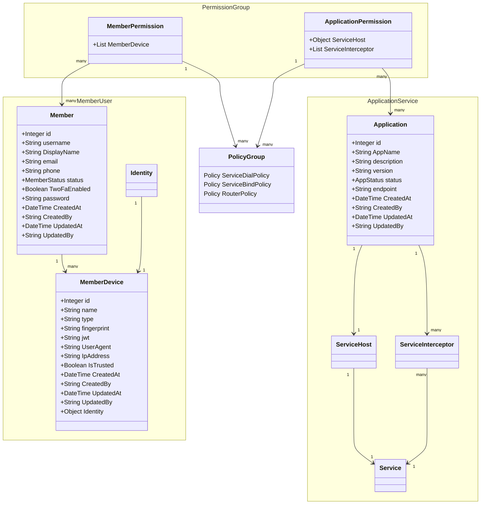
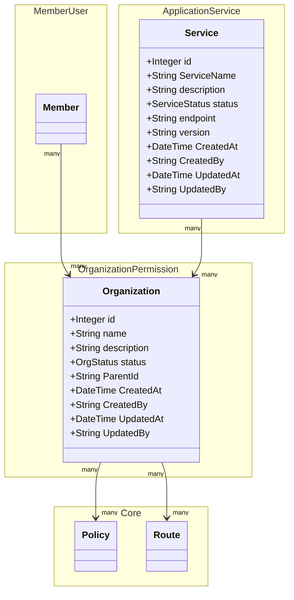

# Resources Architecture

## Data Types & Enums

### User Management Enums

### Service & Application Enums

### Organization & Policy Enums

- **PolicyType**: ServiceDialPolicy, ServiceBindPolicy, RouterPolicy

## Admin RBAC

## Core Architecture

## Domain Architecture

## Organization

