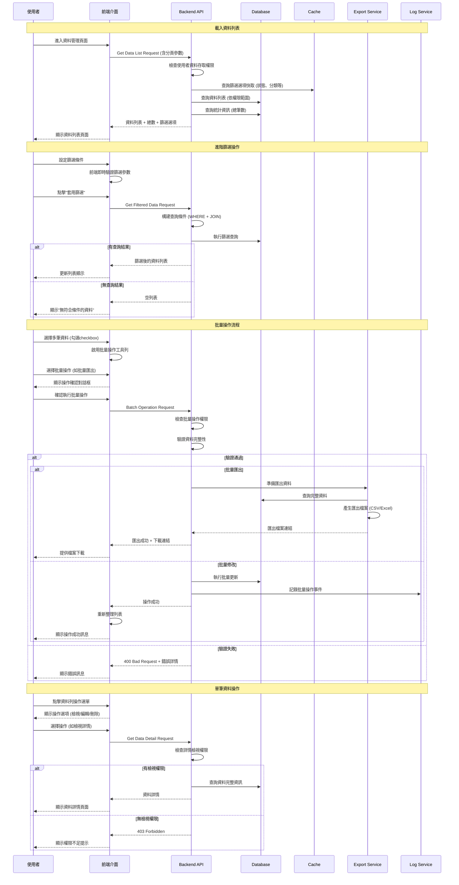
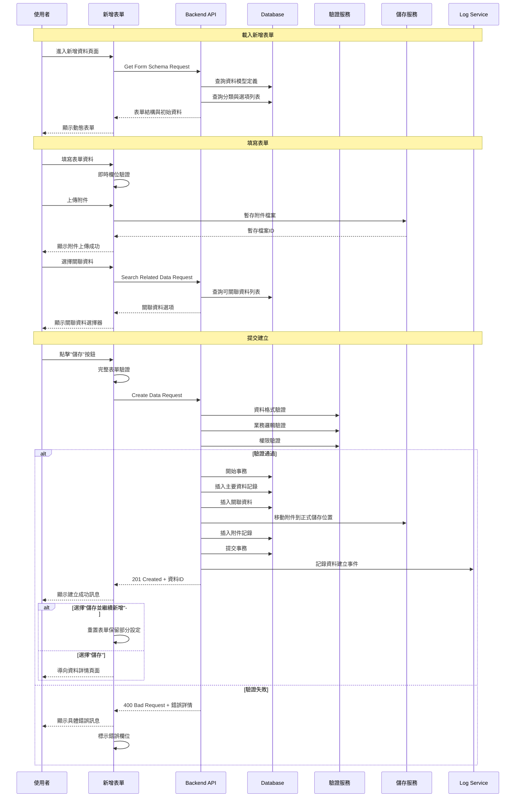
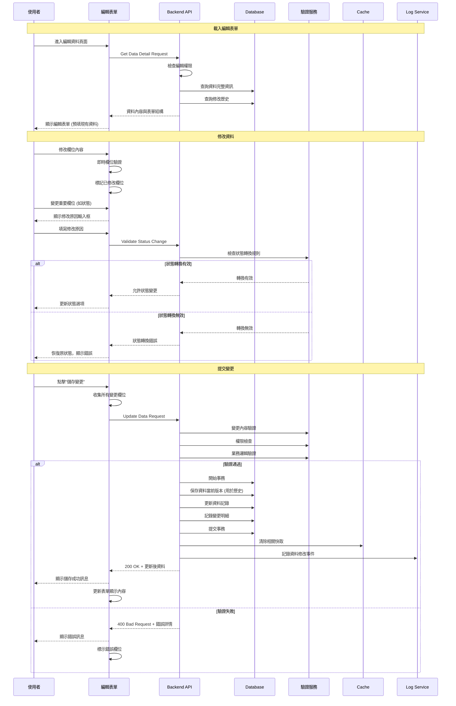
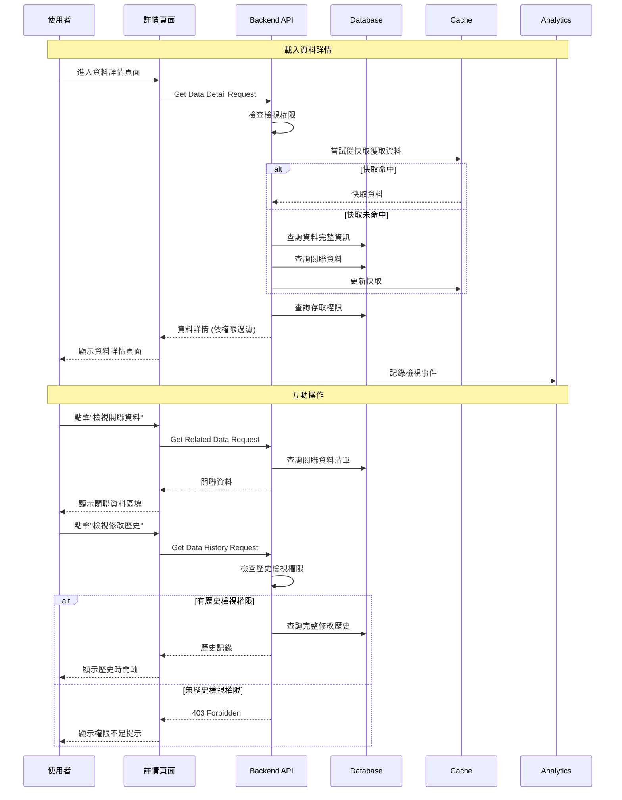
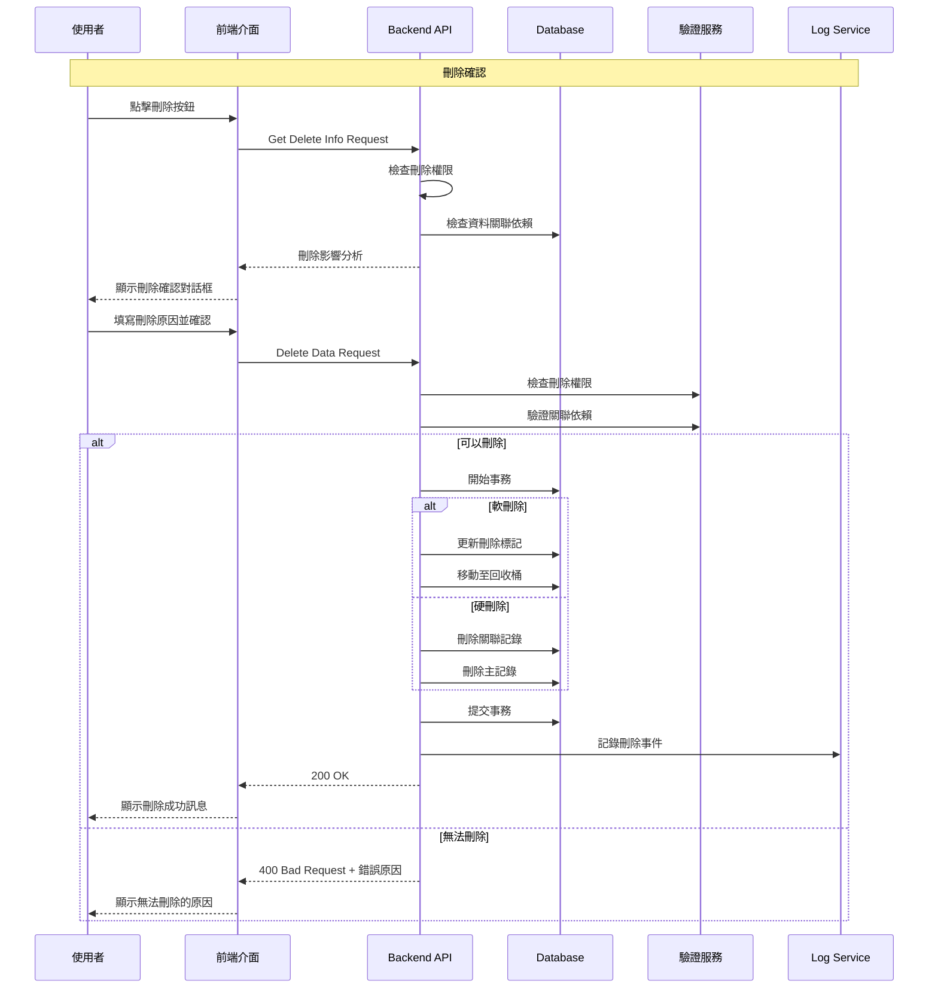

# Console Platform - 通用資料管理系統 產品規格書

## 一、User Stories

### 1.1 身份與需求

#### 系統管理者 (Super Admin)

**As a** 系統管理者  
**I want to** 管理系統中所有資料的完整生命週期  
**So that** 我可以確保資料完整性、安全性並控制所有資料存取

**Acceptance Criteria:**

- 可以建立、查看、修改、刪除所有資料記錄
- 可以設定資料欄位的權限控制
- 可以檢視所有資料變更記錄與稽核軌跡
- 可以進行資料的批量操作與管理
- 所有操作皆有完整稽核記錄

#### 資料管理員 (Data Manager)

**As a** 資料管理員  
**I want to** 管理特定範圍的資料並確保資料品質  
**So that** 我可以維護資料的正確性與一致性

**Acceptance Criteria:**

- 可以建立和管理指定範圍內的資料
- 可以設定資料驗證規則與品質檢核
- 可以進行資料匯入與匯出作業
- 可以檢視資料統計與分析報表
- 能夠處理資料異常與錯誤修正

#### 業務使用者 (Business User)

**As a** 業務使用者  
**I want to** 查詢和編輯與我工作相關的資料  
**So that** 我可以有效完成日常業務操作

**Acceptance Criteria:**

- 可以透過多種條件快速查詢所需資料
- 可以檢視資料的詳細內容
- 可以編輯被授權的資料欄位
- 可以匯出查詢結果進行分析
- 介面操作簡單直覺易懂

### 1.2 使用場景

#### 場景一: 查詢特定資料

業務使用者需要查找特定條件的資料時:

1. 進入資料管理頁面
2. 設定篩選條件 (日期範圍、狀態、關鍵字等)
3. 執行查詢並檢視結果列表
4. 點擊特定記錄查看詳細資訊
5. 根據需要進行資料編輯或匯出

#### 場景二: 新增資料記錄

資料管理員需要建立新的資料記錄時:

1. 點擊「新增資料」按鈕
2. 填寫完整的資料表單
3. 進行資料驗證與格式檢查
4. 提交建立並確認資料正確性
5. 系統記錄建立事件並通知相關人員

#### 場景三: 批量資料處理

管理員需要處理大量資料時:

1. 使用進階篩選功能選擇目標資料
2. 選擇批量操作類型 (修改、刪除、匯出等)
3. 預覽影響範圍並確認操作
4. 執行批量作業並監控進度
5. 檢視操作結果與異常處理報告

#### 場景四: 資料稽核檢查

稽核人員需要檢視資料變更歷程時:

1. 進入資料稽核頁面
2. 設定稽核時間範圍與條件
3. 檢視資料變更明細與操作者
4. 分析異常變更並產生稽核報告
5. 必要時進行資料回復或糾正

---

## 二、功能需求

### 2.1 資料列表頁面 (Data List)

#### 2.1.1 顯示欄位

**頁面標題與操作**

- 頁面標題 "資料管理"
- "新增資料" 按鈕 (權限: data.create)
- 全域搜尋框 (支援關鍵字、編號、名稱搜尋)
- 進階篩選器
- 檢視模式切換 (表格檢視/卡片檢視)
- 批量操作工具列

**篩選器面板**

| 篩選類型   | 控制項類型     | 說明                       |
| ---------- | -------------- | -------------------------- |
| 關鍵字搜尋 | Text Input     | 支援模糊搜尋多個欄位       |
| 狀態篩選   | Multi-Select   | 資料狀態多選               |
| 分類篩選   | Dropdown       | 資料分類單選               |
| 日期範圍   | Date Range     | 建立/修改時間範圍          |
| 數值範圍   | Number Range   | 數值型欄位範圍篩選         |
| 標籤篩選   | Tag Select     | 支援多標籤組合篩選         |
| 自訂欄位   | Dynamic Filter | 根據資料模型動態產生篩選器 |

**資料表格欄位**

| 欄位     | 顯示內容     | 說明                 | 可排序 |
| -------- | ------------ | -------------------- | ------ |
| 選取     | Checkbox     | 批量選取用           | -      |
| 編號     | ID/Code      | 系統編號或業務編號   | ✓      |
| 名稱     | Name/Title   | 主要顯示名稱         | ✓      |
| 狀態     | Status Badge | 目前狀態與狀態指示   | ✓      |
| 分類     | Category     | 資料分類或類型       | ✓      |
| 建立時間 | Created At   | 資料建立時間         | ✓      |
| 建立者   | Created By   | 建立人員             | ✓      |
| 最後修改 | Updated At   | 最近修改時間         | ✓      |
| 修改者   | Updated By   | 最後修改人員         | ✓      |
| 操作     | Action Menu  | 檢視/編輯/刪除等操作 | -      |

**狀態指示**

- Active: 正常狀態
- Draft: 草稿狀態
- Pending: 待處理
- Inactive: 停用
- Archived: 已歸檔
- Error: 錯誤狀態

**批量操作選項**

- 批量編輯 (修改共同欄位)
- 批量刪除
- 批量匯出
- 批量狀態變更
- 批量標籤操作

**分頁與顯示**

- 顯示總筆數與目前頁面資訊
- 每頁顯示數量選擇 (10/25/50/100)
- 分頁導覽與跳頁功能
- 無限滾動載入選項

#### 2.1.2 表單填寫欄位及驗證規則

**搜尋與篩選**

| 欄位名稱   | 欄位類型     | 必填 | 驗證規則                  | 說明               |
| ---------- | ------------ | ---- | ------------------------- | ------------------ |
| 關鍵字搜尋 | Text         | 否   | 長度: 1-100 字元          | 支援多欄位模糊搜尋 |
| 狀態篩選   | Multi-Select | 否   | 有效狀態值                | 可多選狀態組合     |
| 日期範圍起 | Date         | 否   | 有效日期格式              | 不可晚於結束時間   |
| 日期範圍迄 | Date         | 否   | 有效日期格式              | 不可早於開始時間   |
| 數值範圍   | Number       | 否   | 數值型態且最小值 ≤ 最大值 | 支援整數和小數     |
| 標籤選擇   | Tag          | 否   | 有效標籤 ID               | 支援自訂標籤新增   |
| 排序設定   | Select       | 否   | 有效欄位名稱 + 排序方向   | 預設按建立時間降序 |

**批量操作驗證**

| 操作類型 | 必要條件      | 驗證規則                        |
| -------- | ------------- | ------------------------------- |
| 批量編輯 | 選取至少 1 筆 | 編輯權限 + 欄位修改權限         |
| 批量刪除 | 選取至少 1 筆 | 刪除權限 + 非關聯依賴檢查       |
| 批量匯出 | 選取至少 1 筆 | 匯出權限 + 數量限制檢查         |
| 狀態變更 | 選取至少 1 筆 | 狀態變更權限 + 狀態轉換規則檢查 |

#### 2.1.3 Action Flow



#### 2.1.4 商業邏輯

**資料存取權限控制**

1. **分層權限檢查**

   - 基於使用者角色決定可存取的資料範圍
   - 欄位級別的權限控制 (讀取/編輯)
   - 資料列級別的存取限制 (如部門、專案)
   - 敏感欄位需額外權限驗證

2. **動態權限過濾**

   - 查詢時自動加入權限 WHERE 條件
   - 敏感欄位動態遮罩或隱藏
   - 操作按鈕依權限即時顯示/隱藏

**搜尋與篩選最佳化**

1. **智慧搜尋機制**

   - 關鍵字自動拆解與組合查詢
   - 模糊搜尋支援拼音與同義詞
   - 搜尋歷史記錄與快速套用
   - 個人化搜尋偏好記憶

2. **篩選器邏輯**

   - 多條件組合使用 AND 邏輯
   - 支援排除條件 (NOT IN)
   - 範圍條件包含邊界值
   - 空值條件特殊處理

3. **效能最佳化**

   - 使用資料庫索引優化查詢
   - 分頁查詢避免全表掃描
   - 快取常用篩選結果
   - 非同步載入大型資料集

**批量操作安全機制**

1. **操作前檢查**

   - 驗證所有選取項目的操作權限
   - 檢查資料依賴關係與完整性
   - 評估操作影響範圍
   - 確認操作的不可逆性

2. **執行時保護**

   - 使用資料庫交易確保一致性
   - 設定操作超時限制
   - 記錄詳細操作日誌
   - 提供操作進度回饋

**快取與效能策略**

1. **多層快取機制**

   - 瀏覽器快取: 靜態資源 (圖片、CSS)
   - 應用快取: 篩選選項 (10 分鐘)
   - 分散式快取: 查詢結果 (5 分鐘)
   - 資料庫快取: 統計資訊

2. **快取更新策略**

   - 資料變更時清除相關快取
   - 定期背景更新統計快取
   - 使用版本號控制快取一致性

#### 2.1.5 權限設計

| 操作         | 所需權限            | 說明                       |
| ------------ | ------------------- | -------------------------- |
| 檢視資料列表 | data.read           | 基本檢視權限               |
| 檢視敏感欄位 | data.read_sensitive | 如無權限，敏感欄位會被遮罩 |
| 新增資料     | data.create         | 建立新資料記錄             |
| 編輯資料     | data.update         | 修改資料記錄               |
| 刪除資料     | data.delete         | 刪除資料記錄               |
| 匯出資料     | data.export         | 匯出查詢結果               |

#### 2.1.6 Error 場景

| 錯誤代碼 | HTTP Status | 錯誤訊息                 | 觸發條件           | 處理方式                     |
| -------- | ----------- | ------------------------ | ------------------ | ---------------------------- |
| DATA_001 | 403         | 權限不足，無法存取此資料 | 使用者權限不足     | 隱藏相關功能，顯示權限說明   |
| DATA_002 | 400         | 篩選條件格式錯誤         | 篩選參數格式不正確 | 清空錯誤篩選條件，顯示提示   |
| DATA_003 | 404         | 查無符合條件的資料       | 篩選無結果         | 顯示空狀態頁面，建議調整條件 |
| DATA_004 | 413         | 查詢結果過多，請縮小範圍 | 結果超過系統限制   | 建議增加篩選條件             |
| DATA_005 | 429         | 操作過於頻繁，請稍後再試 | 觸發頻率限制       | 顯示倒數計時，暫時禁用操作   |
| DATA_006 | 500         | 載入資料失敗             | 資料庫查詢異常     | 提供重新整理按鈕             |
| DATA_007 | 400         | 批量操作選擇項目過多     | 超過批量操作限制   | 建議分批操作或使用進階工具   |
| DATA_008 | 422         | 資料驗證失敗             | 資料格式或規則錯誤 | 顯示具體錯誤欄位與修正建議   |

---

### 2.2 新增資料記錄 (Create Data)

#### 2.2.1 顯示欄位

**頁面標題與導覽**

- 頁面標題 "新增資料"
- 麵包屑導覽: 資料管理 > 新增資料
- "儲存並繼續新增" 按鈕
- "儲存" 按鈕
- "取消" 按鈕

**基本資訊區塊**

- 資料名稱 \*必填
- 資料編號 (系統生成或手動輸入)
- 資料分類 \*必填
- 狀態設定 (預設為草稿)
- 描述說明

**詳細資訊區塊**

- 動態表單欄位 (依資料模型定義)
- 關聯資料選擇器
- 附件上傳區塊
- 標籤管理

**設定區塊**

- 權限設定
- 有效期限
- 通知設定
- 稽核選項

**預覽區塊**

- 資料預覽
- 驗證結果顯示

#### 2.2.2 表單填寫欄位及驗證規則

| 欄位名稱 | 欄位類型    | 必填     | 驗證規則                     | 錯誤訊息                 |
| -------- | ----------- | -------- | ---------------------------- | ------------------------ |
| 資料名稱 | Text        | 是       | 長度: 1-100 字元, 不可純空白 | "請輸入有效的資料名稱"   |
| 資料編號 | Text        | 條件必填 | 格式驗證, 唯一性檢查         | "編號格式錯誤或已存在"   |
| 資料分類 | Select      | 是       | 有效分類 ID                  | "請選擇資料分類"         |
| 描述說明 | Textarea    | 否       | 最多 500 字元                | "描述內容過長"           |
| 附件     | File Upload | 否       | 檔案大小 10MB, 支援常見格式  | "檔案格式或大小不符規定" |
| 標籤     | Tag Input   | 否       | 每個標籤最多 20 字元         | "標籤格式錯誤"           |
| 有效期限 | Date        | 否       | 不可早於當前日期             | "有效期限設定錯誤"       |

#### 2.2.3 Action Flow



#### 2.2.4 商業邏輯

**資料模型驗證**

1. **動態表單生成**

   - 根據資料模型定義產生表單欄位
   - 支援多種欄位類型 (文字、數字、日期、選擇、檔案)
   - 條件式顯示邏輯 (依其他欄位值顯示/隱藏)
   - 欄位間依賴關係驗證

2. **業務規則檢查**

   - 資料完整性約束檢查
   - 業務邏輯驗證 (如狀態轉換規則)
   - 重複資料檢查
   - 關聯資料存在性驗證

**檔案處理機制**

1. **附件管理**

   - 支援多檔案上傳與預覽
   - 檔案類型與大小限制
   - 病毒掃描與安全檢查
   - 附件版本控制

2. **儲存策略**

   - 暫存上傳檔案避免資料遺失
   - 成功建立後移動到正式位置
   - 失敗時自動清理暫存檔案
   - 附件與資料記錄關聯管理

#### 2.2.5 權限設計

| 操作         | 所需權限        | 說明             |
| ------------ | --------------- | ---------------- |
| 建立資料記錄 | data.create     | 基本建立權限     |
| 上傳附件     | data.upload     | 檔案上傳權限     |
| 設定關聯     | data.relate     | 建立資料關聯權限 |
| 權限設定     | data.permission | 設定資料存取權限 |

#### 2.2.6 Error 場景

| 錯誤代碼   | HTTP Status | 錯誤訊息         | 觸發條件       | 處理方式               |
| ---------- | ----------- | ---------------- | -------------- | ---------------------- |
| CREATE_001 | 400         | 必填欄位不完整   | 必填欄位空白   | 標示所有未填欄位       |
| CREATE_002 | 400         | 資料格式驗證失敗 | 欄位格式錯誤   | 顯示具體格式要求       |
| CREATE_003 | 409         | 資料已存在       | 唯一性約束違反 | 建議檢查現有資料       |
| CREATE_004 | 413         | 上傳檔案過大     | 檔案超過限制   | 提示檔案大小限制       |
| CREATE_005 | 400         | 不支援的檔案格式 | 檔案類型限制   | 列出支援的檔案格式     |
| CREATE_006 | 500         | 建立資料失敗     | 系統異常       | 保留表單資料，提供重試 |

---

### 2.3 編輯資料記錄 (Edit Data)

#### 2.3.1 顯示欄位

**編輯方式**

- 支援單欄位即時編輯
- 完整表單編輯模式
- 版本比較檢視

**可編輯區塊**

- 基本資訊編輯
- 詳細資料修改
- 狀態與分類調整
- 附件管理 (新增/移除/替換)
- 關聯資料調整
- 標籤管理

**唯讀資訊區塊**

- 系統生成欄位 (ID、建立時間)
- 稽核資訊 (建立者、修改歷史)
- 計算欄位 (統計資料、衍生值)

**版本控制區塊**

- 修改歷史記錄
- 版本比較檢視
- 復原功能

#### 2.3.2 表單填寫欄位及驗證規則

| 欄位名稱 | 欄位類型 | 必填 | 驗證規則           | 特殊處理     |
| -------- | -------- | ---- | ------------------ | ------------ |
| 資料名稱 | Text     | 是   | 長度: 1-100 字元   | 重複性檢查   |
| 狀態     | Select   | 是   | 有效狀態轉換       | 狀態流程檢查 |
| 分類     | Select   | 是   | 分類變更影響評估   | 關聯資料檢查 |
| 修改原因 | Textarea | 是   | 重要變更需說明原因 | 敏感欄位必填 |

#### 2.3.3 Action Flow



#### 2.3.4 商業邏輯

**編輯權限控制**

1. **欄位級權限**

   - 不同角色可編輯的欄位範圍不同
   - 敏感欄位需要額外權限
   - 系統欄位完全不可編輯
   - 計算欄位僅能透過重新計算更新

2. **資料狀態限制**

   - 某些狀態下的資料不可編輯
   - 已鎖定或歸檔的資料唯讀
   - 正在被其他使用者編輯時的衝突處理

**版本控制機制**

1. **變更追蹤**

   - 記錄每次變更的詳細內容
   - 保存變更前後的欄位值
   - 記錄變更時間、操作者、變更原因

2. **並發控制**

   - 使用樂觀鎖防止編輯衝突
   - 檢測資料是否被他人修改
   - 提供衝突解決方案

#### 2.3.5 權限設計

| 操作         | 所需權限              | 說明         |
| ------------ | --------------------- | ------------ |
| 編輯基本資訊 | data.update           | 一般欄位編輯 |
| 編輯敏感資訊 | data.update_sensitive | 敏感欄位編輯 |

#### 2.3.6 Error 場景

| 錯誤代碼 | HTTP Status | 錯誤訊息                     | 觸發條件     | 處理方式         |
| -------- | ----------- | ---------------------------- | ------------ | ---------------- |
| EDIT_001 | 404         | 找不到指定的資料             | 資料 ID 無效 | 導回資料列表     |
| EDIT_002 | 403         | 權限不足，無法編輯此資料     | 編輯權限不足 | 顯示唯讀模式     |
| EDIT_003 | 409         | 資料已被他人修改，請重新載入 | 並發編輯衝突 | 提供重新載入選項 |
| EDIT_004 | 400         | 資料狀態不允許編輯           | 狀態限制     | 說明狀態限制原因 |
| EDIT_005 | 422         | 資料驗證失敗                 | 欄位驗證錯誤 | 標示所有錯誤欄位 |

---

### 2.4 檢視資料詳情 (View Data Detail)

#### 2.4.1 顯示欄位

**頁面標題與導覽**

- 頁面標題 "資料詳情 - {資料名稱}"
- 麵包屑導覽: 資料管理 > 資料詳情
- 快速操作按鈕組
- "返回列表" 按鈕

**資料概覽區塊**

- 資料名稱與編號
- 目前狀態
- 基本資訊摘要
- 快速操作按鈕

**詳細資訊卡片**

| 欄位類別 | 顯示方式      | 說明           |
| -------- | ------------- | -------------- |
| 基本資訊 | 標籤值對      | 結構化顯示     |
| 長文本   | 摺疊式展示    | 避免頁面過長   |
| 附件     | 下載連結/預覽 | 支援線上預覽   |
| 關聯資料 | 連結跳轉      | 可點擊查看詳情 |
| 標籤     | 標籤雲        | 視覺化顯示     |

**關聯資訊區塊**

- 相關資料列表
- 依賴關係圖
- 關聯操作選項

**歷史記錄區塊**

- 修改歷史時間軸
- 版本比較功能
- 操作者資訊

#### 2.4.2 Action Flow



#### 2.4.3 商業邏輯

**資料呈現優化**

1. **智慧化顯示**

   - 根據欄位類型選擇適當顯示方式
   - 長文本自動摺疊與展開
   - 日期時間本地化格式
   - 數值資料格式化與單位顯示

2. **關聯資料處理**

   - 延遲載入關聯資料避免過度查詢
   - 關聯資料權限獨立檢查
   - 提供快速存取關聯資料的連結

**效能最佳化**

1. **快取策略**

   - 熱門資料優先快取
   - 不同權限角色使用不同快取
   - 關聯資料獨立快取管理

2. **分段載入**

   - 基本資訊優先載入
   - 附件和關聯資料按需載入
   - 大型資料集分頁顯示

#### 2.4.4 權限設計

| 資訊類別 | 所需權限            | 說明         |
| -------- | ------------------- | ------------ |
| 基本資訊 | data.read           | 一般欄位檢視 |
| 敏感資訊 | data.read_sensitive | 敏感欄位檢視 |
| 附件下載 | data.download       | 附件下載權限 |
| 關聯資料 | 依關聯資料類型決定  | 獨立權限檢查 |

#### 2.4.5 Error 場景

| 錯誤代碼 | HTTP Status | 錯誤訊息                 | 觸發條件     | 處理方式         |
| -------- | ----------- | ------------------------ | ------------ | ---------------- |
| VIEW_001 | 404         | 找不到指定的資料         | 資料 ID 無效 | 導向資料列表     |
| VIEW_002 | 403         | 權限不足，無法檢視此資料 | 檢視權限不足 | 顯示權限說明     |
| VIEW_003 | 500         | 載入資料詳情失敗         | 系統異常     | 提供重新載入按鈕 |

---

### 2.5 刪除資料記錄 (Delete Data)

#### 2.5.1 顯示欄位

**刪除確認對話框**

- 資料摘要資訊
- 關聯資料影響說明
- 刪除原因輸入框 \*必填
- 確認刪除按鈕
- 取消按鈕

#### 2.5.3 Action Flow



#### 2.5.4 商業邏輯

**刪除前檢查**

1. **依賴關係檢查**

   - 檢查是否有其他資料依賴此記錄
   - 評估刪除對系統的影響範圍
   - 提供關聯資料處理建議

2. **權限與規則驗證**

   - 驗證使用者刪除權限
   - 檢查資料是否在保護期內
   - 確認是否符合保留政策

**刪除策略**

1. **軟刪除機制**

   - 標記為已刪除但不實際移除
   - 保留稽核軌跡和復原可能性
   - 設定自動清理時間

2. **硬刪除處理**

   - 永久移除所有相關記錄
   - 清理關聯的檔案和附件
   - 無法復原的最終刪除

#### 2.5.5 權限設計

| 操作   | 所需權限     | 說明         |
| ------ | ------------ | ------------ |
| 軟刪除 | data.delete  | 一般刪除權限 |
| 硬刪除 | data.purge   | 永久刪除權限 |
| 復原   | data.restore | 從回收桶復原 |

#### 2.5.6 Error 場景

| 錯誤代碼 | HTTP Status | 錯誤訊息                 | 觸發條件     | 處理方式           |
| -------- | ----------- | ------------------------ | ------------ | ------------------ |
| DEL_001  | 403         | 權限不足，無法刪除此資料 | 刪除權限不足 | 隱藏刪除按鈕       |
| DEL_002  | 400         | 此資料正被其他記錄使用   | 存在依賴關係 | 顯示依賴關係列表   |
| DEL_003  | 400         | 資料在保護期內無法刪除   | 保護期限制   | 顯示保護期結束時間 |
| DEL_004  | 404         | 找不到要刪除的資料       | 資料不存在   | 導回資料列表       |

---

## 三、權限系統架構

### 3.1 權限命名規範

**權限命名採用 `{resource}.{action}` 格式:**

- 資源類型.操作類型
- 例如: data.read, data.create, data.update, data.delete

### 3.2 權限分類結構

**權限列表**

- `data.read` - 檢視資料列表
- `data.read_sensitive` - 檢視敏感欄位
- `data.create` - 建立資料
- `data.update` - 修改資料
- `data.update_[field]` - 修改資料
- `data.update_sensitive` - 修改敏感欄位
- `data.delete` - 刪除資料
- `data.export` - 匯出資料
- `data.import` - 匯入資料
- `data.upload` - 上傳附件
- `data.download` - 下載附件

**權限層級**

```
data.read                               # 檢視資料列表
├── data.read_sensitive                 # 檢視敏感欄位
├── data.export                         # 匯出資料
├── data.update                         # 修改資料
│   ├── data.create                     # 建立資料
│   │   └── data.upload                 # 上傳附件
│   │   └── data.update_[field]         # 特定欄位修改
│   ├── data.update_sensitive           # 修改敏感欄位
│   ├── data.import                     # 匯入資料
│   └── data.delete                     # 刪除資料
```
